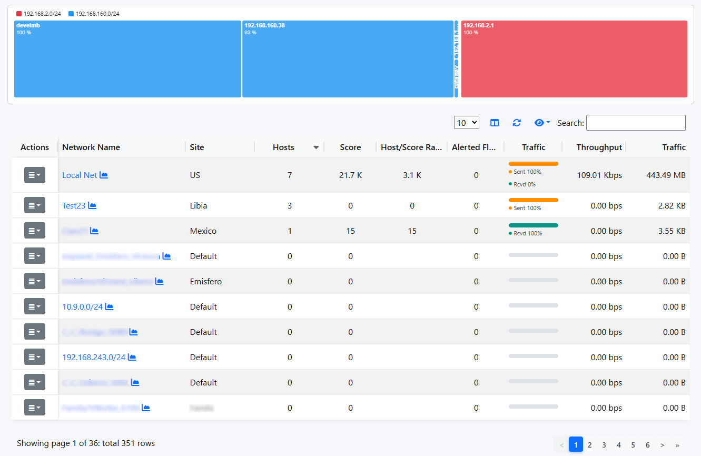
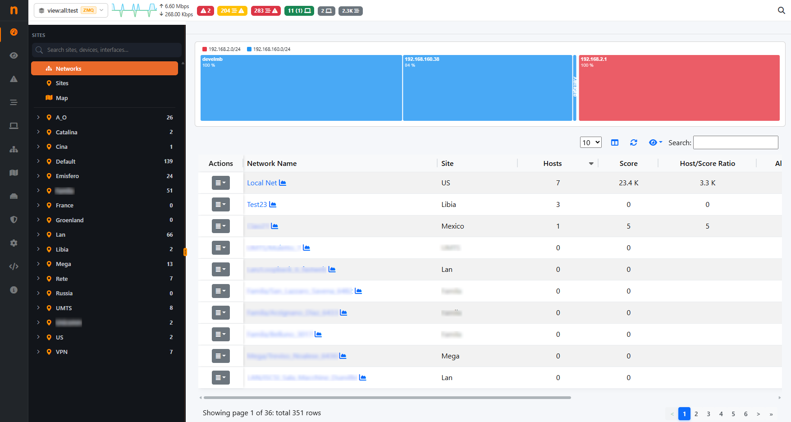

.. _Networks:

Networks
--------

Networks shows all networks discovered by ntopng and configured in the configuration file (-m option).

  The Networks Summary Page

For each network discovered ntopng provides the number of hosts, alerts triggered, date of discovery,
breakdown, throughput, traffic. Network names can be clicked
to display the hosts lists inside the network selected.

Also by editing a network (from the Actions column), it is possible to rename a Network and assign a Label/Name to it

Networks Dashboard
------------------

.. note::

  This feature is available only with at least an Enterprise M license

The network page is moved to the `Dashboard Sites`.

  The Networks Dashboard
 
The Networks page also provides a **Sites** tab, which groups networks under named locations such
as offices, branches or data centers. See `Sites`_ for details on creating sites and assigning networks
to them.

Also from the edit of a Network it is possible to assign a Network to a Site
 
.. _`Sites`: sites.html
