.. _Sites:

Sites
-----

A *Site* is a named place - typically a physical location such as an office, a branch,
or a data center - to which one or more networks can be assigned. Sites let you
group networks by location, so that hosts, traffic, score and alerts can be reviewed per
place rather than per individual network. A site can optionally be pinned on a map through
its geographic coordinates.

.. note::

  Sites are available with an Enterprise M (or higher) license.

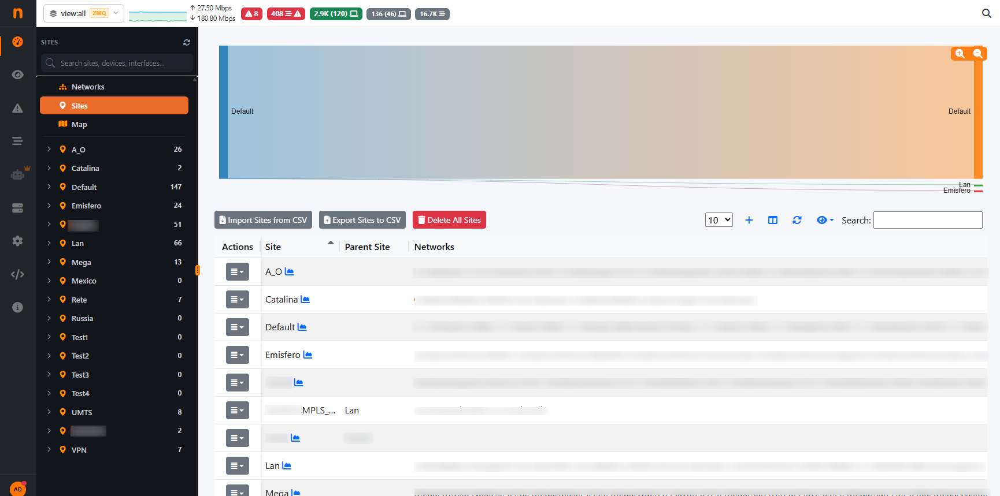

  The Sites Page

Sites are managed from the `Dashboard Sites` page. To access this page, click on `Dashboard` and the tab `Sites`
should be available

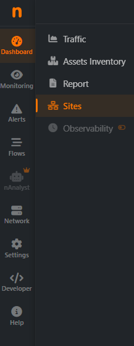

  The Dashboard Sites Tab

For each site the following information is shown:

- **Site**: the display name of the site.
- **Parent Site**: the display name of the Parent Site, if configured.
- **Description**: an optional free-text description.
- **Networks**: the networks currently assigned to the site.
- **Location**: the site coordinates (latitude and longitude). The location is shown only
  when coordinates have been set.

The Default Site
^^^^^^^^^^^^^^^^^

A predefined **Default** site is always present and cannot be removed. Every network
that has not been explicitly assigned to a site belongs to the Default site, which therefore
acts as a fallback. Being a reserved site, the Default site cannot be edited or deleted, and
its actions are disabled in the table.

Adding a Site
^^^^^^^^^^^^^

From the **Sites** tab, click the **+** button at the top of the table to open the creation
form, then fill in the following fields:

- **Site** (required): from 2 to 32 characters. Only letters, numbers and spaces are allowed
  (accented letters are accepted). The name must be unique: two sites cannot share the same name.
- **Description** (optional): up to 256 characters.
- **Parent Site** (optional): enter an other already configured Site to create a hierachy between sites.
- **Location** (optional): set the position either by typing the **Latitude** and **Longitude**
  values, or by clicking directly on the map below the fields. The map marker and the coordinate
  fields stay in sync, so a click updates the values and typing updates the marker. Latitude must
  be between -90 and 90, longitude between -180 and 180. 

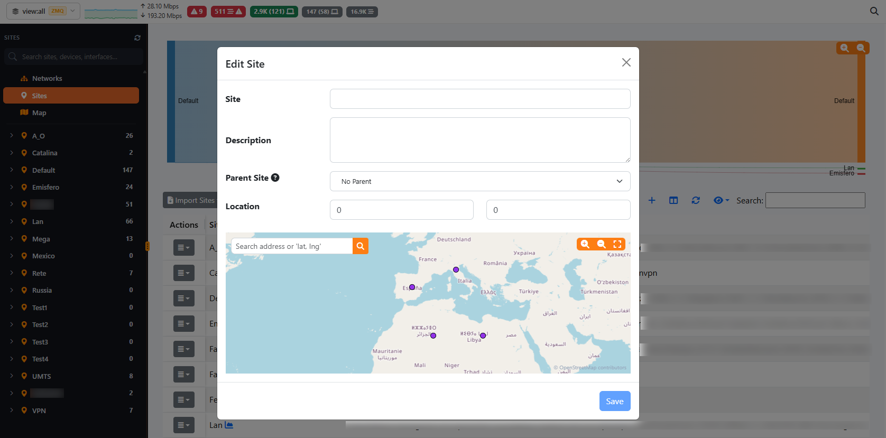

  The Site creation / edit form

.. note::

  The search above the geographic map can be used to search for a Nation, a City or an address

Click **Save** to create the site. If a value is not valid (for example a duplicate name) the
form reports the error and the site is not saved.

Editing a Site
^^^^^^^^^^^^^^

In the **Sites** tab, use the edit action on a site row to reopen the same form with the current
values pre-filled. Update the fields as needed and click **Save**. The Default site is reserved
and cannot be edited.

Deleting a Site
^^^^^^^^^^^^^^^

Use the delete action on a site row and confirm to remove the site. The Default site is reserved
and cannot be deleted.

.. note::

  Deleting a site does not prevent removal when networks are still assigned to it. Any network
  that was assigned to the deleted site falls back to the Default site.

Assigning a Network to a Site
^^^^^^^^^^^^^^^^^^^^^^^^^^^^^^

Networks are not assigned to a site from the site form. Instead, the assignment is done from the
**Networks** tab: edit a network and choose the desired site from the list. The **Site** column in
the networks list shows the site each network currently belongs to. Networks left unassigned remain
part of the Default site.

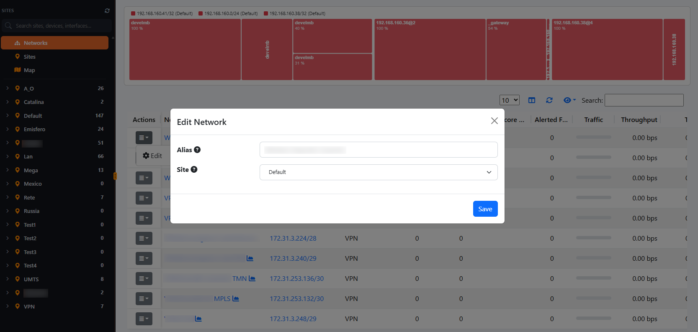

  :align: center
  :alt: Edit the Network Site

  The Network edit form

Navigating Sites
^^^^^^^^^^^^^^^^

After creating a site, it will be displayed on the left navigation bar.

It is possible to search Sites, Devices, ecc. by entering the name of the Asset to search in the search bar

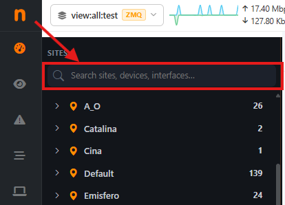

  :align: center
  :alt: Dashboard Sites Details

  Dashboard Sites Details

All the information displayed are searchable both on Live Data and Historical Data

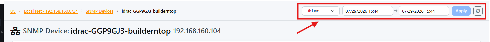

  :align: center
  :alt: Dashboard Sites Details

  Dashboard Sites Details

From there it is possible to display the data of each site in details:

- Flows (if present);
- Exporters (if present);
- Networks;

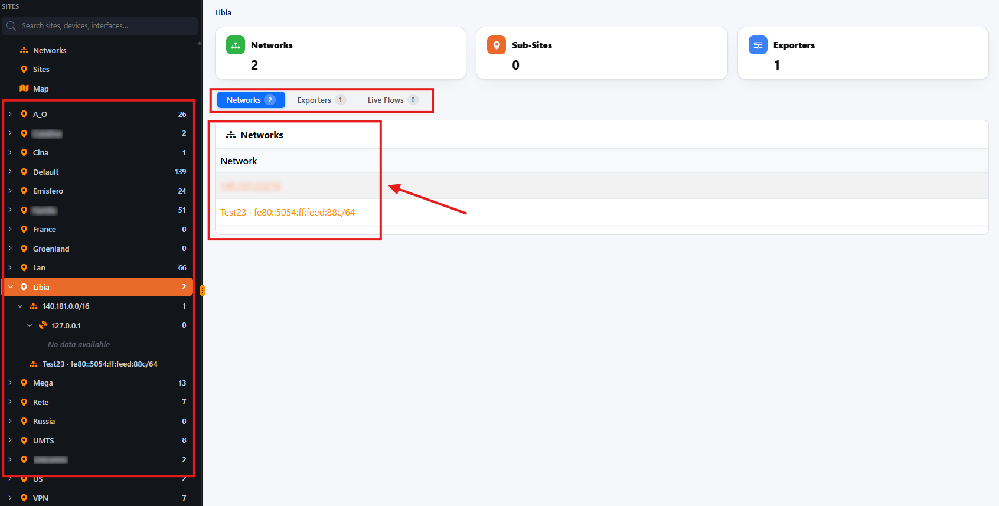

  :align: center
  :alt: Dashboard Sites Details

  Dashboard Sites Details

It is also possible to drill down more inside each information displayed.
If available, the Networks and Exporters will be displayed inside the Site and they are also navigable with their own statistics and data.

For Networks, there will be displayed:

- Exporters (if present)
- Flows
- Hosts

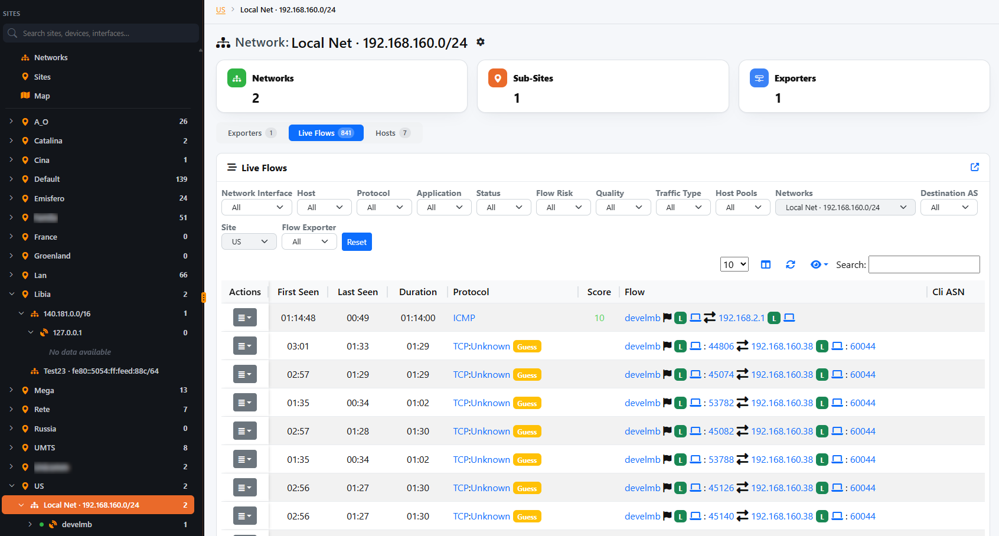

  :align: center
  :alt: Dashboard Sites Details

  Dashboard Sites Details

Exploring an Exporter
^^^^^^^^^^^^^^^^^^^^^^

Clicking a Flow Exporter (NetFlow/sFlow/IPFIX probe) inside a network opens its detail view, with a
breadcrumb (Site > Network > Exporter) at the top and header cards for Interfaces count, Current
Traffic (sent/received split), Flows, Active Hosts and SNMP polling status. The exporter view has
four sub-tabs:

**Traffic Analysis**
  The default sub-tab: a Traffic Time Series chart (sent/received bytes over time), a Top
  Applications table (protocol name, traffic volume and percentage share), and Top Local Hosts /
  Top Remote Hosts tables. Every table row links out to the Flows page pre-filtered by that
  application or host.

  :align: center
  :alt: Exporter Traffic Analysis sub-tab

  Exporter - Traffic Analysis

**Interfaces**
  Lists each physical/logical interface exposed by the exporter, with Bytes Received and Bytes
  Sent columns. Clicking an interface narrows the traffic charts to that single interface.

**Live Flows**
  The live flows table for traffic seen by this exporter: source/destination host, application
  protocol, L4 protocol, ports, VLAN, throughput and duration, with the same filter bar (protocol,
  status, QoE, traffic type, host pool, ASN, in/out interface index) used on the standalone Flows
  page.

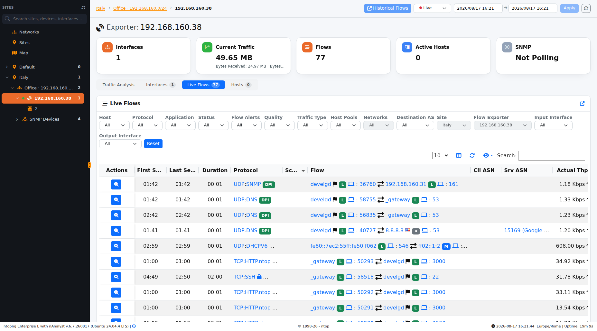

  :align: center
  :alt: Exporter Live Flows sub-tab

  Exporter - Live Flows

**Hosts**
  The host table for this exporter: every local/remote host that has generated traffic through it,
  with traffic volume, country/ASN and the usual host-table column set (sortable, searchable, with
  column visibility control).

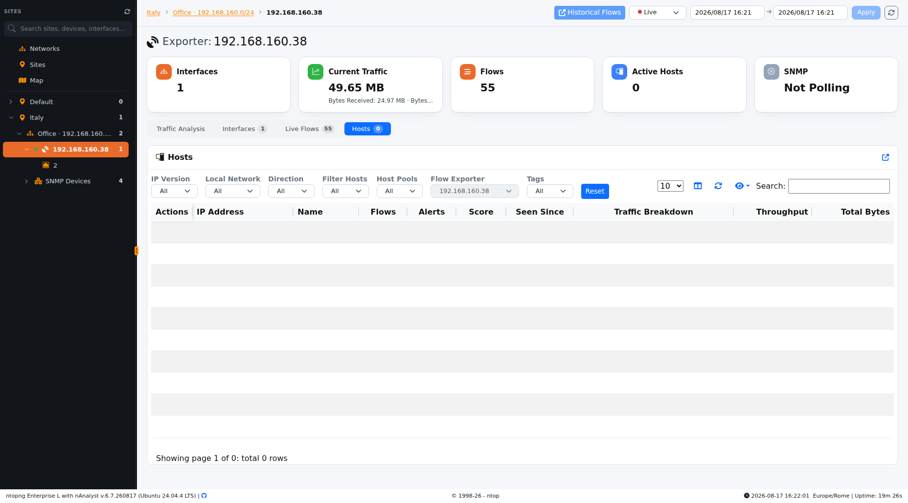

  :align: center
  :alt: Exporter Hosts sub-tab

  Exporter - Hosts

**SNMP**
  Not a sub-tab on the exporter itself: the SNMP status card in the header shows *Polling* or *Not
  Polling*. If the exporter is also configured as a polled SNMP device, an **SNMP Devices** entry
  appears as a sibling node under it in the left sidebar tree - see below.

Exploring an SNMP Device
^^^^^^^^^^^^^^^^^^^^^^^^^

Finally SNMP devices are also available (only if polled by ntopng with SNMP). Expanding **SNMP
Devices** in the sidebar tree lists every polled device by name; selecting one opens its detail
view with:

- **SNMP Interfaces** header count.
- A **Traffic Time Series** chart, with one selectable line per SNMP interface (physical port,
  virtual interface, bridge, etc.).
- A **Device Information** card: Device Name, Device IP, Description (from the device's system
  description OID), Location, Contact, Uptime, Time Since Last Poll, SNMP Interfaces count and
  Interfaces With Errors count.
- An **SNMP Interfaces** table, one row per polled port/interface, with columns for Name,
  Interface Alias, Interface IPs, Role, In/Out Bytes, Throughput, VLAN, Admin. Status, Oper.
  Status, Duplex Status, MACs, In Discards, In/Out Errors, Uplink/Downlink Speed, Last In/Out
  Usage and Last Change. Clicking a row opens that single SNMP interface's own detail page.

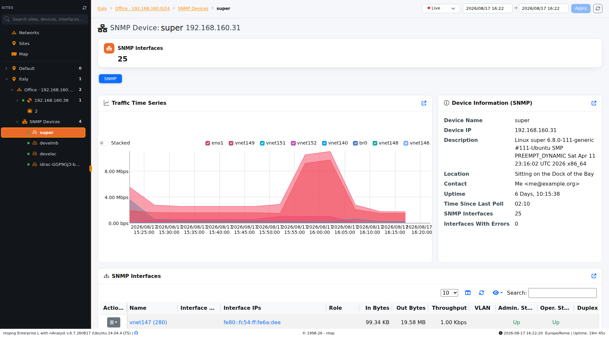

  :align: center
  :alt: SNMP device detail view: traffic chart, device information and interfaces table

  SNMP Device Details

Map and Matrix Views
^^^^^^^^^^^^^^^^^^^^^

Besides the **Networks** and **Sites** tabs, the Sites Dashboard offers a **Map** tab with two
sub-views for a geographic and cross-site perspective on traffic:

- **Map**: plots every site with configured coordinates on an OpenStreetMap base layer. A
  **Metric** selector controls what each site marker represents (defaults to Traffic), and a
  Live/historical toggle switches between current and time-ranged data. Markers can be searched by
  address or by typing coordinates directly.

  .. figure:: ../../../img/dashboard_sites_map.png

    :align: center
    :alt: Sites Map view

    Sites - Map

- **Matrix**: a site-to-site traffic matrix, where rows and columns are sites and each cell shows
  the traffic exchanged between that pair of sites - useful for spotting which sites communicate
  most with each other.

  .. figure:: ../../../img/dashboard_sites_matrix.png

    :align: center
    :alt: Sites Matrix view

    Sites - Matrix