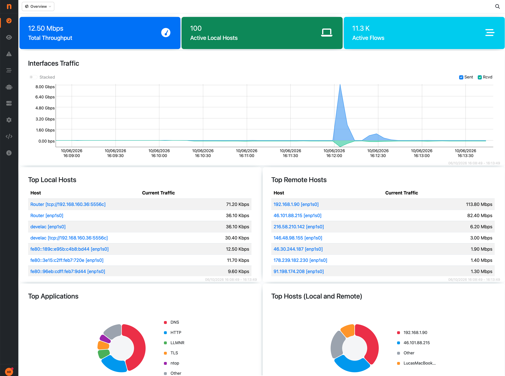

.. _Overview:

Overview
========

When ntopng monitors more than one network interface, the Interfaces dropdown menu in the top
toolbar lists an additional *Overview* entry. Selecting it switches the web GUI to a view that
combines the data of all the local interfaces of the ntopng instance, so that a single page shows
the overall picture instead of one interface at a time.

The Overview does not require any configuration: it is computed on demand from the interfaces
ntopng is already monitoring. It is not an interface itself, nothing is added to the command line,
and no extra traffic processing takes place in the background. This is the main difference with
`View Interfaces <../../advanced_features/interfaces/view_interfaces.html>`_, which are created
via the command line and merge traffic of the underlying interfaces into a real logical interface.

The Overview entry is shown in the dropdown when:

- ntopng monitors two or more interfaces (the `System Interface <../../basic_concepts/system_interface.html>`_
  is not counted), and
- no View Interface is configured. When a View Interface exists, that is the intended way to see
  aggregated data, and the Overview entry is hidden.

While the Overview is selected, the menu only shows the pages that are able to combine data of all the
interfaces. The other menu entries are disabled with the *Not available in Overview* hint;
select a regular interface from the dropdown to access them.

Dashboard
---------

The Overview has its own dashboard. Counters, charts and tables are computed by querying every
local interface and merging the results: traffic charts show the total across all the interfaces,
while Top Local / Remote Hosts tables report, next to each host, the name of the interface where
the host has been seen.

  Overview Dashboard

Report and Historical Flows
---------------------------

In the Overview, the Report and the Historical Flows Explorer are also available: queries return
flows and data of all the interfaces. In the Historical Flows Explorer, the interface where each flow has
been seen is reported in a dedicated column.

Interface Details
-----------------

The Interface Details page reports the totals of all the local interfaces: traffic, packets,
drops, flows, flow exporters and probes (for collector interfaces), database export statistics and
alert counters. The list of the interfaces being aggregated is reported at the top of the page,
in place of the identity information (name, MAC address, speed, etc.) of a single interface.
Counters are refreshed automatically as for a regular interface.

Only the information that can be meaningfully summed is shown. Per-interface sections, such as
storage utilization, traffic recording, live capture and the traffic breakdown charts, are available
by selecting the actual interface.

The *Historical* tab shows the timeseries summed across all the local interfaces. Enabling the
*Stacked* toggle on the chart splits it into one series per interface, stacked on top of each
other, so that the contribution of each interface to the total is visible.

The *Reset Counters* action resets the counters of all the local interfaces.

Alerts
------

When ClickHouse is enabled, the Alerts Explorer is available in the Overview and lists the
alerts of all the interfaces, both engaged and past alerts. All the explorer actions work on the
whole set of alerts: filters, acknowledging and deleting alerts, and opening alert details.

Actions that refer to a single interface, such as the live flows of a host or the extraction of
the traffic of a flow from the traffic recording, require jumping on the actual interface.

.. note::

   Alerts are only available in the Overview when ClickHouse is enabled. With the default
   (SQLite) alert database, the Alerts menu is disabled in the Overview.

Search
------

In the Overview, the search box in the top toolbar always looks for hosts on all the
interfaces, regardless of the *Search In All Interfaces* preference. Each result reports the
interface where the host has been found:

- clicking a host opens its details page on the interface where the host is active;
- the *Alerts* and *Historical Flows* icons next to a result open those pages within the
  Overview, filtered by the host, so the results cover all the interfaces.
