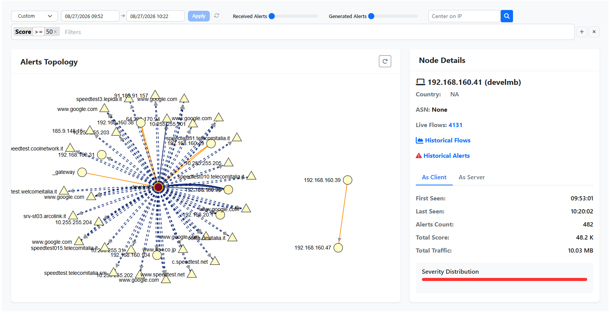

.. _AlertsGraph:

Alerts Graph
############

Instead of the traditional tabular view of
flow alerts, this graph lets you visually explore how alerts are
connected across hosts, making it much easier to spot patterns such as
brute force attempts, obsolete TLS/SSH versions, periodic flows,
possible C2 traffic, botnets, and similar issues, simply by looking at
how alerts are distributed and propagate across the network.

.. note::
    This feature is available from the Enterprise L license

  Alerts Graph

Graph Structure
----------------

The graph represents, for a given time range, all the hosts involved in
flow alerts and the alerts connecting them:

- Each **node** represents a host:

  - a **triangle** is a remote host
  - a **circle** is a local host

- Each **edge** represents an alert, with the arrow pointing from the
  originator (flow client) to the target (flow server) of the alert.

This makes it straightforward to spot **hubs**, i.e. hosts responsible
for generating or suffering a disproportionate number of alerts compared
to the rest of the network, as well as to follow how an alert on one
host may have triggered further alerts on other hosts.

Color Insights
--------------

Colors provide an immediate severity overview of the graph:

- **Edges**: light yellow indicates a low alert count between two hosts,
  while orange/red indicates a high alert count.
- **Nodes**: the more red a node is, the higher its alert score, i.e.
  the more it generated or suffered alerts. Every issue detected in a
  flow contributes a score between 0 and 150, and a flow alert can be
  made up of multiple issues, so the total score of a host is the sum of
  all the issues affecting it.

How To Use The Alerts Graph
----------------------------

- **Single click** on a node to show detailed host information (IP,
  Country, Autonomous System) in the side panel, together with quick
  links to that host's Live Flows, Historical Flows and Historical
  Alerts for the selected time range.
- **Double click** on a node to filter out all the noise and only show
  the alerts concerning that specific host.
- Clicking a node also highlights its **blast radius**, i.e. all the
  paths that originate from it, letting you quickly see how alerts may
  have propagated starting from that host. This is currently an
  approximation, as a fully causal reconstruction would additionally
  require taking the time dimension into account.

License Pre Requisites
-----------------------

The Alerts Graph visualizes historical flow alerts stored in
ClickHouse, using flows either collected directly by ntopng or exported
to it from nProbe. This feature requires **ntopng Enterprise L** (or
above) or **nEdge Enterprise L** (or above), together with ClickHouse
enabled as described in :ref:`ClickHouseTimeseriesAdvanced`.

Once enabled, the Alerts Graph can be reached from the left sidebar,
under *Alerts* -> *Alerts Graph*.

More information on this feature, along with example screenshots, can
be found on our blog post:
https://www.ntop.org/introducing-ntopng-alerts-graph-visualize-security-events-like-never-before/