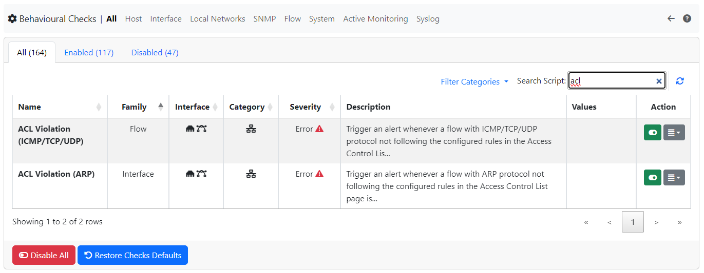
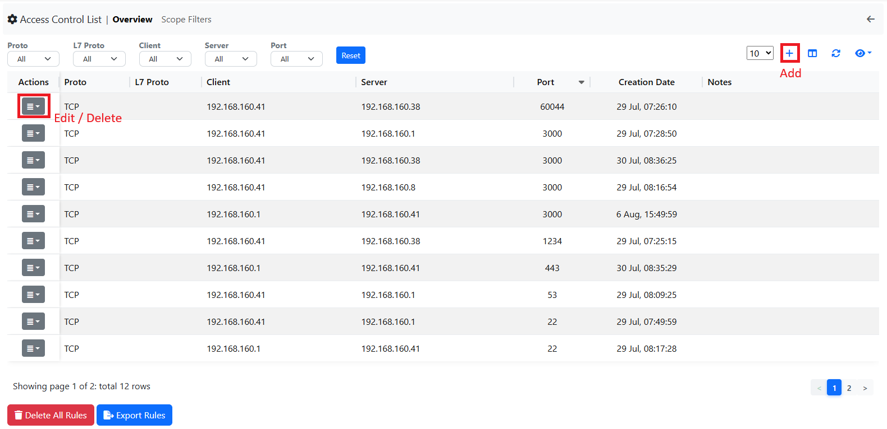
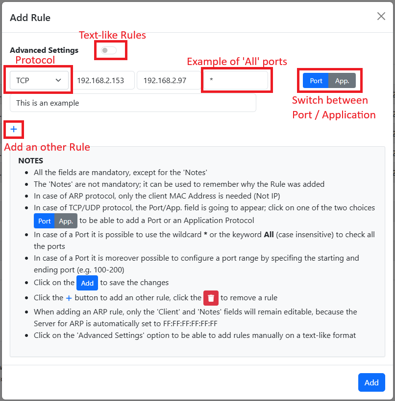
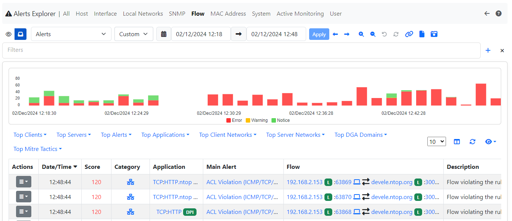
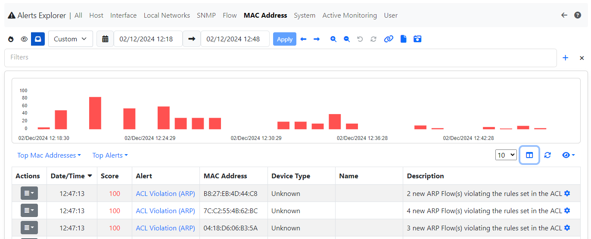
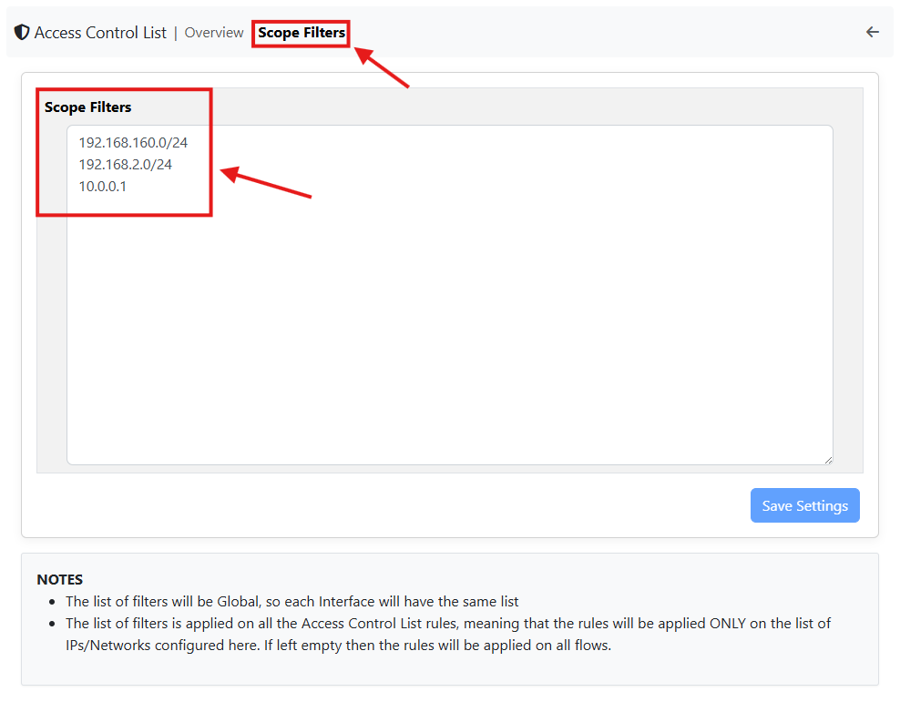
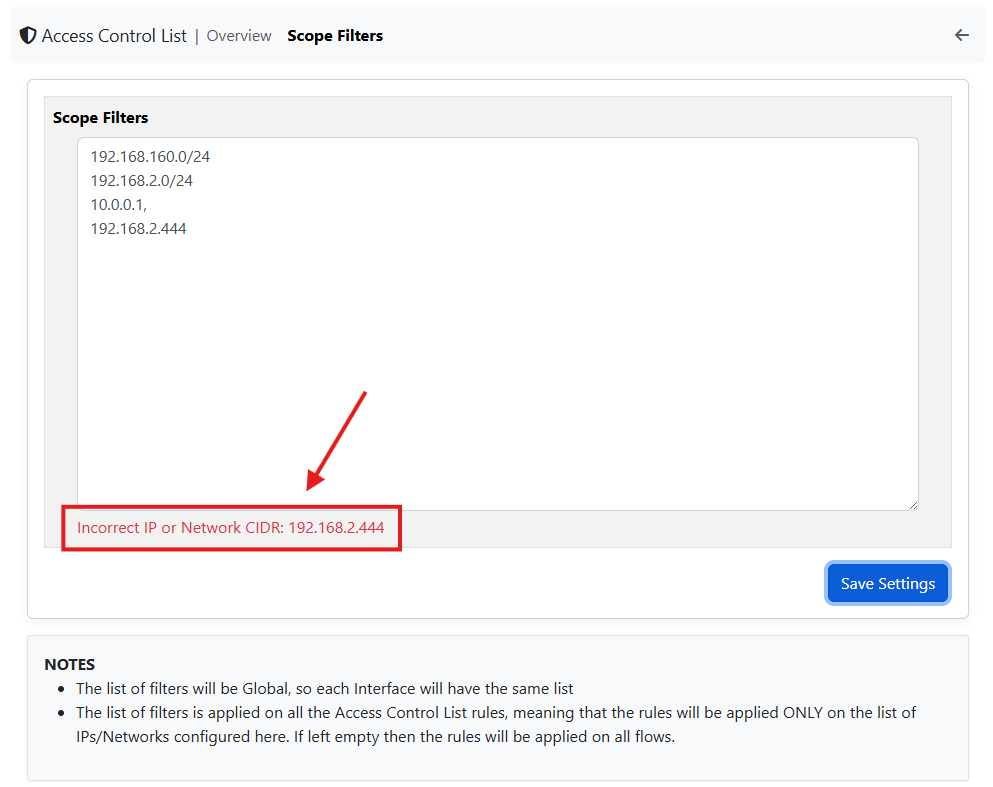
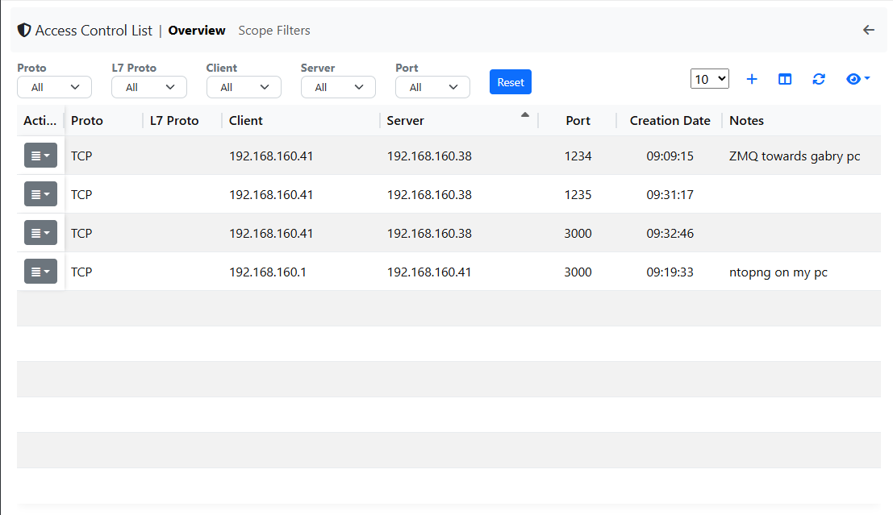
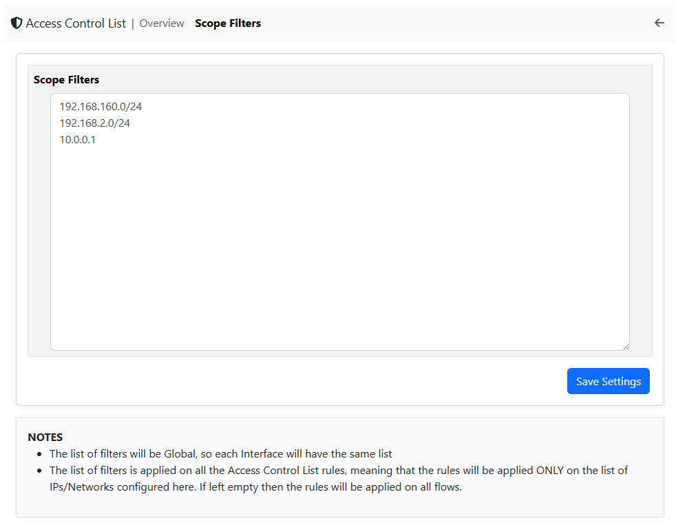
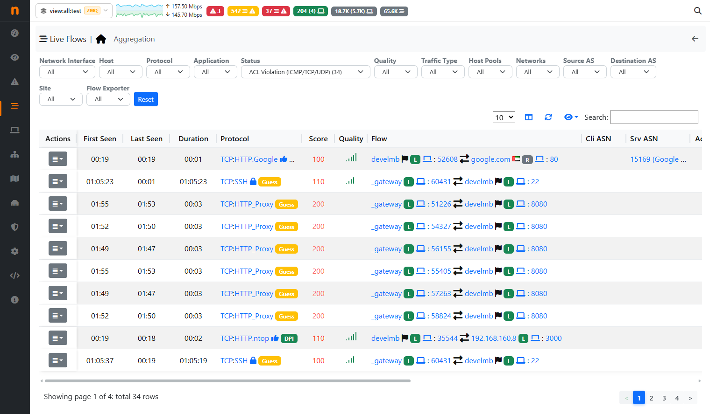

.. _AccessControlList:

Access Control List
-------------------

ntopng is able to define an Access Control List, used to trigger an alert in case one of the defined rules is not respected. It is also possible to restrict the check of these rules only to specified Networks CIDR/Hosts (`Scope Filters`_)

.. note::

  This feature is available with Enterprise L License or better.

.. note::

  This feature is available only if the ACL Violation alert is enabled.

Configuration
^^^^^^^^^^^^^

To enable this feature, first enable the ACL Violation alert.
There are two alerts for this feature:
 - ACL Violation (ARP), for ARP traffic.
 - ACL Violation (ICMP/TCP/UDP), for ICMP/TCP/UDP traffic.

.. note::

  Even if a rule is set but the alert is not enabled, no alert is going to be emitted by ntopng.

  ACL Violation alert

After enabling the alert, a new entry, called Access Control List, in the Settings section is going to be available, click there to jump to the Access Control List page.

  Access Control List

Adding Rules
^^^^^^^^^^^^

By clicking on the `+` button it is possible to Add a new Rule. By clicking on the action column instead of an already existing rule it is possible to Edit / Delete the rule.

  Add Rule

From here it is possible to configure a rule.
Click on the `Advanced Settings` to jump to a text-like field, where it is possible to directly write the rule. Each rule must be put on a newline, so one rule per line; each field must be
separated by a `;`
 - PROTOCOL;CLIENT;SERVER;PORT|APPLICATION

All parameters are mandatory except in some cases:
 - ARP protocol: in case of ARP protocol only the Protocol and Client MAC are to be added (ARP has FF:FF:FF:FF:FF:FF as Server);
 - TCP/UDP protocol: in case of these two protocols, PORT|APPLICATION are mandatory and only one of the two can be specified (application in text-like format, e.g. HTTP);
 - Other protocols: for all other protocols only the Protocol, Client IP and Server IP are required

.. note::

  PORT|APPLICATION are only available for the TCP/UDP protocols

In case of PORT|APPLICATION:
 - The application needs to be put in text-like format, e.g. HTTP, TLS, ...;
 - In case of ports, 3 possibilities are available: 
    - Configure a single port (e.g. 53);
    - Configure a port-range, set the starting port and ending port (e.g. 1-100);
    - Configure all ports to be accepted, in this case it can be done by putting the wildcard `*` or the `all` keyword (case insensitive);

It is not recommended to use the Advanced Settings if not for special cases, because in the other case all the controls are handled by ntopng.
It is moreover possible to add multiple rules in a single add, by clicking the `+` below the last rule; it is possible to remove a rule instead by clicking the trash icon.

Editing Rules
^^^^^^^^^^^^^

It is possible to edit an existing rule by clicking on the Action button and selecting `Edit`. The modal is the same as the Add, following the same rules; the only difference is that it's not possible to access the Advanced Settings feature.

.. figure:: ../../../img/edit_acl_rule.png
  :align: center
  :alt: Edit Rule

  Edit Rule

Delete Rules
^^^^^^^^^^^^

It is instead possible to delete rules, like for the Edit, by clicking on the Action button and selecting `Delete`. Other than that it's possible to delete all the rules by clicking on the red button `Delete All Rules` below the table.

Alert
^^^^^

After configuring everything, ntopng is going to start checking for flows not respecting the set rules and trigger the alerts;

  Flow Alert (ICMP/TCP/UDP)

  MAC Alert (ARP)

Scope Filters
^^^^^^^^^^^^^

In order to restrict the evaluation of the ACL rules, it is possible to create a list of Networks CIDR and Hosts.

By jumping to the `Scope Filters` section, a list of Networks CIDR/Hosts can be added.

This list will automatically exclude all the flows with both Client and Server hosts not inside the list (in order to be evaluated, at least one of the two needs to be inside the specified list).

  Scope Filters

The list of Networks CIDR and Hosts needs to be a list of comma or newline separated elements (both are accepted and parsed).
In case of typing errors, a check is done and the incorrect Network/Host will be displayed.

  Scope Filters Input Error

.. warning::
  The Scope Filters is global to ntopng, this means that all the Network Interfaces will have the same Scope Filters

Example
~~~~~~~

Below an example of ACL Rules set on a test Network, where the Local Network is the 192.168.160.0/24.

Here only ntopng and ZMQ protocols should be seen, for this reason, in the ACL, the ZMQ and ntopng flows are excluded; also the Scope Filters are set
to only check the flows inside that Network (there are other Networks in this enviroment)

  ACL Rules Example

  Scope Filters Example

  ACL Rules Example

Despite the huge amount of flows in the Enviroment, the ACL Rules are only triggered for the flows inside the specified Networks and with traffic different from ZMQ or ntopng.

