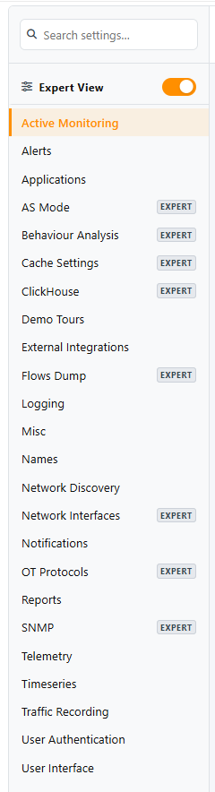
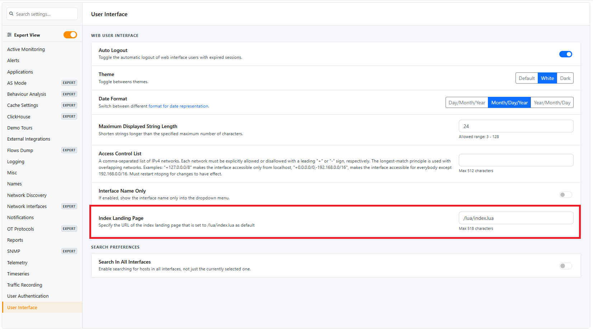
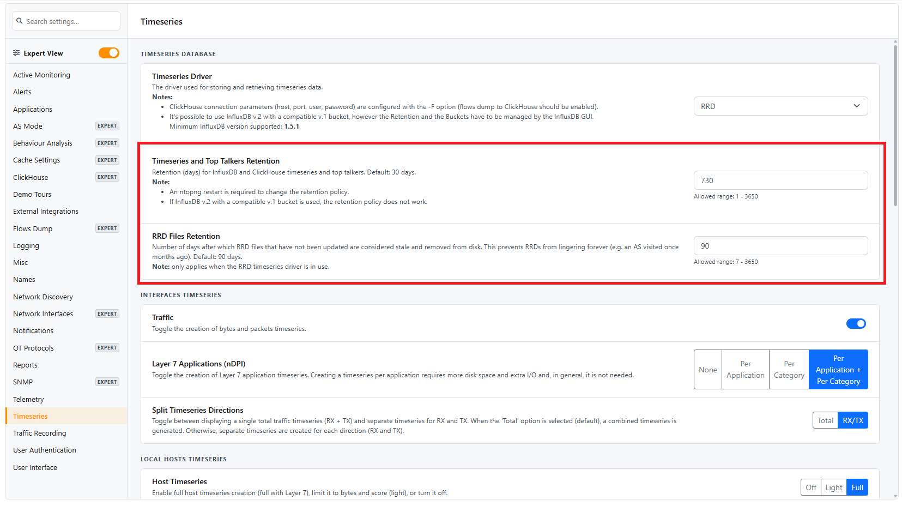

.. _Preferences:

Preferences
###########

Preferences menu entry enables the user to change runtime configurations. There are two types of settings (changeable by clicking the view at the end of the preferences menu) : `Expert View` and `Simple View`. The `Expert View` has all the configurable preferences, instead the `Simple View` only has the basic preferences.

  Preferences List

A thorough help is reported below every preference directly into ntopng web GUI.

Change ntopng Index Page
========================

It is possible to change the ntopng index page (e.g., instead of displaying the 'Traffic Dashboard' when opening ntopng, display the 'SNMP' page), by jumping to the 'Settings' and 'Preferences' tab.
From here jump to the 'User Interface' section and modify the 'Index Page' with the ntopng page desired to be displayed as an index.

For instance, by setting the 'Index Page' to '/lua/pro/enterprise/snmpdevices_stats.lua', when opening ntopng, the default page displayed is going to be the 'SNMP' one.

.. _Data Retention:

Data Retention
==============

Data retention is configurable from the preferences.

  Data Retention Configuration

Data retention is expressed in days and it affects:

- Top Talkers stored in sqlite
- Timeseries
- Historical flows

.. note::

  When using RRDs for timeseries, changing the data retention only affects new RRDs created after the change.

.. _Days Data Retention:

Flows/Alerts Data Retention
---------------------------

When flows are stored in ClickHouse, the *Flows/Alerts Data Retention* preference
(ClickHouse section) sets the number of days raw (unaggregated) flows and alerts are
kept. The default is 30 days.

The check runs daily: since ClickHouse data is partitioned by day, ntopng deletes the
whole daily partitions older than the configured number of days.

- Other ClickHouse data has its own retention, configured in the same section:
  aggregated flows, aggregated ASN data, vulnerability scan reports and Wazuh alerts.
  Timeseries follow the *Timeseries and Top Talkers Retention*.
- Aggregated flows must be kept longer than raw flows: when the raw flows retention
  is set to a value equal or greater than the aggregated flows retention, the latter
  is automatically set to the raw flows retention plus one day.
- If *Archive Flows Before TTL Deletion* is enabled, each day is archived to the
  *Flows Archive Path* before it is deleted (see the Historical Flows Archive for
  Compliance section of the ClickHouse documentation).

.. _Max Disk Space Retention:

Flows/Alerts Max Disk Space
---------------------------

When flows are stored in ClickHouse, retention can also be limited by disk space,
in addition to days. This lets ntopng keep as many days of flows as fit in the
available space, instead of a fixed number of days.

The *Flows/Alerts Max Disk Space (GB)* preference (ClickHouse section) sets the
maximum size of the ClickHouse database. The check runs daily: when the database
exceeds the limit, ntopng deletes the oldest days of raw (unaggregated) flows and
alerts, one daily partition at a time, until the database is back under the limit.

- The limit applies to the whole ntopng ClickHouse database, but only raw flows and
  alerts are deleted. Aggregated flows, aggregated ASN data, vulnerability scan reports,
  Wazuh alerts and timeseries keep their own retention.
- The current day is never deleted.
- The day-based :ref:`Flows/Alerts Data Retention <Days Data Retention>` still applies: data is deleted when
  either limit is reached.
- If archiving before deletion is enabled, each day is archived before it is deleted.
- Set the value to 0 (default) to disable the limit.

.. note::

  This preference reads partition sizes from the ClickHouse ``system.parts`` table.
  When the ClickHouse user configured in ntopng is not allowed to read it (e.g. it is
  granted only on the ntopng database and ``select_from_system_db_requires_grant``
  is enabled), the limit is not enforced and a warning is logged. In this case
  grant access to it, for instance:

  .. code:: sql

    GRANT SELECT ON system.parts TO <ntopng user>;

  The day-based retention does not require this grant.

User Authentication
===================

Authentication settings have moved to the dedicated :doc:`/authentication` page.

