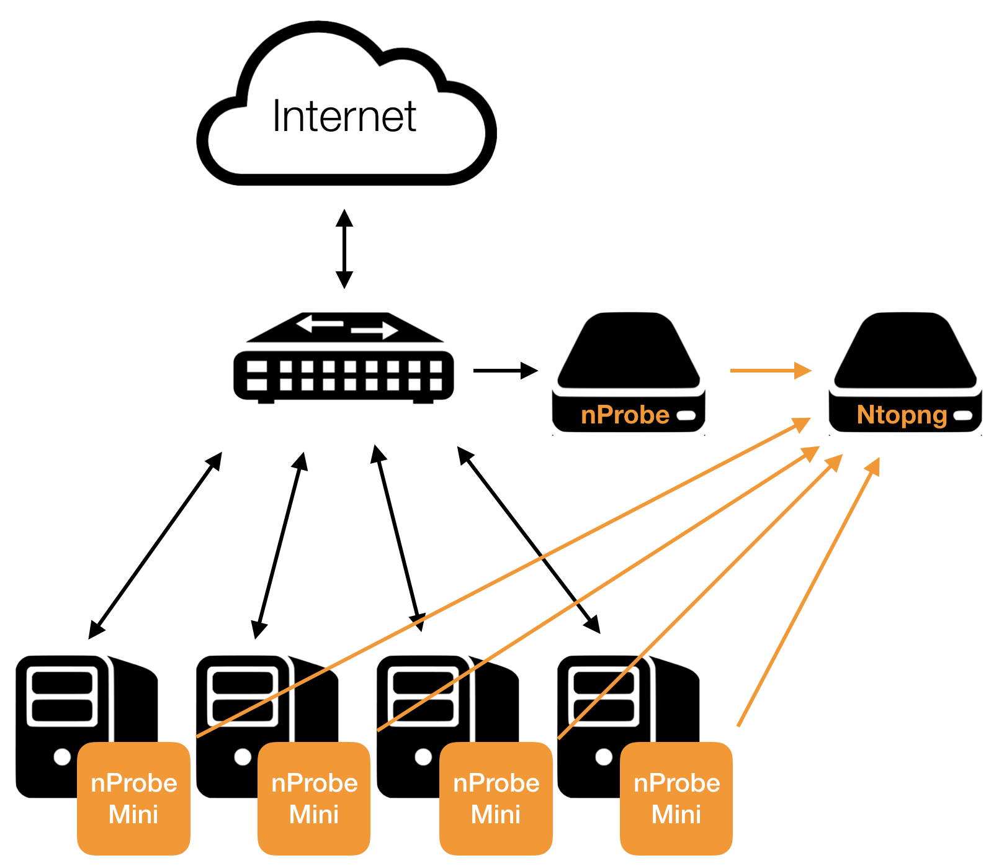
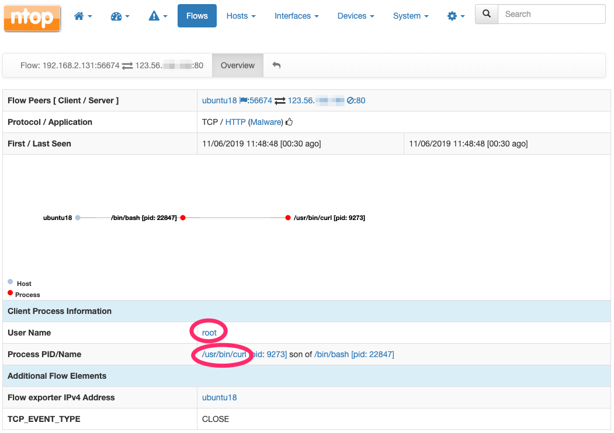
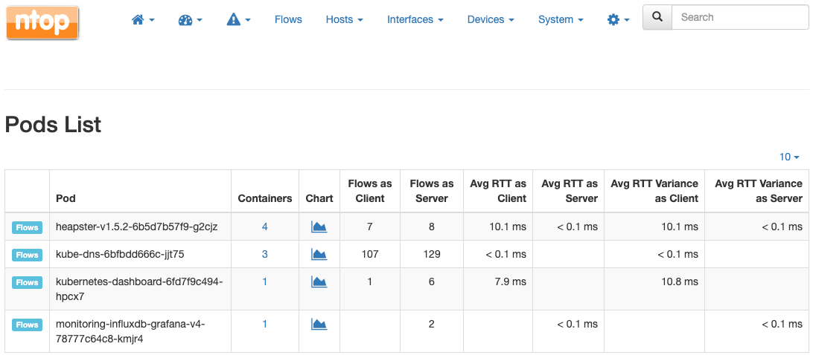

.. _UsingNtopngWithNprobeMini:

Using ntopng with nProbe Mini
#############################

nProbe™ Mini is a lightweight probe/agent that implements a low-overhead event-based monitoring, 
mostly based on technologies such as eBPF and Netlink. nProbe™ Mini enhances network visibility 
by means of system introspection. It enriches classical network data such as IP addresses, 
bytes and packets with system-introspected processes, users, containers, orchestrators, and 
other performance indicators.

For further information about nProbe Mini please visit the `product page <https://www.ntop.org/products/netflow/nprobe-mini/>`_ and the `nProbe Mini documentation <https://www.ntop.org/guides/nprobemini/>`_.

ntopng can be used to analyse and visualize data that has been generated or collected by nProbe Mini.
The following picture summarizes how they can be combined together.

  Using nProbe Mini with ntopng

Following is a minimum, working, configuration example of nProbe Mini and ntopng to obtain what 
has been sketched in the picture above. The example assumes both ntopng and nProbe Mini are running 
on the same (local) host. In case they run on separate machines, the IP address 127.0.0.1 has to be 
changed with the address of the machine hosting ntopng. You can even run multiple nprobe-mini and let 
them export to the same instance of ntopng.

*ntopng Configuration*

.. code:: bash

   ntopng -i tcp://*:1234c -m "192.168.1.0/24"

Where:

- *-i* specifies on which port ntopng has to listen for incoming data (see the port is 1234, the same used for nprobe-mini below)
- *-m* specifies the local network of interest.

*nProbe Mini Configuration*

.. code:: bash

   nprobe-mini -v --zmq tcp://127.0.0.1:1234c

Use Cases
=========

Trace-Back Users and Processes Behind Network Activities
--------------------------------------------------------

Finding the user who tried to download a file from a malware host, or Which process is he/she running, 
is one of the questions ntopng can answer when used in combination with nProbe™ Mini.

Let’s say you have detected certain flows towards a blacklisted host.

.. figure:: ./img/using_nprobe_mini_with_ntopng_blacklisted_host.png
  :align: center
  :alt: nProbe Mini and blacklisted hosts

  nProbe Mini and blacklisted hosts

Just by looking at the flows list you can easily spot the responsible which turns out to be user *root* 
attempting to perform a download using process *curl*.

.. figure:: ./img/using_nprobe_mini_with_ntopng_blacklisted_host_flows_list.png
  :align: center
  :alt: nProbe Mini: blacklisted host flows

  nProbe Mini: blacklisted host flows

At this point, it is possible to perform an additional drill down to get to the process and user ids, 
along with other details.

  nProbe Mini: blacklisted host flow details

Per-Container and Per-POD Network Activity and Performance Indicators
---------------------------------------------------------------------

Checking the the performance of a given container, or spotting the true bottlenecks in a OS-virtualized 
infrastructure, is another question ntopng can answer using it in combination with nProbe™ Mini. It is
possible to uncover container and POD activities and performance using, for example, the measured 
Round-Trip times of their communications.

.. figure:: ./img/using_nprobe_mini_with_ntopng_containers_list.png
  :align: center
  :alt: nProbe Mini: containers list

  nProbe Mini: containers list

  nProbe Mini: Pods list

