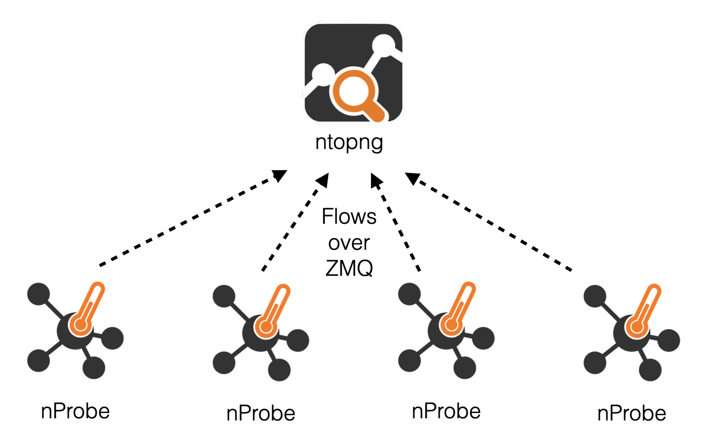
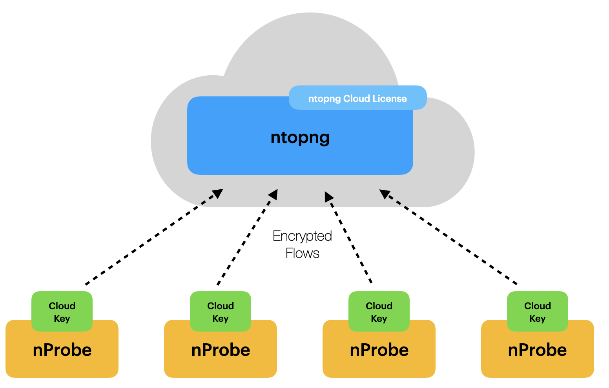
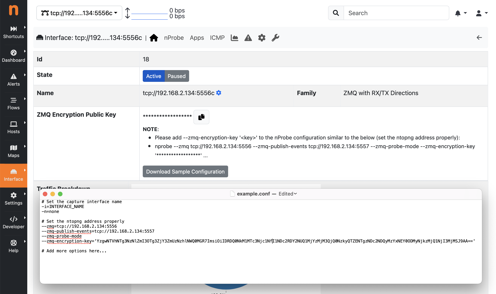

.. _UsingNtopngCloud:

Using ntopng Cloud with nProbe
##############################

The :ref:`UsingNtopngWithNprobe` section describes how ntopng can be used in combination
with nProbe to visualize traffic data that has been generated by a remote probe or collector.
This can be used to:

- Collect flow data exported by remote NetFlow/sFlow devices (e.g. routers and switches)
- Monitoring physical interfaces attached to a traffic mirror (SPAN port or TAP devices)

In a Cloud scenario, ntopng, running as a Cloud service, can collect traffic information
from multiple nProbe instances deployed in different locations of a distributed Network.
The remote nProbe instances deliver traffic to the centralized ntopng using the ZMQ
channel which supports data encryption, to ensure confidentiality for data that is moved
over Internet (see the Data Encryption section of :ref:`UsingNtopngWithNprobe`).

  Distributed Architecture

Implementing this with the standard licensing model requires to:

- Apply a license to the centralized ntopng instance
- Apply a license to the remote nProbe instances (one for each probe)

In addition to this, it is a good practice to also:

- Configure encryption on ntopng and generate a private/public key pair
- Configure the public encryption key on all the nProbe instances

The installation of a new probe (or reinstallation of a container or VM), requires
the generation and installation of a new nProbe license, that depends on the system
identifier (System ID).

In order to simplify this process, ntopng 5.7 introduces support for *Cloud Licenses*.

Cloud Licenses
==============

.. note::

   ntopng Cloud Licenses requires ntopng 5.7 and nProbe 10.3

A Cloud license is a License Key specifically designed for service providers that indend
to provide ntopng as a Cloud service. A Cloud key can be used to unlock an ntopng instance
and all the probes (up to the number allowed by the license ) connected to that ntopng instance.
No license needs to be installed on the probes, simplifying the probes installation and management.
When the system is running in Cloud mode, traffic is delivered in binary format and encrypted
over ZMQ. For this reason, a public key provided by ntopng must be configured to the remote
probes. 

  ntopng Cloud Architecture

Please note that the same public key is configured to all the probe instances, making
it easy to create a single image that is distributed to the remote location, as there is no
license key based on the system identifier involved.

ntopng Configuration
~~~~~~~~~~~~~~~~~~~~

In order to run ntopng in Cloud mode:

1. Install a Cloud License Key following the provided instructions.

2. Configure ntopng with one (or more) ZMQ collection endpoint and one ZMQ events endpoint.

3. Restart the service

ntopng configuration example:

.. code:: bash

   ntopng -i tcp://192.168.2.134:5556c --zmq-publish-events tcp://192.168.2.134:5557

Note:

The events endpoint (the same used when :ref:`UsingNtopngWithNprobeIPS`) is used to create
a control communication channel with the remote probe instances.

A private/public key pair is automatically generated by ntopng to create encrypted channels
both for collection and control.

In this configuration ntopng will listen on the configured ports for connections from the 
nProbe sensors. Make sure the firewall is configured properly.

nProbe Configuration
~~~~~~~~~~~~~~~~~~~~

After running ntopng, a Public Key for nProbe is generated. This key should be distributed 
with nProbe as it is used for data encryption, which is mandatory in this configuration.

The Public Key is available from the Interface -> Details page where it is possible to
*copy the Public Key* or *Download a Sample Configuration* for nProbe, which includes the
generated Public Key.

  nProbe Cloud Configuration

At this point it is possible to run nProbe that should be configure to export data to
ntopng using ZMQ and the Public Key generated by ntopng. Example:

.. code:: bash

   nprobe -i eno1 --ntopng tcp://192.168.2.134:5556 --zmq-publish-events tcp://192.168.2.134:5557 --zmq-probe-mode --zmq-encryption-key  'YzgwNTVhMTg...'

