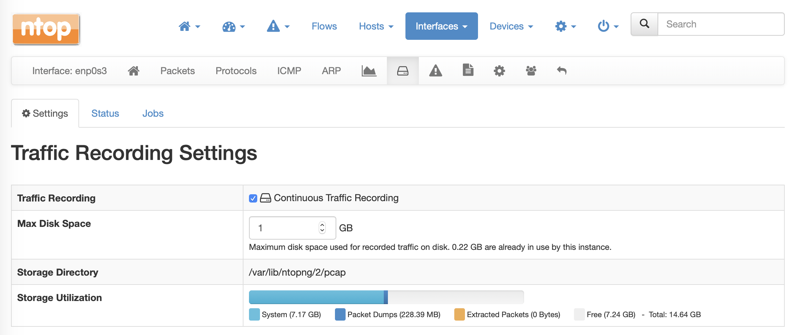
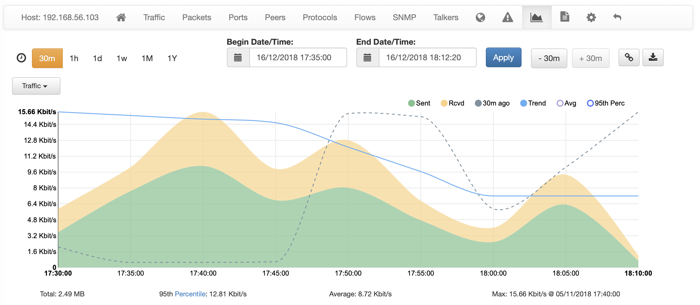
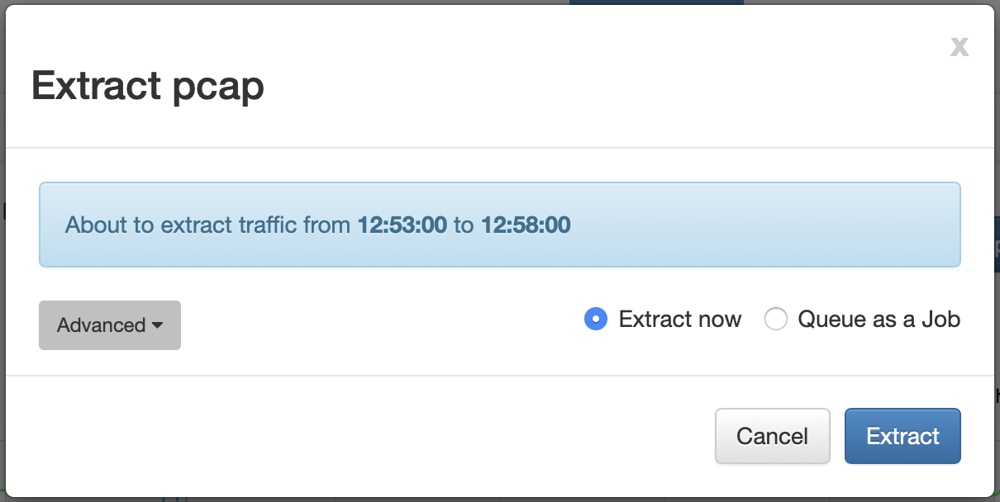
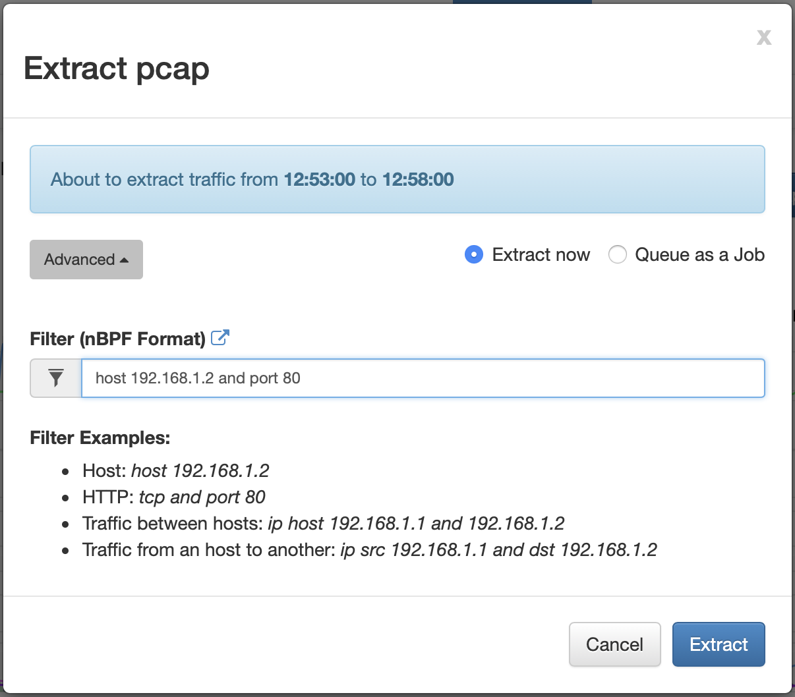

.. _UsingNtopngWithN2disk:

Using ntopng with n2disk
========================

When it comes to troubleshoot a network issue or analyse a security event,
going back in time and drilling down to the packet level could be crucial
to find the exact network activity that caused the problem.
Continuous traffic recording provides a window into network history, that
allows you to retrieve and analyse all the raw traffic in that period of time.

Enabling Traffic Recording
--------------------------

*ntopng*, since version 3.7, includes support for continuous traffic recording 
leveraging on *n2disk*, an optimized traffic recording application part of the 
*ntop* suite available on Linux systems. For this reason, in order to be able to 
enable this feature, both *ntopng* and *n2disk* need to be installed from packages
according to your Linux distribution (we assume that you already configured the 
`ntop repository <http://packages.ntop.org>`_ and have *ntopng* installed).

*apt*

.. code:: bash

   apt-get install n2disk

*yum*

.. code:: bash

   yum install n2disk

Please make sure that *ntopng* is running using the *ntopng* user, which
is the default since version 3.7, as reported in `this notice <https://www.ntop.org/support/faq/migrate-the-data-directory-in-ntopng/>`_.

In order to use *n2disk* a license is also required, you can get one at
`e-shop <http://shop.ntop.org>`_ or, if you are no-profit, research or an 
education institution please read `this <https://www.ntop.org/support/faq/do-you-charge-universities-no-profit-and-research/>`_.
The *n2disk* license can be installed directly from *ntopng* through the
*Preferences*, *Traffic Recording* menu. The same page also provides
the installed *n2disk* version and SystemID, both required to generate
the license.

.. note::

   ntopng Enterprise L already includes a n2disk 1 Gbit license, there is no need
   to buy a n2disk license if a ntopng Enterprise L license is installed.

  The Traffic Recording Preferences Page

At this point you are ready to start recording traffic. 
Packets are dumped to disk using the industry standard Pcap file format. The default 
folder for pcap files is the ntopng data directory, under the "pcap" folder of a 
specific network inteface id (e.g. `/var/lib/ntopng/0/pcap`), however it is possible to
replace the `/var/lib/ntopng` root folder with a different one adding *--pcap-dir <path>* 
to the *ntopng* configuration file.

.. note::

  For Continuous Traffic Recording with ZC or FPGA adapters please read the `ZC/FPGA Support`_ section.

In order to actually start recording traffic, you need to select an interface from 
the *Interfaces* menu, click on the disk icon, and configure the recording instance:

1. Select "Continuous Traffic Recording"
2. Configure the desired "Max Disk Space" value. This lets you control the maximum 
   disk space to be used for pcap files, which also affects the data retention time
   (when the maximum disk space is exceeded, the oldest pcap file is overwritten).
   Please note that the data retention time also depends on the traffic throughput 
   of the networks being monitored.
3. Press the "Save Settings" button to actually start recording.

  The Traffic Recording Page

At this point a new badge should appear on the top status bar. 
When the badge is blue, it means that traffic recording is running. Instead, when 
the badge is red, it means that there is a failure. 

.. figure:: ../img/web_gui_interfaces_recording_badge.png
  :align: center
  :alt: Traffic Recording Badge

  The Traffic Recording Badge in the Footer

It is possible to get more information about the *n2disk* service status by 
clicking on the badge. The status page provides information including the uptime
of the recording service, statistics about processed traffic, the log trace.

  The Traffic Recording Status Page

External Traffic Recording Providers
~~~~~~~~~~~~~~~~~~~~~~~~~~~~~~~~~~~~

One can manage n2disk services manually using the command line. In
this case, one can configure ntopng to bind to an external traffic
recording provider. Traffic recording providers are configured from
the interface settings page. A dropdown menu with the list of
available recording providers is shown.

  The Selection of External Traffic Recording Providers

.. note::

   In case n2disk processes are managed manually using configuration
   files, ntopng will not show a settings tab nor it will allow any
   configuration change. However, extractions will still be possible
   as described in the following section.

Traffic Extraction
------------------

All pcap files dumped to disk are indexed on-the-fly by *n2disk* to improve traffic 
extraction speed when recorded data need to be retrieved.
It is possible to extract traffic from multiple places in *ntopng*, including the interface
and the host *Historical Traffic Statistics* pages. 

After enabling continuous traffic recording on an interface, a new button for extracting
traffic appears at the top right corner of the *Historical Traffic Statistics* page.

  The Extract Pcap Button in the Interface Historical Traffic Statistics page

  The Extract Pcap Button in the Host Historical Traffic Statistics Page

By clicking on the button, a dialog box will let you run an extraction to retrieve the 
traffic matching the time interval selected on the chart. It is possible to download the
extracted traffic directly (this should be used when the expected amount of extracted 
traffic is low) or queue the extraction job to process traffic in background (this should 
be used for extractions taking too long, or to archive extracted data on the machine running 
ntopng).

  The Extract Pcap Dialog

In addition to the time constraint, it is possible to configure a BPF-like filter, 
to further reduce the extracted amount of data, by clicking on the *Advanced*. button 
The filter format is described at `Packet Filtering <https://www.ntop.org/guides/n2disk/filters.html>`_.

  The Extract Pcap Dialog Filter

The extraction button is also available in several other places while browsing the
historical data, an example is the list of the *Top Receivers* or *Top Senders* available 
at the bottom of the *Interface Historical Traffic Statistics* page. In this case, a button
on the right side of the row lets you download the traffic matching a specific host in the
selected time interval.

  The Extract Pcap Button in the Top Receivers in the Interface Historical Traffic Statistics Page

When an extraction job is scheduled for background processing by selecting the *Queue as Job* option, 
ntopng extracts the traffic and creates new *pcap* files with the traffic. This usually requires a few 
seconds, depending on a few factors, including: the time interval, the amount of recorded data, the 
extraction filter. 

A reference for the extraction job (a link to the *Traffic Extraction Jobs* page with the list of 
scheduled extractions, and the extraction *ID*) is provided after starting the extraction, in order 
to control the status and download the pcap file(s) as soon as the extraction is completed.
Extraction jobs can be stopped anytime using the *Stop* button, in case of extractions taking too 
long, or removed using the *Delete* button (this will also delete the corresponding pcap files).

  The Traffic Extraction Jobs page

It is possible to access the *Traffic Extraction Jobs* page also by clicking on the badge that 
appears on the top status bar when there is at least one extraction job scheduled.

.. figure:: ../img/web_gui_interfaces_extraction_badge.png
  :align: center
  :alt: Traffic Extraction Jobs Badge

  The Traffic Extraction Jobs Badge in the Top Status Bar

REST API
~~~~~~~~

The pcap file can also be downloaded directly through http, running a live extraction. 
It is possible to use a command line tool such as `wget` or `curl` for this.
The direct URL for downloading the pcap is 
:code:`http://<ntopng IP>:3000/lua/rest/get/pcap/live_extraction.lua?ifid=<id>&epoch_begin=<epoch>&epoch_end=<epoch>[&bpf_filter=<filter>]`

Where:

- *ifid* is the interface Id as reported by *ntopng* in the interface page
- *epoch_begin* is the start of the time interval to be extracted (epoch)>
- *epoch_end* is the end of the time interval to be extracted (epoch)>
- *bpf_filter* is a filter in `nBPF <https://www.ntop.org/guides/n2disk/filters.html>`_ format

Please note that you should use cookies for authentication, as explained in the documentation. 
For example with `curl` you can specify username and password with :code:`--cookie "user=<user>; password=<password>"`

Command line tools are useful for example to process a pcap stream and pipe it to an analysis tool such as `tcpdump` or `tshark`/`wireshark`. 
For example, to process the extracted traffic directly with `wireshark`, it is possible to use `curl` as in the example below:

.. code:: bash
	  
   curl -s --cookie "user=admin; password=admin" "http://192.168.1.1:3000/lua/rest/get/pcap/live_extraction.lua?ifid=1&epoch_begin=1542183525&epoch_end=1542184200" | wireshark -k -i -

.. _ZCSupportSection:

ZC/FPGA Support
---------------

If you need to process traffic at high rate at 10/40Gbit and above, you are probably looking for
capture technologies like `PF_RING ZC <http://www.ntop.org/guides/pf_ring/zc.html>`_ for Intel
or `FPGA <http://www.ntop.org/guides/pf_ring/modules/index.html>`_ adapters.

As both PF_RING ZC and FPGA adapters are based on kernel bypass, the drawback is that they do not 
allow you to capture the same stream from multiple applications at the same time. This means that
you cannot run ntopng for traffic analysis and n2disk for raw traffic recording at the same time
on the same interface.

In order to overcome this, n2disk is able to export flow metadata to ntopng over ZMQ, similar to
what nProbe does as explained in the `Using ntopng with nProbe <http://www.ntop.org/guides/ntopng/using_with_nprobe.html>`_ section. 
As depicted below, in this configuration n2disk can be configured to capture raw packets, dump PCAP 
data to disk, and export flow metadata in JSON format through ZMQ to ntopng at the same time. 

  Support for n2disk ZMQ export

Following is a sample configuration of n2disk and ntopng to achieve what has been depicted above. 
This example assumes that both n2disk and ntopng are running on the same host.

*ntopng Configuration File*

In order to process flow metadata through ZMQ in ntopng, you need to add a collector interface to
the configuration file (*/etc/ntopng/ntopng.conf*):

.. code:: bash

   -i=tcp://*:5556c

*n2disk Configuration File*

The ntopng endpoint should be added to the n2disk configuration file (e.g. */etc/n2disk/n2disk-nt01.conf)* 
using the :code:`--zmq` option.
The :code:`--zmq-probe-mode` option (if ntopng is running as a collector like in this example: notice 
the small :code:`c` in the ntopng endpoint) and the :code:`--zmq-export-flows` option (to export flow 
metadata in addition to traffic statistics) are also required.

It is a good practice to run n2disk using the *ntopng* user (see :code:`-u`) in order to make sure that
ntopng is able to access the PCAP data recorded by n2disk and run traffic extractions.

Please see the `n2disk User's Guide <http://www.ntop.org/guides/n2disk/index.html>`_ for further information
about the other options. Please note that in the example below n2disk is aggregating traffic in hardware
from 2 ports of a Napatech adapter, please see the `Napatech configuration <http://www.ntop.org/guides/n2disk/napatech.html>`_
for configuring the adapter.

.. code:: bash

   --interface=nt:0,1
   --dump-directory=/storage/n2disk/pcap
   --timeline-dir=/storage/n2disk/timeline
   --disk-limit=80%
   --max-file-len=1000
   --buffer-len=4000
   --max-file-duration=60
   --index
   --snaplen=1536
   --writer-cpu-affinity=0
   --reader-cpu-affinity=1
   --compressor-cpu-affinity=2,3
   --index-on-compressor-threads
   -u=ntopng
   --zmq=tcp://127.0.0.1:5556
   --zmq-probe-mode
   --zmq-export-flows

At this point you should start both the ntopng service (e.g. *systemctl start ntopng*) and the n2disk
service (e.g. *systemctl start n2disk@nt01*), and configure the n2disk instance as external PCAP source
for the collector interface as explained in the `External Traffic Recording Providers`_ section in order
to be able to check the n2disk service status and run traffic extractions.

