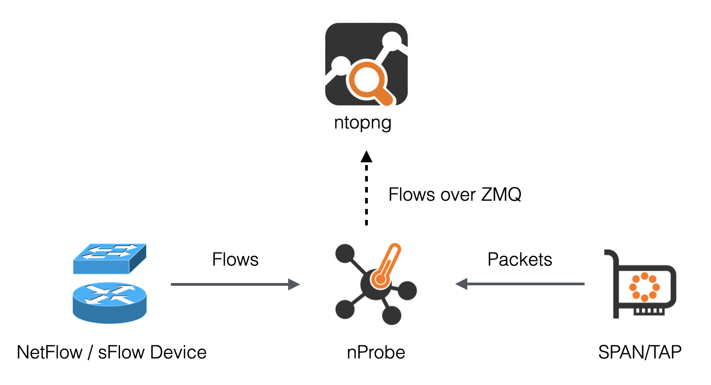
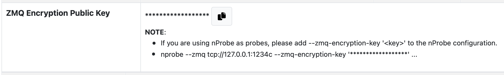

.. _UsingNtopngWithNprobe:

Using ntopng with nProbe
########################

ntopng can be used to visualize traffic data that has been generated or collected by nProbe. 

.. note::

   ntopng Enterprise L already includes a nProbe Pro license, there is no need
   to buy a nProbe license if a ntopng Enterprise L license is installed.

Using ntopng with nProbe is convenient in several scenarios, including:

- *The visualization of NetFlow/sFlow data originated by routers, switches, and network devices in general.* In this scenario, nProbe collects and parse NetFlow/sFlow traffic from the devices, and send the resulting flows to ntopng for the visualization.
- *The monitoring of physical network interfaces that are attached to remote systems.*  In this scenario, ntopng cannot directly monitor network interfaces nor it can see their packets. One or multiple nProbe can be used to capture remote network interfaces traffic and send the resulting flows towards a central ntopng for the analysis and visualization.

The following picture summarizes the two scenarios highlighted above and demonstrates that they can also be combined together.

  Using nProbe with ntopng

In the picture above, arrows from nProbe to ntopng represent the logical direction of exported flows. In practice:

 - The actual connection can either be initiated by ntopng or nProbe as discussed in `Using Behind a Firewall`_.
 - nProbe export flows in TLV format, or optionally as standard JSON, over ZMQ (http://zeromq.org/). The benefits of this are described in detail in the following blog post http://www.ntop.org/nprobe/why-nprobejsonzmq-instead-of-native-sflownetflow-support-in-ntopng/.

Following is a minimum, working, configuration example of nProbe and ntopng to obtain what has been sketched in the picture above. The example assumes both ntopng and nProbe are running on the same (local) host. In case they run on separate machines, the IP address :code:`127.0.0.1` has to be changed with the address of the machine hosting nProbe.

*ntopng Configuration*

.. code:: bash

	  ntopng -i tcp://127.0.0.1:5556

*nProbe Configuration*

.. code:: bash

	  nprobe --zmq "tcp://*:5556" -i eth1 -n none -T "@NTOPNG@" # raw packets
	  nprobe --zmq "tcp://*:5556" -i none -n none --collector-port 2055 -T "@NTOPNG@" # NetFlow/sFlow over UDP on port 2055

Option :code:`-T "@NTOPNG@"`, known as template, tells nprobe the minimum set of fields it has to export in order to ensure interoperability with ntopng. Specifying this option is recommended when using nProbe with ntopng. Other collectors may require different sets of fields in order to work. Templates and exported fields are discussed below.

For more information about configuring nProbe for ntopng check out https://www.ntop.org/nprobe/best-practices-for-the-collection-of-flows-with-ntopng-and-nprobe.

Exported Flow Fields
====================

One of the benefits of exporting flows in TLV or JSON is that they have no fixed format. As a consequence, the set of fields exported from nProbe to ntopng is variable and *configurable* using an nProbe template. In order to ensure interoperability with ntopng, this template, defined with nprobe option :code:`-T`, should contain the following minimum set of fields:

.. code:: text

	  %IN_SRC_MAC %OUT_DST_MAC %SRC_VLAN %IPV4_SRC_ADDR %IPV4_DST_ADDR %L4_SRC_PORT %L4_DST_PORT %IPV6_SRC_ADDR %IPV6_DST_ADDR %IP_PROTOCOL_VERSION %PROTOCOL %L7_PROTO %IN_BYTES %IN_PKTS %OUT_BYTES %OUT_PKTS %FIRST_SWITCHED %LAST_SWITCHED %FLOW_TO_APPLICATION_ID %FLOW_TO_USER_ID %INITIATOR_GW_IP_ADDR %EXPORTER_IPV4_ADDRESS

Rather that specifying all the fields above one by one, an handy macro :code:`@NTOPNG@` can be used as an alias for all the fields. nProbe will automatically expand such macro during startup. Hence, the following two configurations are equivalent:

.. code:: bash

	  nprobe --zmq "tcp://*:5556" -i eth1 -n none -T "@NTOPNG@"
	  nprobe --zmq "tcp://*:5556" -i eth1 -n none -T "%IN_SRC_MAC %OUT_DST_MAC %SRC_VLAN %IPV4_SRC_ADDR %IPV4_DST_ADDR %L4_SRC_PORT %L4_DST_PORT %IPV6_SRC_ADDR %IPV6_DST_ADDR %IP_PROTOCOL_VERSION %PROTOCOL %L7_PROTO %IN_BYTES %IN_PKTS %OUT_BYTES %OUT_PKTS %FIRST_SWITCHED %LAST_SWITCHED"

Additional fields can be combined with the macro :code:`@NTOPNG@` to specify extra fields that will be added to the minimum set. For example:

.. code:: bash

	  nprobe --zmq "tcp://*:5556" -i eth1 -n none -T "@NTOPNG@ %FLOW_TO_APPLICATION_ID %FLOW_TO_USER_ID %INITIATOR_GW_IP_ADDR %EXPORTER_IPV4_ADDRESS"

Collecting from Multiple Exporters
==================================

There are two main ways to gather flows from multiple NetFlow/sFlow exporters and visualize data into ntopng:

1. By running a single nProbe instance, and directing all the exporters to the same nProbe port.
   This is the simpler option since adding a new exporter does not require any modification of
   the nProbe/ntopng configurations. It is also possible to enable `Dynamic Interfaces Disaggregation`_
   by Probe IP to separate the exporters flows.

2. By running multiple nProbe instances, one for each exporter. This method is the most performant
   because each exported data will be handled by a separate thread into ntopng so it can leverage
   the CPU cores of a multicore system.

Here is an example on how to configure multiple nProbe instances (second approach):

.. code:: bash

    ntopng -i "tcp://127.0.0.1:5556" -i "tcp://127.0.0.1:5557"
    nprobe --zmq "tcp://*:5556" -i none -n none --collector-port 2055
    nprobe --zmq "tcp://*:5557" -i none -n none --collector-port 6343

In this examples two NetFlows exporters export flows to ports 2055 and 6343 respectively.
nProbe uses two separate ZMQ channels to communicate with ntopng. The two exporters flows
will be split into two separate virtual network interfaces into ntopng:

     - `tcp://127.0.0.1:5556`: flows from exporter on port 2055
     - `tcp://127.0.0.1:5557`: flows from exporter on port 6343

.. _`Dynamic Interfaces Disaggregation`: advanced_features/dynamic_interfaces_disaggregation.html

Using Behind a Firewall
=======================

In the remainder of this section it is shown how to connect nProbe and ntopng in presence of a NAT or firewalls. Indeed, the examples given above might not have worked well in case there was a firewall or a NAT between nProbe and ntopng. Following it is shown an exhaustive list of all the possible scenarios that may involve firewalls or NATs, and the configuration that has to be used to always ensure connectivity between nProbe and ntopng.

**nProbe and ntopng on the same private network (firewall protected)**

In this scenario, the firewall does not create any trouble to ZMQ communications and the normal configurations described above can be used.

**nProbe on a public network/IP, ntopng on a private network/IP protected by a firewall**

In this case the ZMQ paradigm works well as ntopng connects to nProbe and the normal configurations highlighted above can be used.

**nProbe on a private network/IP, ntopng on a public network/IP protected by a firewall**

In this case the ZMQ paradigm does not work as the firewall prevents ntopng (connection initiator) to connect to nProbe. In this case it is necessary to revert the ZMQ paradigm by swapping the roles of nProbe and ntopng. Suppose nProbe runs on host :code:`192.168.1.100` and ntopng on host :code:`46.101.x.y`. In this scenario it is necessary to start the applications as follows

.. code:: bash

	  nprobe --zmq-probe-mode --zmq "tcp://46.101.x.y:5556" -i eth1 -n none
	  ntopng -i "tcp://*:5556c"

Note the two options:

- :code:`--zmq-probe-mode` tells nProbe to initiate a connection to :code:`46.101.x.y`
- :code:`-i "tcp://*:5556c"` tells ntopng to act as a collector (notice the small :code:`c`) and to listen for incoming connections.

In essence the roles of nProbe and ntopng have been reverted so they behave as NetFlow/IPFIX probes do. Only the roles have been reverted. Everything else will continue to work normally and the flows will still go from nProbe to ntopng.

Collector Passthrough
=====================

nProbe can be configured with option :code:`--collector-passthrough` to collect NetFlow/sFlow and immediately send it verbatim to ntopng. This may be beneficial for performances in high-speed environments. See https://www.ntop.org/guides/nprobe/case_study/flow_collection.html for a full discussion.

Data Encryption
===============

ntopng and nProbe support data encryption over ZMQ. This is based on the native CURVE encryption support in ZMQ, and it is available with ZMQ >= 4.1.

In order to enable encryption, the :code:`--zmq-encryption` option should be added to the configuration file. A private/public key pair is automatically generated by ntopng and the public key is displayed in the interface status page. 

  Encryption Public Key

The public key should be configured in nProbe (the same applies to cento and n2disk when used as probes for ntopng, or other ntopng instances when used as data producers in a 
`hierarchical cluster <https://www.ntop.org/ntopng/creating-a-hierarchical-cluster-of-ntopng-instances/>`_) by using the :code:`--zmq-encryption-key '<pub key>'` option.

Example:

- Suppose you want to run nprobe and ntopng on the same host and send flows on ZMQ port 1234
- Start ntopng as follows: :code:`ntopng -i tcp://127.0.0.1:1234 --zmq-encryption`
- Connect to the ntopng web GUI, select the ZMQ interface as in the above picture and copy the value of --zmq-encryption-key '...'
- Start nprobe as follows:  :code:`nprobe --zmq-encryption-key '<pub key>' --zmq tcp://127.0.0.1:1234`

ntopng saves the ZMQ public/private keypairs under /var/lib/ntopng/<interface id>/key.{pub,priv}
  

Quick Start
===========

A sample configuration file for running ntopng as ZMQ collector for nProbe is installed on Unix 
systems under /etc/ntopng/ntopng.conf.nprobe.sample. As described in the *Running ntopng as a Daemon*
section, the configuration file has to be named ntopng.conf and must be placed under /etc/ntopng/ when 
running ntopng as a daemon on Unix systems with *init.d* or *systemd* support. In order to enable 
this configuration, you should replace the configuration file with the sample configuration and
restart the service:

.. code:: bash

   cp /etc/ntopng/ntopng.conf.nprobe.sample /etc/ntopng/ntopng.conf
   systemctl restart ntopng

Please note that the sample configuration assumes that both ntopng and nProbe are running on the 
same (local) host. In case they run on separate machines, the configuration file has to be changed 
with the address of the machine hosting nProbe.

Similarly, a sample configuration file for nProbe is also installed (by the *nprobe* package) on Unix 
systems under /etc/nprobe/nprobe.conf.ntopng.sample. In order to enable this configuration, also in
this case, you should replace the configuration file with the sample configuration and restart the 
service:

.. code:: bash

   cp /etc/nprobe/nprobe.conf.ntopng.sample /etc/nprobe/nprobe.conf
   systemctl restart nprobe

Please note that the sample configuration for nProbe assumes that a NetFlow exporter is delivering
NetFlow to nProbe on port 6363. In this case nProbe acts as a proxy, collecting NetFlow and delivering 
flows to ntopng over ZMQ. If you need to process live traffic on a physical interface, the interface 
name should be set in place of :code:`-i=none` and :code:`--collector-port=6363` should be commented out.

