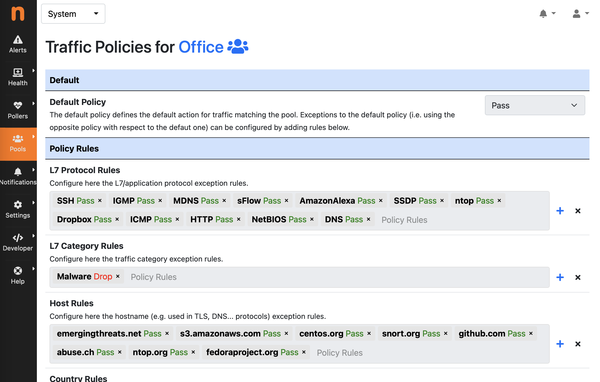

.. _UsingNtopngWithNprobeIPS:

Using ntopng with nProbe IPS
############################

ntopng can be used to enforce traffic policies and report them, when ntopng is used in 
combination with `nProbe in IPS mode <https://www.ntop.org/guides/nprobe/ips_mode.html>`_.

.. note::

   A ntopng Pro or Enterprise license is required.

Traffic policies are automatically exported to nProbe after a change to the policies configuration, or
when a new nProbe instance connects to ntopng via ZMQ. In order to publish IPS events (including policies)
an additional ZMQ channel is required. This can be configured using the :code:`--zmq-publish-events` option to 
configure the ntopng ZMQ endpoint for IPS events. Example:

.. code:: bash

   nprobe --zmq tcp://*:1234 --ips-mode none --zmq-publish-events tcp://127.0.0.1:5557 -i nf:0
   ntopng -i tcp://127.0.0.1:1234 --zmq-publish-events tcp://*:5557

Please refer to the `nProbe documentation <https://www.ntop.org/guides/nprobe/ips_mode.html>`_ for more 
details about the nProbe configuration and working mode.

A different traffic policy can be configured for each pool of hosts (see :ref:`HostPools`) by clicking on the “key” button in 
the *Pools* > *Host Pool Members* page, after selecting the *System* interface.

.. figure:: ../img/web_gui_interfaces_edit_host_pool_policy.png
  :align: center
  :alt: Edit Host Pool Policy

  The Host Pool Page

The policies configuration includes a default policy, that can be Pass or Drop (Default Deny), and
more specific rules that can be used to configure exceptions with respect to the default policy, including:

- L7 Application Protocol Rules
- L7 Category Rules
- Host Rules to configure hostnames used in TLS and DNS protocols for instance
- Country Rules
- Continent Rules
- Risk Rules to apply policies based on the Flow Risk computed by nDPI

  The Traffic Policies Page

An *Auto Configure* functionality is also available to automatically create a recommended configuration
for the Traffic Policy by leveraging on the protocols/hosts seen by ntopng for the devices belonging to the Pool
(please note ntopng should run for at least 1 day in order to get the best results). Please note that this
configuration is a *guess* and should be manually fine tuned. This feature is particularly useful in case of 
devices which are supposed to use a limited/static set of services, which is the case of *IoT devices* for 
instance. In this case the *Default Policy* is set to Drop (*Default Deny*) and the *Auto Configure* 
functionality adds those L7 protocols and hostnames which are actually required for the device to work 
(according to the historical data). In order to populate *Host Rules*, the *Top Visited Sites* euristic 
should be enabled under *Settings* > *Preferences* > *Applications*.

.. figure:: ../img/web_gui_interfaces_autoconfigure_policies.png
  :align: center
  :alt: Auto Configure Traffic Policies

  The Auto Configure Feature
