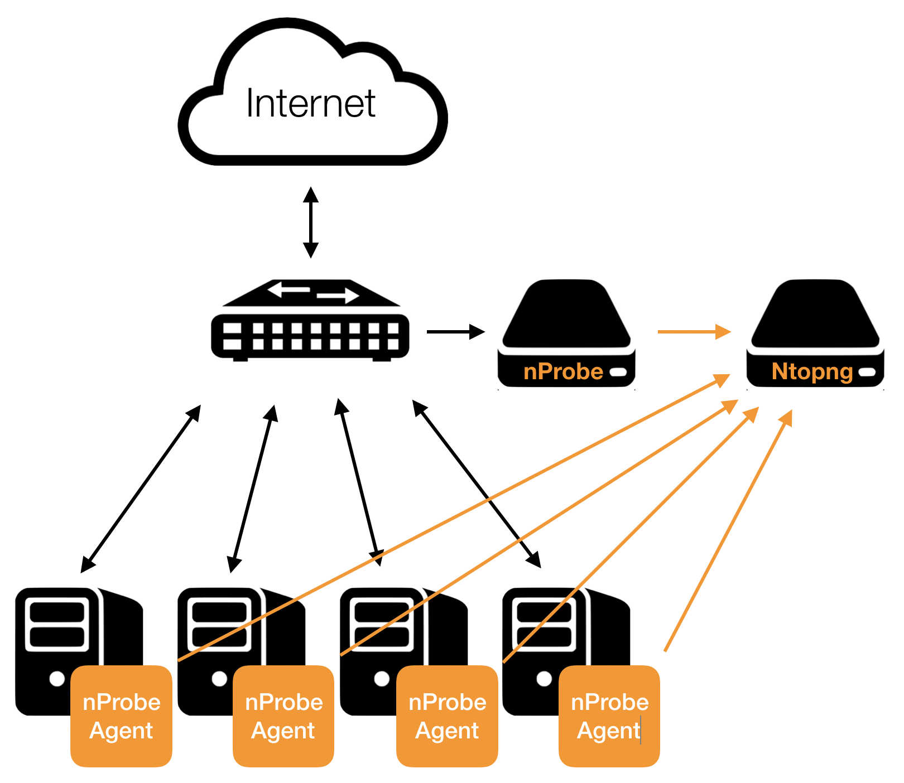
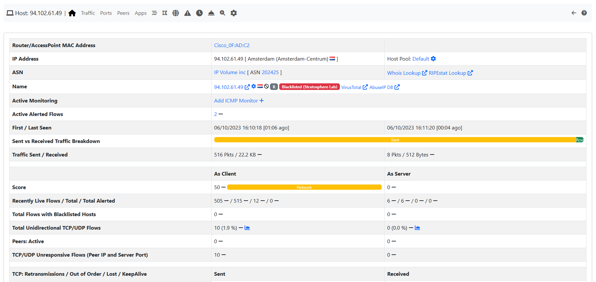
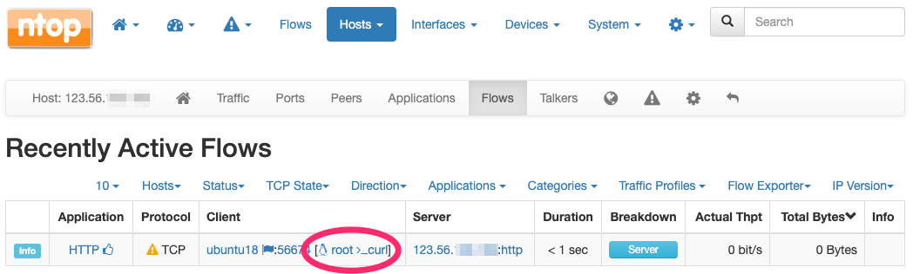
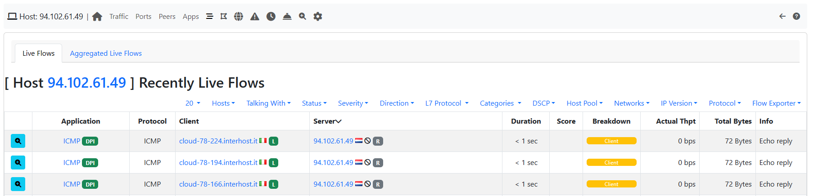
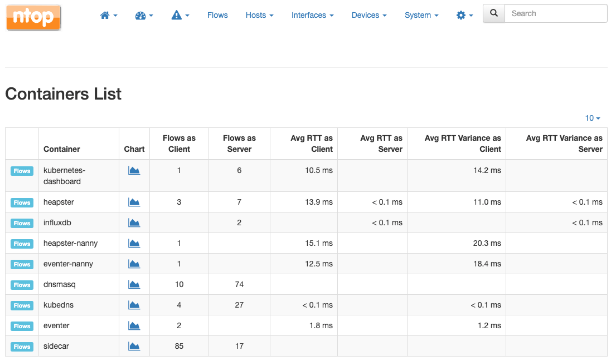
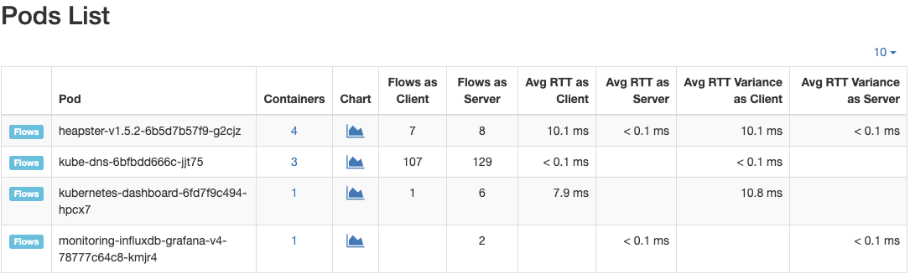

.. _UsingNtopngWithNprobeAgent:

Using ntopng with nProbe Agent
##############################

nProbe™ Agent is a lightweight probe/agent that implements a low-overhead event-based monitoring, 
mostly based on technologies such as eBPF and Netlink. nProbe™ Agent enhances network visibility 
by means of system introspection. It enriches classical network data such as IP addresses, 
bytes and packets with system-introspected processes, users, containers, orchestrators, and 
other performance indicators.

For further information about nProbe Agent please visit the `product page <https://www.ntop.org/products/netflow/nprobe-agent/>`_ and the `nProbe Agent documentation <https://www.ntop.org/guides/nprobeagent/>`_.

ntopng can be used to analyse and visualize data that has been generated or collected by nProbe Agent.
The picture below shows how they can be combined together.

  Using nProbe Agent with ntopng

Following is a minimal, working, configuration example of nProbe Agent and ntopng to obtain what 
has been sketched in the picture above. The example assumes both ntopng and nProbe Agent are running 
on the same (local) host. In case they run on separate machines, the IP address 127.0.0.1 has to be 
changed with the address of the machine hosting ntopng. You can even run multiple nprobe-agent and let 
them export to the same instance of ntopng.

*ntopng Configuration*

.. code:: bash

   ntopng -i tcp://*:1234c -m "192.168.1.0/24"

Where:

- *-i* specifies on which port ntopng has to listen for incoming data (see the port is 1234, the same used for nprobe-agent below)
- *-m* specifies the local network of interest.

*nProbe Agent Configuration*

.. code:: bash

   nprobe-agent -v --zmq tcp://127.0.0.1:1234

Where:

- *--zmq* specifies the ntopng ZMQ endpoint
- *-v* sets the verbosity for printing all exported information on screen. 

For a full list of options please check the `nProbe Agent documentation <http://www.ntop.org/guides/nprobemini/cli_options.html>`_.

Use Cases
=========

This section contains a few use cases for nProbe Agent and its integration with ntopng.

Trace-Back Users and Processes Behind Network Activities
--------------------------------------------------------

Finding the user who tried to download a file from a malware host, or Which process is he/she running, 
is one of the questions ntopng can answer when used in combination with nProbe™ Agent.

Let’s say you have detected certain flows towards a blacklisted host.

  nProbe Agent and blacklisted hosts

Just by looking at the flows list you can easily spot the responsible which turns out to be user *root* 
attempting to perform a download using process *curl*.

  nProbe Agent: blacklisted host flows

At this point, it is possible to perform an additional drill down by clicking on the flow *Info* and then
*Overview* to get to the process and user ids, along with other details.

  nProbe Agent: blacklisted host flow details

Per-Container and Per-POD Network Activity and Performance Indicators
---------------------------------------------------------------------

Checking the the performance of a given container, or spotting the true bottlenecks in a OS-virtualized 
infrastructure, is another question ntopng can answer using it in combination with nProbe™ Agent. It is
possible to uncover container activities and performance using, for example, the measured Round-Trip 
times of their communications.

It is possible to access the containers list through the *Hosts* -> *Containers* menu.

  nProbe Agent: containers list

The same applies to Pods: it is possible to access the PODs list through the *Hosts* -> *Pods* menu.

  nProbe Agent: Pods list

