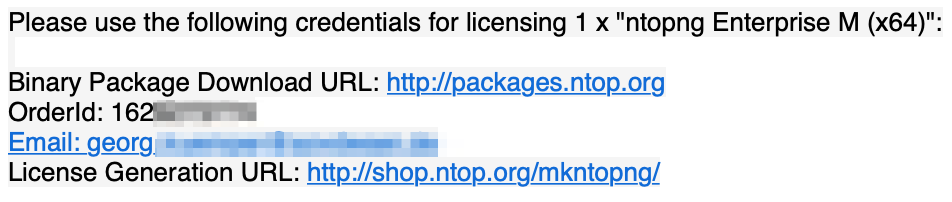
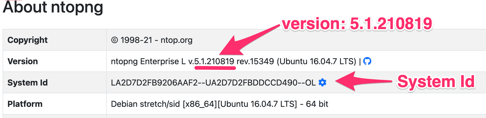
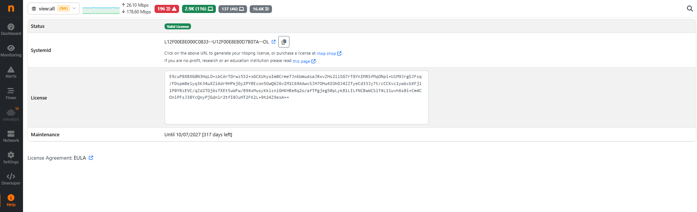
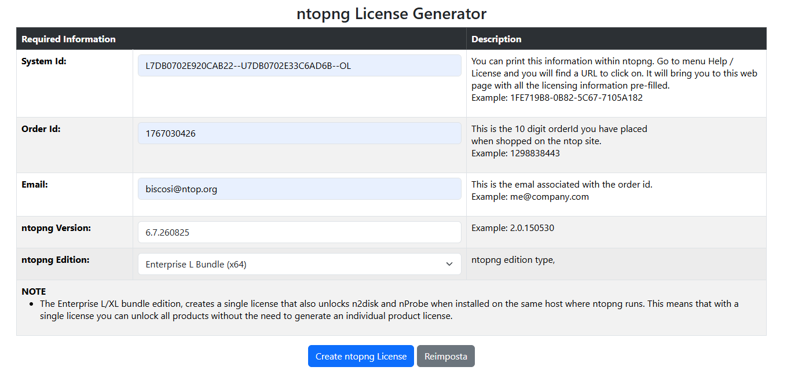
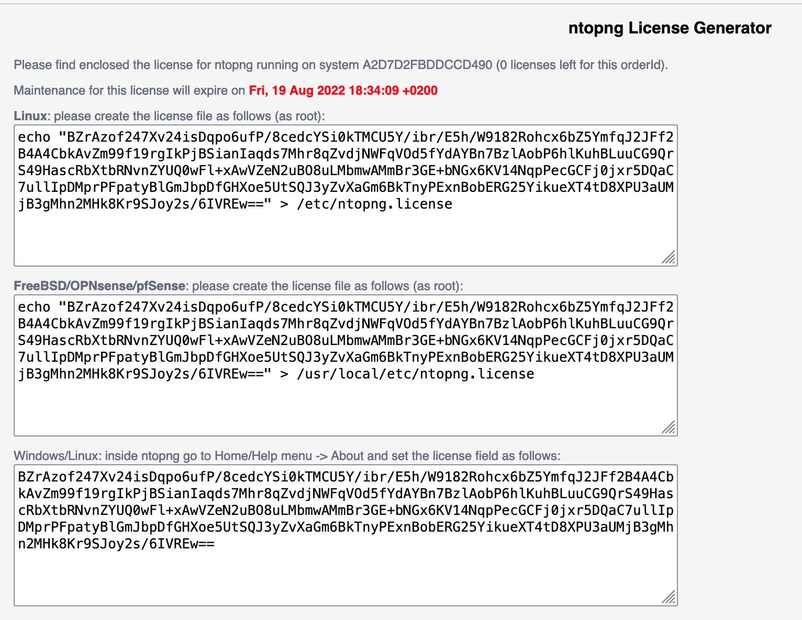

.. _AvailableVersions:

Available Versions & Licensing
##############################

The ntopng software comes in four versions: Community, Professional, Enterprise M, Enterprise L, and Enterprise L Bundle. Each version unlocks additional features with respect to the smaller one.

The full list of features and differences between versions is available in the ntopng
`Product Page <https://www.ntop.org/products/traffic-analysis/ntop/>`_.

ntopng Community
----------------

The Community version is free to use and open source. The full source code can be found on `Github <https://github.com/ntop/ntopng>`_.

ntopng Professional
-------------------

The Professional version offers some extra features with respect to the Community, which are particularly useful for SMEs, including graphical reports, traffic profiles and LDAP authentication.

ntopng Enterprise M
-------------------

The Enterprise M version offers some extra features with respect to the Professional version, which are particularly useful for large organizations, including SNMP support, advanced alerts management.

ntopng Enterprise L
-------------------

The Enterprise L version offers some extra features with respect to the Enterprise M version, including fast ClickHouse export, historical data explorer and analysis, Identity Management (the ability to correlate users to traffic).


ntopng Enterprise L Bundle
--------------------------

The Enterprise L Bundle unlocks ntopng Enterprise L, nProbe Pro (Flow Collection), and n2disk 1 Gbit (Continuous Recording).

.. warning::
   ntopng and nProbe must be on the same machine to have them unlocked with the ntopng Enterprise L Bundle license. The bundle license must be placed under :code:`/etc/ntopng/ntopng.license`.

ntopng Enterprise XL/XXL/XXXL
-----------------------------

The Enterprise XL/XXL/XXXL version offer additional features and releases some limitations in terms of number of hosts, SNMP devices and flow collectors number. Below in this page there is a compatison table the highlights the differences across editions.

Licensing
---------

The Community edition does not need any license. Professional and Enterprise
versions require a license. ntopng automatically switches to one of these four versions,
depending on the presence of a license.

License is per-server and is released according to the EULA (End User
License Agreement). Each license is perpetual (i.e. it does not
expire) and it allows to install updates for one year since
purchase/license issue. This means that a license generated on
1/1/2021 will be able to activate new versions of the software until
12/31/2021. If you want to install new versions of the software release
after that date, you need to renew the maintenance or avoid further
updating the software. For source-based ntopng you can refer to the
GPL-v3 License.

ntopng licenses are generated using the orderId and email you provided
when the license has been purchased on https://shop.ntop.org/.

Once the license has been generated, it can be applied to ntopng
simply by visiting page "Settings"->"License" of the web GUI and
pasting the license key in the license form.

Alternatively, the license key can be placed in a one-line file
:code:`ntopng.license`:

- On Linux, the file must be placed in :code:`/etc/ntopng.license`
- On Windows, the file must be placed in :code:`Program
  Files/ntopng/ntopng.license`

.. note::

   An ntopng restart is recommended once the license has been applied
   to make sure all the new functionalities will be unlocked.

.. _PurchasingALicense:

Purchasing a License
--------------------

The first step is to purchase a license. Licenses can be purchased online at https://shop.ntop.org. For bulk purchases, reseller discounts, or any other special requirement related to the purchase of licenses you can `contact ntop <https://www.ntop.org/support/need-help/contacts/>`_ directly.
Once the purchase has been completed successfully, you will receive an `Order Id`.



  The Order Id

The `Order Id` is a numeric identifier associated to the purchase. Along with the `Order Id` you'll also find the `email` indicated during the purchase procedure. Both `Order Id` and the `email` are necessary to generate the license key.

Generating the License Key
--------------------------

License keys are generated at https://shop.ntop.org/mkntopng/. To generate the license key, you need:

- The `Order Id` received after the purchase and the `email` indicated during the purchase procedure (see :ref:`PurchasingALicense`).
- The `System Id`, that is, an identifier associated to the host running ntopng
- The ntopng `version`, that is, a string representing the version of the installed ntopng (e.g., `5.1.210819`).

.. note::
  The `System Id` and the `version` can only be obtained after ntopng has been installed successfully. If you have not yet installed it, follow the installation procedure indicated at https://packages.ntop.org/ before moving forward with the license key generation.

The `System Id` and the `version` can be always obtained from the ntopng UI, page `"Help -> About"`



  `System Id` and `version` from the UI

On Linux, FreeBSD and other unix-based systems, the `System Id` and the `version` can also be obtained from the command line simply with an :code:`ntopng --version`

.. code:: bash

   $ ntopng --version
   Version: 5.1.210819 [Enterprise/Professional build]
   GIT rev: dev:065742705143bd1af06cf99fb2f35505ee349bb3:20210819
   Pro rev: r4187
   Built on:   Ubuntu 16.04.7 LTS
   System Id:  LA2D7D2FB9206AAF2--UA2D7D2FBDDCCD490--OL
   Platform:   x86_64
   Edition: Enterprise L (Bundle)
   License Type:  Time-Limited [Empty license file]
   Validity:   Until Thu Aug 19 18:23:03 2021

On Windows, `System Id` and the `version` can be printed from the command interpreter with a :code:`ntopng.exe /c --version` inside the ntopng installation directory :code:`C:\Program Files\ntopng`.

Generating The Key
------------------

To generate the license visit https://shop.ntop.org/mkntopng/ and fill the form using all the information indicated above.

.. warning::
   You must also pick the right version from the dropdown `ntopng Edition:`. Make sure this version matches with the version you've purchased or the license generation will fail.

Installing The Key
------------------

Upon successful generation, the license key will be printed in the browser. At this point you have two options:

You can copy the license key in a plain text file :code:`/etc/ntopng.license`, e.g.,

.. code:: bash

   # echo "XJQ6U04QIW2ixxzNMfGnWibAySvd8Rd3K4qxymrZNT3DoR0m1K6Ybx1nnG1Y1n+7O4znPE4Zroy+A5EZZfu/i0UzrOhly/HNUgNju+RTP6d/zAvMTs04ZtIG9/BjalrrOfHzw0bU3uTm0z1F+S5N6IFUP6cXzoWP+yrpGmPjzmQHGa5kSw5IJw6YjmPvAgGLHsKn+u2KoA6xP7c4eZ7YGJ/S6MTmYtLFOBse4qoaViSC30RBu54QVG4Zafz4qwhMEnT+hijwbkWJfjZBRzl3eLE05HclnkRWibuYJqKG6c9NRExF0u6a3+P/+ouB7PcczDf8G4O22MWgr2cTNjsmRA==" > /etc/ntopng.license

Alternatively on selected platforms (e.g. Windows), you can paste the license key straight into the ntopng UI, page `"Settings -> License"`




  Installing the ntopng License Key

This said it is recommended to place the license key in the plain text file.

.. note::

   A restart of ntopng is required after license installation to make sure all the licensed features will be properly unlocked.

Example
-------

Let's say that we've purchased an ntopng Enterprise L license for:

.. code:: bash

   $ ntopng --version
   Version: 5.1.210819 [Enterprise/Professional build]
   [...]
   System Id:  LA2D7D2FB9206AAF2--UA2D7D2FBDDCCD490--OL

The `Order Id` received after the purchase is 1621231231 and the email indicated during the purchase procedure is info@ntop.org.

The form at https://shop.ntop.org/mkntopng/ will be filled as follow



  License Generation Example

Upon successful generation, the license key will be printed in the browser:



  The Obtained License Key

At this point the license can be installed as described above or simply by following the instructions indicated in the resulting page.

.. _LicenseActivation:

License Activation
-------------------

Installing the license key also requires activation in order to ensure full support and updates. In most cases, this happens automatically without any action from the user,
however when ntopng is unable to connect to Internet or is started with the :code:`--offline` option, a manual activation is required.

With Internet Access
~~~~~~~~~~~~~~~~~~~~

If ntopng is connected to the Internet, activation is performed automatically the first time ntopng is started with a Professional or Enterprise license installed, thus no action is required.

Without Internet Access
~~~~~~~~~~~~~~~~~~~~~~~

If the system is offline and ntopng cannot reach the Internet, or it has been started with the :code:`--offline` command line option, automatic activation is not possible. In this case:

- ntopng shows a toast notification in the web GUI inviting the user to activate the license
- An `Activation` tab becomes available in the `License` page of the web GUI

To complete the activation manually:

1. From a PC with Internet access, go to https://shop.ntop.org/recover_licenses.php and recover the license: an activation code will be displayed there.
2. Copy the activation code.
3. On the ntopng instance, go to `"License"->"Activation"` and paste the activation code in the form, then click `"Activate"`.

.. _LicenseManager:

Using the License Manager
-------------------------

In addition to the standard licenses described above, ntopng can use the license manager (LM). Please refer to https://www.ntop.org/guides/nprobe/introduction.html#using-the-license-manager for details about the LM.

In order to use the LM simply do ```ntopng --license-mgr <licensemgr>.conf <other ntopng options>```.

Below you can find an example of license manager configuration file for ntopng:

.. code:: bash

	  LICENSE_MANAGER=127.0.0.1:9999

	  #
	  # Unique instance name
	  #
	  INSTANCE_NAME=dummy ntopng instance

	  #
	  # User authentication token
	  #
	  AUTH_TOKEN=fjfgsfgsj

	  #
	  # nprobe ntopng
	  #
	  PRODUCT_FAMILY=ntopng

	  #
	  # pro enterprise_s enterprise_m enterprise_l
	  #
	  PRODUCT_EDITION=enterprise_m


where

- LICENSE_MANAGER is the IP and port of the host where the LM is running.
- INSTANCE_NAME is a string used to indetity this specific instance
- AUTH_TOKEN is a token that the LM can use to prevent issuing valid licenses for unknown AUTH_TOKEN. Its value must be configured in the LM.
- PRODUCT_FAMILY and PRODUCT_EDITION define what license the ntop application will as the LM when contacting it.

Licenses on a Container
-----------------------

An article that explain everything in details on how to deploy a license inside a container can be found here:
`Deploying Licenses inside Conteainers <https://www.ntop.org/faq/my-license-does-not-work-inside-a-container-what-can-i-do/>`_

Versions Comparison Table
-----------------------

.. list-table:: Features by Version
   :widths: 40 25 25 25 25 25 25 25
   :header-rows: 1

   * - Feature
     - Community
     - Pro
     - M
     - L
     - XL
     - XXL
     - XXXL
   * - Monitor Remote Hosts using active monitoring (ICMP, HTTP/S, Throughput, SpeedTest)
     - ✓
     - ✓
     - ✓
     - ✓
     - ✓
     - ✓
     - ✓
   * - Monitor the system, machine on which ntopng is running (CPU, RAM, Disk, etc.)
     - ✓
     - ✓
     - ✓
     - ✓
     - ✓
     - ✓
     - ✓
   * - Identify application protocols (Facebook, Youtube, BitTorrent, etc) in the network
     - ✓
     - ✓
     - ✓
     - ✓
     - ✓
     - ✓
     - ✓
   * - Record and Visualize hosts’ historical application protocols usage (timeseries)
     - ✓
     - ✓
     - ✓
     - ✓
     - ✓
     - ✓
     - ✓
   * - Group hosts by VLAN, Operating System, Country, and Autonomous Systems
     - ✓
     - ✓
     - ✓
     - ✓
     - ✓
     - ✓
     - ✓
   * - Get a geographic map of your network communications with the rest of the world
     - ✓
     - ✓
     - ✓
     - ✓
     - ✓
     - ✓
     - ✓
   * - Discover the devices connected to your Local Network (Network Discovery)
     - ✓
     - ✓
     - ✓
     - ✓
     - ✓
     - ✓
     - ✓
   * - Identify top talkers (senders and receivers) hosts with minute resolution
     - ✓
     - ✓
     - ✓
     - ✓
     - ✓
     - ✓
     - ✓
   * - Visualise the top HTTP sites contacted by an host
     - ✓
     - ✓
     - ✓
     - ✓
     - ✓
     - ✓
     - ✓
   * - Export expired flows information to database, possibly augmented with nProbe data **
     - ✗
     - ✓
     - ✓
     - ✓
     - ✓
     - ✓
     - ✓
   * - Generate alerts (for Flows, Hosts, Interfaces, …) when certain conditions are detected (Threshold Crossed, Suspicious Behaviour, …)
     - ✓
     - ✓
     - ✓
     - ✓
     - ✓
     - ✓
     - ✓
   * - Navigate through the alerts, from the GUI, generated by ntopng to find the problem
     - ✓
     - ✓
     - ✓
     - ✓
     - ✓
     - ✓
     - ✓
   * - Get alerts notifications as Email, Discord, Telegram, WebHook, Slack, Syslog messages or execute Shell Scripts
     - ✓
     - ✓
     - ✓
     - ✓
     - ✓
     - ✓
     - ✓
   * - Split, merge, and visualize VLAN based traffic
     - ✓
     - ✓
     - ✓
     - ✓
     - ✓
     - ✓
     - ✓
   * - CollCollect data from nProbe to treat remote nProbe-monitored interfaces and flow exporter devices (for example routers and switches) as if they were localect data from remote nProbe-monitored interfaces and flow exporters
     - ✓
     - ✓
     - ✓
     - ✓
     - ✓
     - ✓
     - ✓
   * - Split, merge, and visualize data collected from nProbe
     - ✓
     - ✓
     - ✓
     - ✓
     - ✓
     - ✓
     - ✓
   * - Group local hosts into logical sets of IP and MAC addresses known as host pools
     - ✓
     - ✓
     - ✓
     - ✓
     - ✓
     - ✓
     - ✓
   * - Add/edit application protocols to ntopng (if a protocol file is configured) and edit protocol categories
     - ✗
     - ✓
     - ✓
     - ✓
     - ✓
     - ✓
     - ✓
   * - Aggregate multiple interfaces traffic in a single view
     - ✗
     - ✓
     - ✓
     - ✓
     - ✓
     - ✓
     - ✓
   * - Limit or block hosts’ traffic with customized per-application policies \*
     - ✗
     - ✗
     - ✓
     - ✓
     - ✓
     - ✓
     - ✓
   * - Integrate ntopng login with LDAP authentication servers \* \*\*
     - ✗
     - ✓
     - ✓
     - ✓
     - ✓
     - ✓
     - ✓
   * - Send alerts to Elasticsearch, to MS Teams or to Fail2Ban
     - ✗
     - ✓
     - ✓
     - ✓
     - ✓
     - ✓
     - ✓
   * - Have access to other ntopng Checks (Alerts)
     - ✗
     - ✓
     - ✓
     - ✓
     - ✓
     - ✓
     - ✓
   * - Add the possibility to create the Network Matrix timeseries (gives the possibility to check traffic between Local Networks)
     - ✗
     - ✓
     - ✓
     - ✓
     - ✓
     - ✓
     - ✓
   * - Visualize and historicise other ntopng data (Interface Score Anomalies, Top Talkers, …)
     - ✗
     - ✗
     - ✓
     - ✓
     - ✓
     - ✓
     - ✓
   * - Graphical reports with top hosts, application protocols, countries, networks, and autonomous systems within any configurable time frame
     - ✗
     - ✗
     - ✓
     - ✓
     - ✓
     - ✓
     - ✓
   * - Automatic (periodic) graphical reports
     - ✗
     - ✗
     - ✗
     - ✓
     - ✓
     - ✓
     - ✓
   * - Graphical reports editor to build custom report templates
     - ✗
     - ✗
     - ✗
     - ✗
     - ✓
     - ✓
     - ✓
   * - Query SNMP devices data, such as port status, traffic and and MAC address information
     - ✗
     - ✗
     - ✓
     - ✓
     - ✓
     - ✓
     - ✓
   * - Get total traffic and activity reports for any given host, network, or interface
     - ✗
     - ✗
     - ✓
     - ✓
     - ✓
     - ✓
     - ✓
   * - Identify attackers and victims through an alerts dashboard in realtime and in the past
     - ✗
     - ✗
     - ✓
     - ✓
     - ✓
     - ✓
     - ✓
   * - Visualize host pools’ historical applications protocols usage
     - ✗
     - ✗
     - ✓
     - ✓
     - ✓
     - ✓
     - ✓
   * - Explore and filter flow alerts in the past
     - ✗
     - ✗
     - ✓
     - ✓
     - ✓
     - ✓
     - ✓
   * - Trigger alerts when SNMP unexpected behavior shows up
     - ✗
     - ✗
     - ✓
     - ✓
     - ✓
     - ✓
     - ✓
   * - Have access to other ntopng Checks (Alerts, such as SNMP Alerts)
     - ✗
     - ✗
     - ✓
     - ✓
     - ✓
     - ✓
     - ✓
   * - Visualize and historicise SNMP per-device-port traffic
     - ✗
     - ✗
     - ✓
     - ✓
     - ✓
     - ✓
     - ✓
   * - Visualize and historicise NetFlow/sFlow devices data
     - ✗
     - ✗
     - ✓
     - ✓
     - ✓
     - ✓
     - ✓
   * - Aggregate and Analyze Long-term flow data
     - ✗
     - ✗
     - ✓
     - ✓
     - ✓
     - ✓
     - ✓
   * - Apply per-protocol daily traffic and time quotas to your clients \*
     - ✗
     - ✗
     - ✓
     - ✓
     - ✓
     - ✓
     - ✓
   * - High performance flow export to ClickHouse and explorer (both aggregated data explorer and historical flow explorer) \*
     - ✗
     - ✗
     - ✓
     - ✓
     - ✓
     - ✓
     - ✓
   * - Hourly Historical Flow Aggregation
     - ✗
     - ✗
     - x
     - ✓
     - ✓
     - ✓
     - ✓
   * - Custom Interface Disaggregation \*\*\*
     - ✗
     - ✗
     - ✓
     - ✓
     - ✓
     - ✓
     - ✓
   * - Monitor other ntopng instances (Infrastructure Monitoring)
     - ✗
     - ✗
     - ✗
     - ✓
     - ✓
     - ✓
     - ✓
   * - Hosts Map (find the hosts outliers)
     - ✗
     - ✗
     - ✓
     - ✓
     - ✓
     - ✓
     - ✓
   * - Service / Periodicity Maps
     - ✗
     - ✗
     - ✗
     - ✓
     - ✓
     - ✓
     - ✓
   * - Identity Management with Firewalls and Active Directory
     - ✗
     - ✗
     - ✗
     - ✓
     - ✓
     - ✓
     - ✓
   * - Have access to all Behavioural Checks
     - ✗
     - ✗
     - ✗
     - ✓
     - ✓
     - ✓
     - ✓
   * - Native nTap Support
     - ✗
     - ✗
     - ✗
     - ✓
     - ✓
     - ✓
     - ✓
   * - Kafka Support
     - ✗
     - ✗
     - ✗
     - ✓
     - ✓
     - ✓
     - ✓
   * - OT/SCADA: IEC 60870-5-104 Traffic Analysis
     - ✓
     - ✓
     - ✓
     - ✓
     - ✓
     - ✓
     - ✓
   * - OT/SCADA: ModbusTCP Traffic Analysis
     - ✗
     - ✗
     - ✗
     - ✓
     - ✓
     - ✓
     - ✓
   * - Continuous Recording license Included (n2disk 1Gbit) \*\* \*\*\*
     - ✗
     - ✗
     - ✗
     - Bundle L
     - Bundle XL
     - ✗
     - x
   * - Flow Collection Deduplication
     - ✗
     - ✗
     - ✗
     - ✗
     - ✓
     - ✓
     - ✓
   * - Smart Recording license Included (n2disk 1Gbit) \*\* \*\*\*
     - ✗
     - ✗
     - ✗
     - ✗
     - Bundle XL
     - ✗
     - x
   * - Flow Collection license Included (nProbe Pro) \*\*\*
     - ✗
     - ✗
     - ✗
     - Bundle L
     - ✗
     - ✗
     - x
   * - Flow Collection license Included (nProbe Enterprise S) \*\*\*
     - ✗
     - ✗
     - ✗
     - ✗
     - Bundle XL
     - ✗
     - x
   * - Maximum Number of Live (Local) Hosts (suggested)
     - 256
     - 256
     - 1K
     - 4K
     - 32K
     - 128K
     - 256K
   * - Maximum Number of Live Flows (suggested)
     - 128K
     - 1M
     - 4M
     - 8M
     - 16M
     - 32M
     - 64M
   * - Max Number of Host Pools
     - 3
     - 3
     - 4096
     - 4096
     - 4096
     - 4096
     - 4096
   * - Max Number of Host Pool Members (per Pool)
     - 8
     - 8
     - Unlimited \*\*\*\*
     - Unlimited \*\*\*\*
     - Unlimited \*\*\*\*
     - Unlimited \*\*\*\*
     - Unlimited \*\*\*\*
   * - Maximum Number of Monitored Interfaces (-i)
     - 8
     - 8
     - 16
     - 32
     - 64
     - 64
     - 64
   * - Mark and historicize traffic with user-defined traffic profiles to match hosts, ports and applications using the BPF syntax (number of profiles) [total/per ntopng]
     - -
     - 16
     - 128
     - 128
     - 128
     - 128
     - 128
   * - Max Number of configurable SNMP Devices [total/per ntopng]
     - -
     - -
     - 16
     - 32
     - 128
     - 512
     - 1024
   * - Max Number of Flow Exporters (e.g. NetFlow router) [total/per ntopng]
     - -
     - 4
     - 16
     - 128
     - 256
     - 512
     - 1024
   * - Flow Exporters/Interfaces combinations [total/per ntopng]
     - -
     - 128
     - 256
     - 512
     - 2K
     - 8K
     - 16K
   * - Asset Inventory
     - -
     - -
     - ✓ (no dashboard)
     - ✓
     - ✓
     - ✓
     - ✓
   * - Wazuh Integration
     - -
     - -
     - ✓
     - ✓
     - ✓
     - ✓
     - ✓


✓ = Feature available, ✗ = Feature NOT available

\* Feature not available on Windows

\*\* Feature not available on FreeBSD / OPNsense / pfSense

\*\*\* Read more about the software bundled with the Bundle edition in the `FAQ <https://www.ntop.org/faq/what-is-included-in-ntopng-enterprise-l-xl-bundle/>`_

\*\*\*\* Read it "as long as there are resources available in the system", i.e. not artifically limited.
