Vulnerability Scan
##################

.. warning::

  This feature support is not available on Windows.

ntopng is able to both passively monitor network and perform a vulnerability scan, whose goal is to detect known `CVEs (Common Vulnerabilities and Exposures) <https://en.wikipedia.org/wiki/Common_Vulnerabilities_and_Exposures>`_ and to discover TCP or UDP open ports in provided services.

The current implementation leverages on `nmap <https://nmap.org>`_ and `vulscan <https://github.com/scipag/vulscan>`_. The code is designed to add new scanner types by simply defining new `modules <https://github.com/ntop/ntopng/tree/dev/scripts/lua/modules/vulnerability_scan/modules>`_.

Vulnerability Scan Page
~~~~~~~~~~~~~~~~~~~~~~~

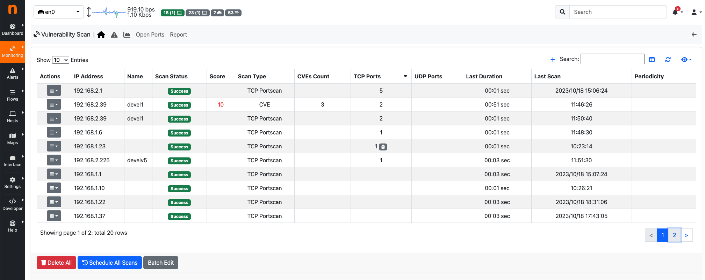

  Vulnerability Scan Page

On the Vulnerability Scan page, it is possible to view the registered hosts that can be scanned, along with various details about the last executed scan, such as:

- Scan Status (can be "Scanning", "Scheduled", "Success", "Not Scanned", "Error");
- Score; (max score of vulnerabilities detected)
- Scan Type;
- CVEs Count (vulnerabilities detected);
- TCP Ports (number of open TCP ports found);
- UDP Ports (number of open UDP ports found);
- Last Duration;
- Last Scan;
- Periodicity

After the ntopng execution of a TCP or UDP Portscan, ntopng compares the open ports detected by the network monitoring with the open ports discovered during the vulnerability scan:

- If the Vulnerability Scan identifies an open TCP (or UDP) port that is not currently in use according to network monitoring results, a ghost icon |ghost| will be displayed near the number of open TCP (or UDP) ports of the specific host; 
- If the Vulnerability Scan fails to identify a TCP (or UDP) port that is actually in use, but ntopng has detected it through network monitoring (the port was filtered by the Vulnerability Scan), a filter icon |filter| will be displayed near the number of open TCP (or UDP) ports for the specific host.

At the bottom of the page, there are three buttons:

- Delete All (to remove all hosts from the vulnerability scan list);
- Schedule All Scans (to schedule a scan for all hosts in the vulnerability scan list);
- Batch Edit (to update the periodicity scan for all hosts in the vulnerability scan list);

At the end of a 'Scan All' execution, if a notification endpoint and the related recipient have 'Notification Type' set to 'Vulnerability Scan Reports,' a notification is sent when the periodic vulnerability scan ends.

Add Host to Vulnerabily Scan List
---------------------------------

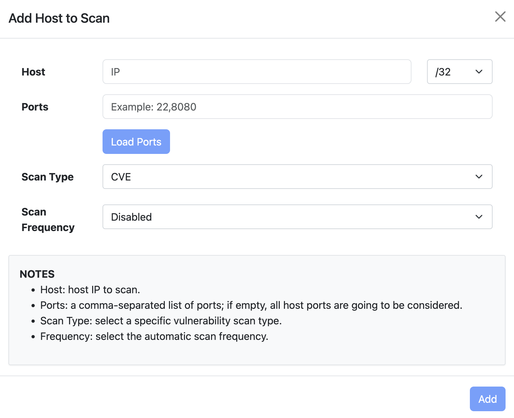

  Add Host to Vulnerability Scan List

By clicking on the '+' icon on the Vulnerability Scan page, the user can add a new host or include all hosts active under a specific CIDR.

If a user designates a specific active host, ntopng will automatically populate the Ports field with the known server ports of such other. If unknown the field will be empty and all the ports will be checked. Note that scanning all ports can require a long amount of time, hence we suggest (if possible) to limit the scan to a small port set.

After selecting the host and ports, it is mandatory to choose one of the Vulnerability Scan Types. 
Currently, five types of vulnerability scans are supported:

- CVE
- TCP Portscan
- UDP Portscan
- Vulners

.. warning::

  The 'UDP Portscan' is available only on Linux.

Periodic Scans
--------------

.. note::

   Periodic Scans require ntopng Enterprise L or better.

Scans can be performed on demand (one shot) or periodically. You have the option to specify a daily scan (performed every days at midnight) or weekly (every Sunday at midnight). In order to avoid hogging the network with aggressive scans, only one scan at time is performed.

If a notification endpoint and the related recipient with the 'Notification Type' set to 'Vulnerability Scan Reports' are enabled, a notification is sent when the periodic vulnerability scan ends.

Actions
-------

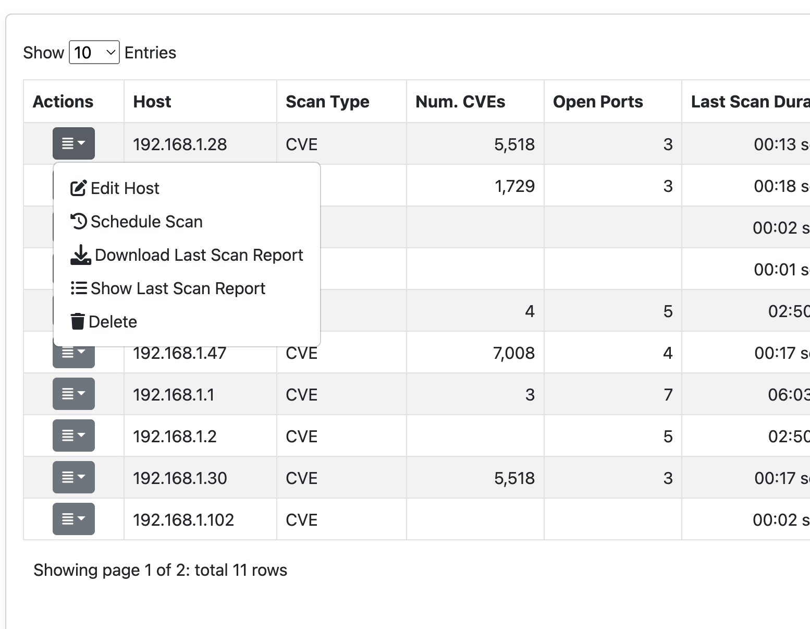

  Row Actions menu 

Clicking on the 'Actions' dropdown of a specific row provides the following options:

- Edit Host (to modify the specifications of the selected row);
- Schedule Scan (to schedule the vulnerability scan of the specific host);
- Download Last Scan Report (to download the file containing the most recent vulnerability scan result); 
- Show Last Scan Report (to display the last scan result in a new page of ntopng);
- Delete (to delete the specific host from the vulnerability scan list); 

Settings
--------

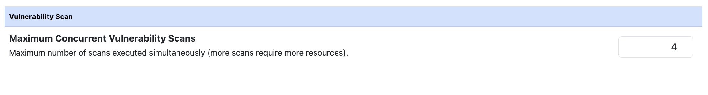

  Maximum Concurrent Vulnerability Scans

It is possible to modify the maximum number of scans executed simultaneously under the 'Misc' tab of the Preferences page. The default value is 4.

Vulnerability Scan Last Report Page
~~~~~~~~~~~~~~~~~~~~~~~~~~~~~~~~~~~

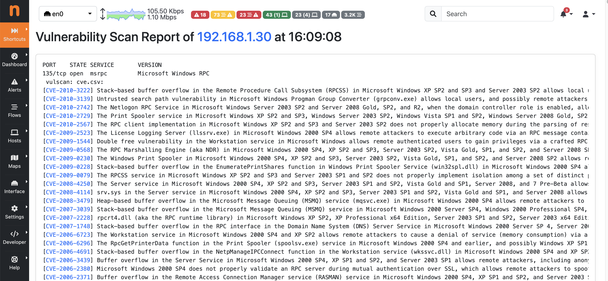

  Vulnerability Scan Last Report Page

Clicking on the `Show Last Scan Report` button in the Actions dropdown menu of a specific row allows ntopng to display the last scan report for the selected host.

Alerts
~~~~~~

If scans are performed periodically, ntopng compares each scan iteration and it generates alerts when someting changes such as a new port is open or the number of CVEs changed. Alerts needs to be enabled in the Behavioural Checks page as follows

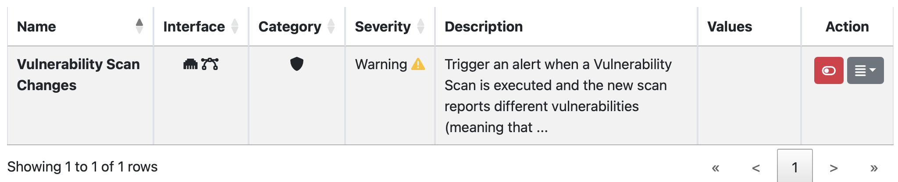

Generated alerts can be accessed from the Alerts Explorer page under the Active Monitoring menu.

Charts
~~~~~~

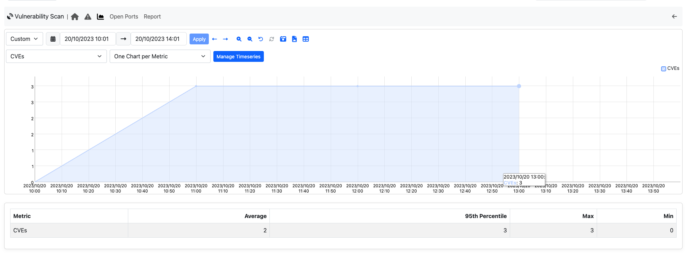

On the Vulnerability Scan Charts page ntopng shows the charts of timeseries filled with vulnerability scan data.

Ntopng currently records the following vulnerability data:

- CVEs (number of CVEs detected);
- Hosts (number of hosts ready to be scanned);
- Open Ports (number of open ports discovered);
- Scanned Hosts (number of scanned hosts);

Open Ports Page
~~~~~~~~~~~~~~~

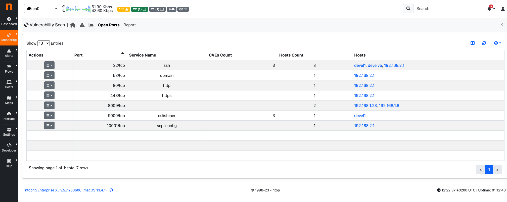

On the Open Ports page, it is possible to display the list of TCP and UDP open ports detected by the Vulnerabitlity Scan, along with the following information:

- Service Name;
- CVEs Count (the sum of CVEs detected on hosts having the specific open port);
- Hosts Count;
- Hosts (the list is limited to five hosts if more than five are available);

By clicking on the `Show Hosts` button in the Actions dropdown menu of a specific row, ntopng allows the user to navigate back to the Vulnerability Scan Page and view the hosts with the selected open port.

Report
~~~~~~

On the Report page are displayed four reports: the `Vulnerability Scan Report`; the `CVEs Count`; the `TCP Ports` and the `UDP Ports`. 

Vulnerability Scan Report
-------------------------

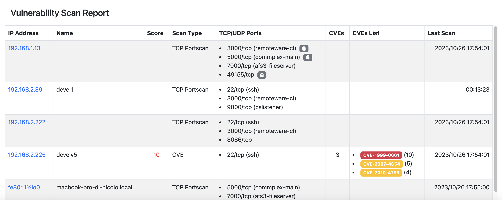

The Vulnerability Scan Report shows the following information:

- IP Address;
- Name (Host Name);
- Score (Maximum vulnerability score detected);
- Scan Type;
- TCP/UDP Ports (List of open TCP/UDP ports);
- CVEs (Number of CVEs detected);
- CVEs List (List of CVEs with the CVE scores);
- Last Scan (Date of most recent scan execution);

It is possible to jump to the 'Vulnerability Scan Last Report Page' specific to that host by clicking on the IP address.

CVEs Count Report
-----------------

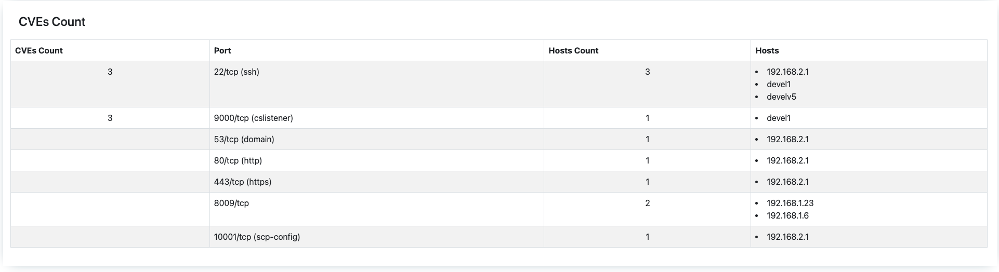

The CVEs Count Report shows the following information:

- CVEs;
- Port (formatted as: `<portID/L4protocol (service name)>`);
- Hosts Count;
- Hosts;

TCP Ports Report
----------------

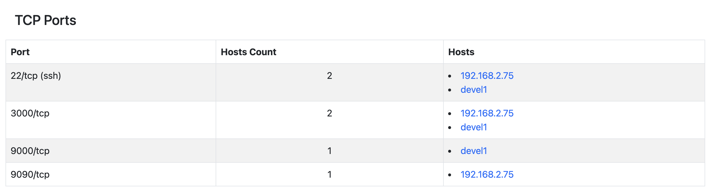

The TCP Ports Report shows the following information:

- Port (formatted as: `<portID/tcp (service name)>`);
- Hosts Count;
- Hosts;

UDP Ports Report
----------------

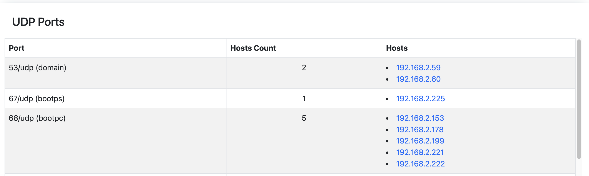

The UDP Ports Report shows the following information:

- Port (formatted as: `<portID/udp (service name)>`)
- Hosts Count;
- Hosts;
