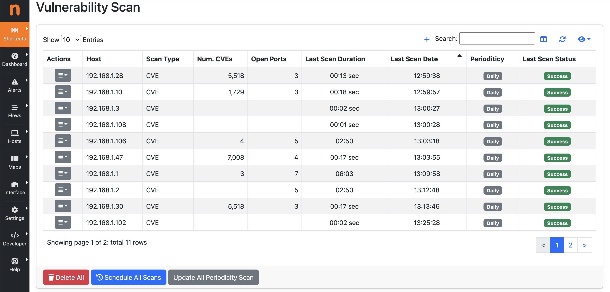

Vulnerability Scan
##################

.. warning::

  This feature support is not available on Windows.

ntopng is able to both passively monitor network and perform a vulnerability scan, whose goal is to detect known `CVEs (Common Vulnerabilities and Exposures) <https://en.wikipedia.org/wiki/Common_Vulnerabilities_and_Exposures>`_ in provided services.

The current implementation leverages on `nmap <https://nmap.org>`_ and `vulscan <https://github.com/scipag/vulscan>`_. The code is desigbed to add new scanner types by simply defining new `modules <https://github.com/ntop/ntopng/tree/dev/scripts/lua/modules/vulnerability_scan/modules>`_.

Vulnerability Scan Page
~~~~~~~~~~~~~~~~~~~~~~~

  Vulnerability Scan Page

On the Vulnerability Scan page, it is possible to view the registered hosts that can be scanned, along with various details about the last executed scan, such as:

- Scan Type;
- Num. CVEs (vulnerabilities detected);
- Open Ports (number of open ports found);
- Last Scan Duration;
- Last Scan Date;
- Scans Periodicity
- Last Scan Status (can be "Success", "In Progress", "Not Scanned", "Error");

At the bottom of the page, there are three buttons:

- Delete All (to remove all hosts from the vulnerability scan list);
- Schedule All Scans (to schedule a scan for all hosts in the vulnerability scan list);
- Update All Periodicity Scan (to update the periodicity scan for all hosts in the vulnerability scan list);

Actions
~~~~~~~

  Row Actions menu 

Clicking on the 'Actions' dropdown of a specific row provides the following options:

- Edit Host (to modify the specifications of the selected row);
- Schedule Scan (to schedule the vulnerability scan of the specific host);
- Download Last Scan Report (to download the file containing the most recent vulnerability scan report); 
- Show Last Scan Report (to display the last scan report in a new page of ntopng);
- Delete (to delete the specific host from the vulnerability scan list); 

Vulnerability Scan Report Page
~~~~~~~~~~~~~~~~~~~~~~~~~~~~~~

  Vulnerability Scan Report Page

Clicking on the `Show Last Scan Report` button in the Actions dropdown menu of a specific row allows ntopng to display the last scan report for the selected host.

Add Host to Vulnerabily Scan List
~~~~~~~~~~~~~~~~~~~~~~~~~~~~~~~~~

  Add Host to Vulnerability Scan List

By clicking on the '+' icon on the Vulnerability Scan page, the user can add a new host or include all hosts active under a specific CIDR.

If a user designates a specific active host, ntopng will automatically populate the Ports field with the known server ports of such other. If unknown the field will be empty and all the ports will be checked. Note that scanning all ports can require a long amount of time, hence we suggest (if possible) to limit the scan to a small port set.

After selecting the host and ports, it is mandatory to choose one of the Vulnerability Scan Types. 
Currently, only two types of vulnerability scans are supported:

- CVE
- OpenVAS

Periodic Scans
--------------

.. note::

   Periodic Scans require ntopng Enterprise L or better.

Scans can be performed on demand (one shot) or periodically. You have the option to specify a daily scan (performed every days at midnight) or weekly (every Sunday at midnight). In order to avoid hogging the network with aggressive scans, only one scan at time is performed.

If a notification endpoint and the related recipient with the 'Notification Type' set to 'Vulnerability Scan Reports' are enabled, a notification is sent when the periodic vulnerability scan begins and ends.

Alerts
------

If scans are performed periodically, ntopng compares each scan iteration and it generates alerts when someting changes such as a new port is open or the number of CVEs changed. Alerts needs to be enabled in the Behavioural Checks page as follows

Generated alerts can be accessed from the Alerts Explorer page under the Active Monitoring menu.

