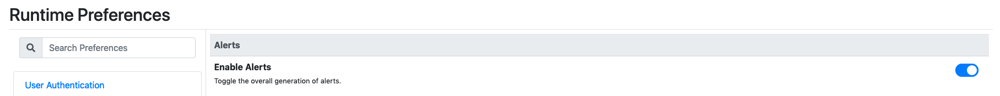
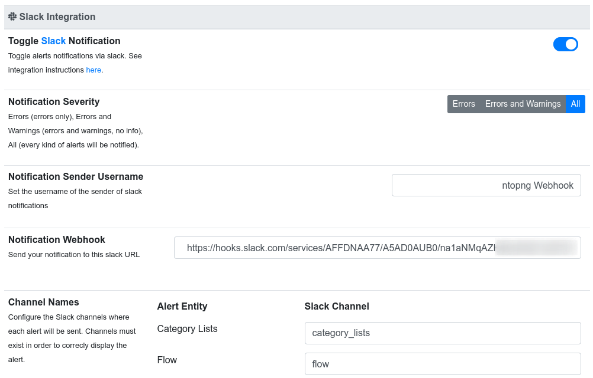
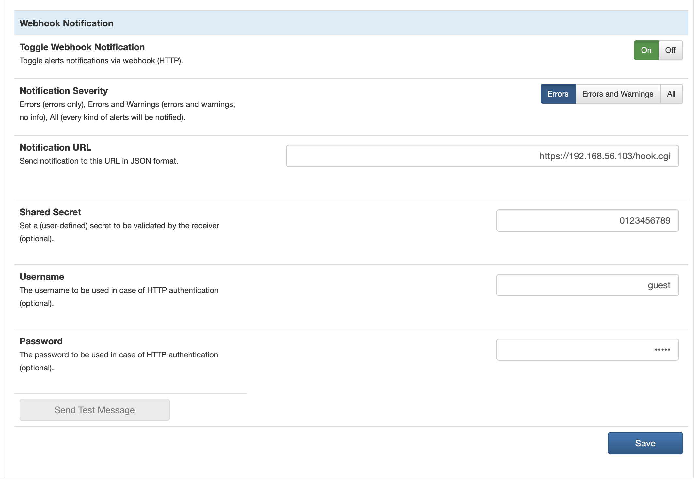

Alerts
======

ntopng includes an alerting engine to report different kind of events. Please read the `Basic Concepts <../basic_concepts/alerts.html>`_ 
section to learn more about this feature.

The Alerts Menu opens a page with the list of alerts that was fired. This icon is hidden if no alerts was
triggered or after purge operation. Each row in the Alerts page presents an alert detected by ntopng with
information such as Date, Severity, Type and Description.

.. figure:: ../img/web_gui_alerts_page.png
  :align: center
  :alt: Alerts Page

  The Alerts Page

:ref:`WebUIUserScripts` are responsible for the generation of alerts. Enabling and disabling a user scripts enables or disables the corresponding alerts. Alerts can also be disabled globally from the preferences.

  Global Alerts Toggle

.. _ThirdPartyAlertEndpoints:

Alert Endpoints
---------------

Endpoints are a way to export the ntopng alerts to external programs.

Endpoints can be enabled and configured from the ntopng preferences page. Users can create custom
endpoints via a custom plugin. Check out the `Plugins Section <../plugins/alert_endpoints.html>`_
for more details. Here is a list of the alerts endpoints built into ntopng.

.. _ElasticsearchAlerts:

Elasticsearch
~~~~~~~~~~~~~

This endpoint is designed to send alerts to `Elasticsearch <https://www.elastic.co/>`_. The endpoint becomes available when ntopng is configured to dump flows to :ref:`FlowDumpElasticsearch` and it uses the *same Elasticsearch connection parameters* used to dump flows.

.. note::

  Elasticsearch alert endpoint is only available in ntopng Enterprise M or above.

Alerts are sent to Elasticsearch indexes :code:`alerts-ntopng-<year>.<month>.<day>`. A new index is created every day. For example, index names used for two consecutive days of April 17th and 18th 2020 are :code:`alerts-ntopng-2020-04-17` and :code:`alerts-ntopng-2020-04-18`.

This plugin can be enabled from the preferences.

The Elasticsearch connection can be tested by clicking the "Test Connection" button of the preferences.

.. note::

  Elasticsearch alert endpoint requires at least Elasticsearch version 7. Version can be tested by clicking the "Test Connection" button of the preferences.

Alerts are sent to Elasticsearch in JSON format. The the following keys are always present:

- :code:`@timestamp`: UTC/GMT alert detection date and time in ISO format yyyy-MM-dd'T'HH:mm:ss.SSSZ.
- :code:`alert_tstamp`: Alert detection Unix epoch
- :code:`alert_tstamp_end`: Alert release Unix epoch for :ref:`Released Alerts`, otherwise this key is not present.
- :code:`alert_type`:  one of {`alert_blacklisted_country`, ` alert_broadcast_domain_too_large`, `alert_device_connection`, ...}. Strings list available at `/lua/defs_overview.lua`.
- :code:`alert_severity`: one of {`info`, `warning`, `error`}.
- :code:`alert_entity`: one of {`interface`, `host`, `network`, ...}. `List of all the available types <https://github.com/ntop/ntopng/blob/fae050b90a8eacf8d1dd64b9142b02b5f54753c8/scripts/lua/modules/alert_consts.lua#L299>`_.
- :code:`alert_entity_val`: A string representing the current alert entity. For hosts the format is `<ip>@<vlan>`, e.g.,  `127.0.0.1@0`.
- :code:`ifname`: The interface name string where the alert was detected, e.g., `eno1`.
- :code:`ntopng_instance_id`: The ntopng instance name string where the alert was detected., e.g., `ntopng-instance-brx1`. Instance name can be configured with option :code:`--instance-name`.
- :code:`engaged`: A boolean which is true for :ref:`Engaged Alerts`, false otherwise.
- :code:`alert_subtype`: A string subtype which depends on the :code:`alert_type`. For example threshold cross can have subtype `bytes`, `packets`, `score`, etc.
- :code:`alert_granularity`: one of {`min`, `5min`, `hour`, `day`}, empty. Empty when the alert doesn't come out of a periodic check (e.g., broadcast domain too large). `List of all the available granularities <https://github.com/ntop/ntopng/blob/fae050b90a8eacf8d1dd64b9142b02b5f54753c8/scripts/lua/modules/alert_consts.lua#L346>`_.
- :code:`alert_json`: A JSON string with additional, alert-specific information (e.g., the broadcast domain, the threshold set, the exceeded value).
- :code:`alert_msg`: A human readable string text message of the alert.

:ref:`Flow Alerts` have the following additional fields:

- :code:`flow_status`: one of {`status_blacklisted`, `status_data_exfiltration`, `status_suspicious_tcp_probing`}. Strings list available at `/lua/defs_overview.lua`.
- :code:`first_seen`: Flow first seen Unix epoch.
- :code:`l7_proto`: A string with the detected nDPI protocol, e.g., `HTTP.Google`.
- :code:`cli_asn`: Integer with the client ASN or empty when asn information is not available.
- :code:`srv_asn`: Integer with the server ASN or empty when asn information is not available.
- :code:`cli_country`: ISO 3166 alpha-2 country code string for the client or empty when country information is not available.
- :code:`srv_country`: ISO 3166 alpha-2 country code string for the server or empty when country information is not available.
- :code:`cli_port`: Integer of the client flow port.
- :code:`srv_port`: Integer of the server flow port.
- :code:`cli_os`: A string with the detected client operating system or empty when operating system is not available.
- :code:`srv_os`: A string with the detected server operating system or empty when operating system is not available.
- :code:`vlan_id`: Integer of the flow VLAN. Integer is zero when the flow has no VLAN.
- :code:`srv2cli_bytes`: Integer with the number of bytes transferred from the server to the client when the alert was generated.
- :code:`cli2srv_bytes`: Integer with the number of bytes transferred from the client to the server when the alert was generated.
- :code:`cli2srv_packets`: Integer with the number of packets transferred from the client to the server when the alert was generated.
- :code:`srv2cli_packets`: Integer with the number of packets transferred from the server to the client when the alert was generated.
- :code:`cli_addr`: A string with the client IPv4 or IPv6 address.
- :code:`srv_addr`: A string with the server IPv4 or IPv6 address.
- :code:`score`: The flow score integer.

Email
~~~~~

This endpoint is designed to send emails to the administrator when an alert occurs.
Ntopng only supports sending emails to a SMTP server without authentication. Since ntopng
does not authenticate with the SMTP server, the server may reject the email. For
this reason, it is suggested to setup a local mail server (e.g. postfix_) and use
it as the email forwarder to the actual mail server.

It is possible to test the email sending functionality by using the "Send Test Email"
button. If an error occurs, an error message will be printed to the ntopng log.
It is possible to get a detailed log of the communication between ntopng and the mail server
by adding the `-v 6` option to the ntopng configuration. After doing this, the email
log will be printed in the console. It is advisable to use the `grep` command
(e.g. `ntopng -v6 | grep "Utils.cpp"`) to only filter out the email log information.

.. _postfix: https://www.digitalocean.com/community/tutorials/how-to-install-and-configure-postfix-on-ubuntu-16-04

Slack
~~~~~

ntopng can send alerts as text messages into `Slack <https://slack.com>`_ channels.

  The Slack Notification Preferences Page

Each alert entity is sent to a different Slack channel, whose name can be configured
by the user. The channels must be manually created by the user. The `Notification Severity`
allow the user to specify which is the minimum alert severity for the alerts to report.

The `Notification Webhook` is the API key provided linked to the Slack account. Detailed
instructions on how to get it can be found in the `README.slack <https://github.com/ntop/ntopng/blob/dev/doc/README.slack>`_ file.

Webhook
~~~~~~~

Webhooks allow you to subscribe to alerts by configuring a HTTP endpoint. Alerts are encoded
in JSON messages and sent to the configured URL where they can be processed or used to trigger 
automations. 

You can add an endpoint by defining the URL and shared secret (optional). The shared secret is 
a user-defined secret to be validated by the webhook receiver. If the HTTP server requires HTTP 
authentication, you should also configure username and password.

  The Webhook Notification Preferences Page

It is possible to test the endpoint to make sure it is active and reachable by using the 
“Send Test Message” button. If an error occurs, an error message will be reported.

Example of alert sent to the webhook endpoint:

.. code:: text

   {version:0.1,sharedsecret:0123456789,alerts:[{"severity":"info","entity_value":"ntopng","ifid":1,"action":"store","tstamp":1536245738,"type":"process_notification","entity_type":"host","message":"[<tstamp>]][Process] Stopped ntopng v.3.7.180906 (CentOS Linux release 7.5.1804 (Core) ) [pid: 4783][options: --interface \"eno1\" --interface \"lo\" --dump-flows \"[hidden]\" --https-port \"4433\" --dont-change-user ]"}]}

Syslog
~~~~~~

Alerts are sent to syslog using standard syslog severities as per RFC 5424.

ntopng alert severities are mapped to standard syslog severities as follow:

- *Info*  becomes syslog :code:`LOG_INFO` equal to the integer 6
- *Warning* becomes syslog :code:`LOG_WARNING` equal to the integer 4
- *Error* becomes syslog :code:`LOG_ERR` equal to the integer 3

Two formats are available when sending alerts to syslog, namely plaintext and JSON. The format defaults to plaintext and can be toggled from the ntopng preferences page.

**Plaintext**

Plaintext alerts have the following format:

.. code:: bash

   [tstamp][severity][type][entity][entity value][action] ... and a plain text message...

Fields have the following meaning:

- :code:`[tstamp]` is the time at which ntopng detected the alert. This time
  is not necessarily equal to the time the alert has reached syslog.
- :code:`[severity]` is the severity of the alert. Severities are also
  used when dispatching messages to syslog. Severities are "Warning", "Error" of "Info".
- :code:`[type]` is a string that indicates the type of alert.
- :code:`[entity]` is a class that categorizes the originator of the
  alert. It can be an "host", an "interface" and so on.
- :code:`[entity value]` is an identifier that uniquely identifies the
  originator along with the :code:`[entity]`. For example, entity
  value for an "host" is its IP address, for an "interface" is its
  name, for a "device" is its MAC address, and so on.
- :code:`[action]` indicates whether this is an engaged alert, an
  alert that has been released or if it just an alert that has to be stored.

Alert types, entities, and actions are explained in detail in section :ref:`BasicConceptAlerts`.
  
Examples of alerts sent to syslog are

.. code:: bash

   devel ntopng: [<tstamp>][Info][Device Connection][Device][58:40:4E:CE:28:29] The device Apple_CE:28:29 has connected to the network.
   devel ntopng: [<tstamp>][Error][Threshold Cross][Interface][iface_0][Engaged] Minute traffic crossed by interface eno1 [1.08 MB > 2 Bytes]
   devel ntopng: [<tstamp>][Warning][Remote to Remote Flow][Flow] Remote client and remote server [Flow: 192.168.1.100:138 192.168.1.255:138] [L4 Protocol: UDP]

**JSON**

JSON alerts have the following keys that are in common with plaintext alerts, namely :code:`[entity]`, :code:`[entity value]`, :code:`[action]`, :code:`[tstamp]`, :code:`[severity]` and :code:`[type]`.

The additional keys are:

- :code:`message`: is a text message describing the alert.
- :code:`ifid`: the id of the monitored ntopng interface
- :code:`alert_key`: is a string that, for threshold-based alerts, represents the check interval (e.g., min, 5min, hour) and the type of threshold checked (e.g., bytes, packets).

Examples of JSON alerts sent to syslog are

.. code:: bash

   develv ntopng: {"entity_value":"ntopng","ifid":1,"action":"store","tstamp":1536245738,"type":"process_notification","entity_type":"host","message":"[<tstamp>]][Process] Stopped ntopng v.3.7.180906 (CentOS Linux release 7.5.1804 (Core) ) [pid: 4783][options: --interface \"eno1\" --interface \"lo\" --dump-flows \"[hidden]\" --https-port \"4433\" --dont-change-user ]","severity":"info"}
   devel ntopng: {"message":"[<tstamp>][Threshold Cross][Engaged] Minute traffic crossed by interface eno1 [891.58 KB > 1 Byte]","entity_value":"iface_0","ifid":0,"alert_key":"min_bytes","tstamp":1536247320,"type":"threshold_cross","action":"engage","severity":"error","entity_type":"interface"}
   
