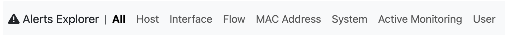
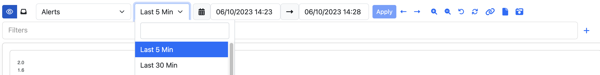
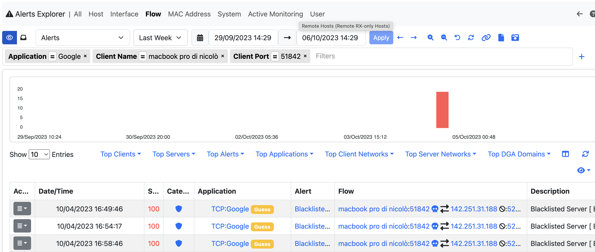

.. _Alerts:

Alerts
######

Here all the alerts ntopng triggers or receives from third party softwares (see `Syslog Ingestion <../advanced_features/syslog.html>`_) can be found.

|

Explorer
--------

From here all the alerts available can be explored and found, by using all the filters available.

|

In ntopng different families of Alerts are available and it's possible to check the different Alerts triggered for each family by using the navigation menu on top of the page.

|

When jumping to a specific family, all the available Alerts in the selected timeframe are going to be displayed in a table

|

It's possible to change the selected timeframe by using the calendar or the preset available next to the calendar and it's possible to filter out the values by adding new filters, by clicking the `+` symbol on the right or by directly clicking the information on the table, it's going to open a modal on which it's possible to add filters.

|

.. figure:: ../img/alerts_filter_modal.png
  :align: center
  :alt: Add Filter Modal

|

After selecting the filter to add, click on the apply button and the filter is going to be applied, filtering the alerts.

|

To check all the information available on an alert, there are two possible ways: by clicking on the alert, more info are going to be displayed, or by clicking the action button and then selecting the `Info` entry.

|

Flow Alerts Analyser
--------------------

.. note::

  This page is available only with Enterprise license.

In this page a summary of the alerts can be seen, in order to understand as fast as possible if and where the issues are.

|

It is possible to change the view type by changing the criteria; by changing instead the timeseries entry, it can be changed the research period.

.. figure:: ../img/flow_alert_analyzer_criteria.png
  :align: center
  :alt: Alerts Info

|

The X and Y axis displayes different data depending on the criteria selected (e.g. Alerts Count and Score when selecting the `Score: Client/Server`); the same goes for the tooltip on each node, if the mouse pointer stand still on a node, depending on the criteria, a different message is displayed.

|

When clicking on a node, the user is going to be redirected to the Alerts page with the corresponding filters.

