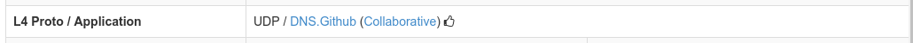
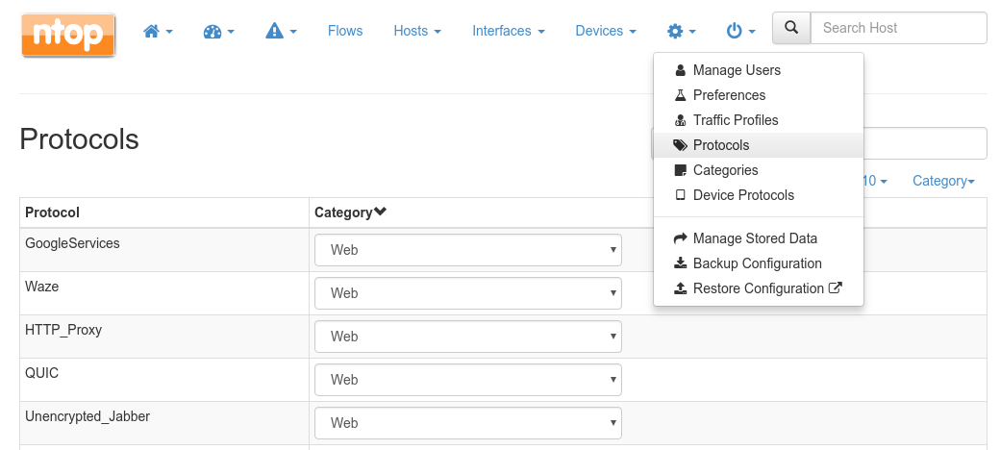

Categories
##########

Traditionally nDPI was used by ntopng to detect flows L7 protocol. With the advent of
more and more protocols, speaking about single protocols is often too difficult.
Users usually are not interested in the specific protocol but rathen on a whole
group of protocols. For example, it's easier to reason about VPN traffic as a
whole rather than a particular VPN implementation.

For these reasons, nDPI (and ntopng) has been extended to provide a logical
grouping of protocols, called Categories. With Categories it's possible, for example,
to get an idea of the network traffic of a host:

.. figure:: ../img/host_category_overview.png
  :align: center
  :alt: Host Category Overview
  :scale: 70

  Host Category Overview

Some use cases solved by the Categories include:

- Block all advertisement sites (nEdge)
- Trigger an alert whenever my employees access a malware site (ntopng, whereas in nEdge there is the ability to block this traffic)
- Prevent clients from accessing the WiFi sites of competitors as they are using them for comparing prices (nEdge)

The picture above shows the Collaborative category being reported on the flow
details of a Github/DNS flow. The flow Category is usually determined based on the
flow protocols. The *Protocols* page can be used to review and modify the category
associated to each protocol:

  The Protocol Category editor

Custom Category Hosts
---------------------

As shown above, ntopng already assigns a default category to the known L7 protocols.
Nevertheless, it's also possible for the user to specify a list of additional hosts
to be included into a particular category. ntopng provides 5 empty "custom categories"
dedicated to this task, but users are also free to modify the other categories.

The custom category hosts can be specified via some host-based rules.
The host-based rules will be used to perform substring matching on some of the flow information:

  - Client/Server IP
  - Host SNI
  - HTTP Host

If a match is found, the flow category will be set to the corresponding matching category.
These rules can be configured from the *Categories* page.

.. figure:: ../img/web_gui_category_editor.png
  :align: center
  :alt: The Category editor

By clicking "Edit Hosts" it's possible to define some hosts which will be considered
as part of the category.

.. figure:: ../img/web_gui_edit_category_hosts.png
  :align: center
  :alt: Edit Category Hosts
  :height: 400px

  Edit Category Hosts

The picture above shows some custom hosts defined for the Advertisement category.
For example, the `.ads.` host rule will match any host containing `.ads.` . It is important
to play with the dots to avoid excessive matching (e.g. a simple `ads` rule would also match `mads.com`).

Note: host matching based on IP addresses is currently limited to IPv4 flows.

ntopng also supports external lists to define custom categories, loaded from text file (local) or online 
services (e.g. *emergingthreats* for the *Malware* category). Since lists are also used to raise alerts 
(e.g. for hosts in the Malware or Mining category), you may need to add exceptions to those lists,
whitelisting selected hosts. This is possible adding an host to the list, prepending "!" to the IP/hostname
(e.g. !1.2.3.4).

Flow Shortcut
-------------

From the flow details view there is a convenient way to add the flow SNI/HTTP host
to a customized category.

.. figure:: ../img/web_gui_add_host_to_category.png
  :align: center
  :alt: Edit Category Hosts

.. figure:: ../img/web_gui_add_host_to_category_dialog.png
  :align: center
  :alt: Edit Category Hosts

  Add a Flow Host to a Category
