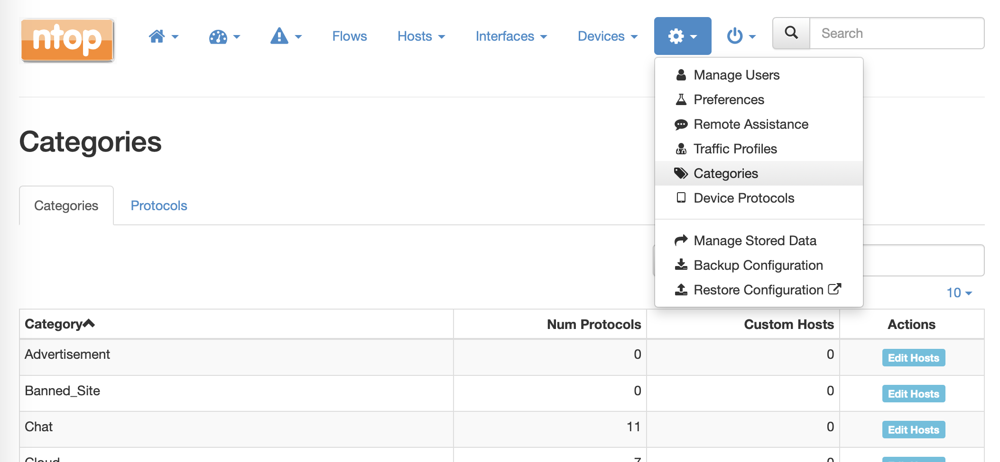
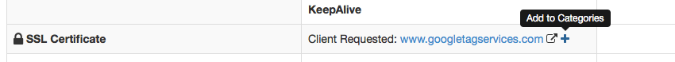

Applications and Categories
###########################

Category
--------

Traditionally nDPI was used by ntopng to detect flows L7 protocol. With the advent of more and more protocols, 
speaking about single protocols is often too difficult. Users usually are not interested in the specific protocol
but rather on a whole group of protocols. For example, it's easier to reason about VPN traffic as a whole rather 
than a particular VPN implementation.

For these reasons, nDPI (and ntopng) has been extended to provide a logical grouping of protocols, called Categories. 
With Categories it's possible, for example, to get an idea of the network traffic of a host:

.. figure:: ../img/host_category_overview.png
  :align: center
  :alt: Host Category Overview

  Host Category Overview

Some use cases solved by the Categories include:

- Block all advertisement sites (nEdge)
- Trigger an alert whenever my employees access a malware site (ntopng, whereas in nEdge there is the ability to block this traffic)
- Prevent clients from accessing the WiFi sites of competitors as they are using them for comparing prices (nEdge)

Custom Applications
-------------------

In the Applications tab it's possible to configure the category associated associated
with a particular application.

.. figure:: ../img/web_gui_categories_protocols.png
  :align: center
  :alt: The Protocol Category editor

  Applications Configuration Page

ntopng determines the application of a flow via some rules into nDPI. However,
some additional rules can be specified by the user via the *--ndpi-protocols|-p <file>*
option. The file has the following format:

.. code:: text

   # host:"<value>",host:"<value>",.....@<subproto>
   host:"googlesyndacation.com"@Google
   host:"venere.com"@Venere

An example for this configuration file is available `here <https://github.com/ntop/nDPI/blob/dev/example/protos.txt>`_.

Ntopng also supports editing such file from the GUI. In order to do so, it's
still necessary to use the above option to point to a protos file located into
a directory where ntopng has the permission to read and write. In practice, in
order to enable this feature, ntopng should be started with the
*--ndpi-protocols=/var/lib/ntopng/protos.txt* option. If you already have a protos
file, move it to */var/lib/ntopng/protos.txt* and run

.. code:: bash

    sudo chown ntopng:ntopng /var/lib/ntopng/protos.txt

to prepare it to be used by ntopng.

After this feature is enabled, by clicking on the "Edit Rules" button it will be
possible edit an application rules directly from the GUI and add new protocols.
It's important to note that rules and new protocols will only be created and applied
after a restart of ntopng.

.. figure:: ../img/web_gui_application_edit.png
  :align: center
  :alt: The Protocol Category editor
  :scale: 65%

  Editing Application Rules

For example, the `tcp:8080` rule in the example above tells ntopng to treat all
the TCP traffic on port 8080 as HTTP. In order to delete a user defined protocol
it's necessary to clear all of its rules and save the changes.
The protocol will be deleted after a restart of ntopng.

.. _CustomCategoryHosts:
  
Custom Categories
-----------------

As shown above, ntopng already assigns a default category to the known L7 protocols.
Nevertheless, it's also possible for the user to specify a list of additional hosts
to be included into a particular category. ntopng provides 5 empty "custom categories"
dedicated to this task, but users are also free to modify the other categories.

The custom category hosts can be specified via some host-based rules.
The host-based rules will be used to perform substring matching on some of the flow information:

  - Client/Server IP
  - DNS query
  - Host SNI
  - HTTP Host

If a match is found, the flow category will be set to the corresponding matching category.
These rules can be configured from the *Categories* tab.

By clicking "Edit Rules" it's possible to define some rules to match hosts and associate
them to the category.

.. figure:: ../img/web_gui_edit_category_hosts.png
  :align: center
  :alt: Edit Category Hosts
  :scale: 65%

  Edit Category Hosts

The picture above shows some custom hosts defined for the `Web` category.

.. note::

  host matching based on IP addresses is currently limited to IPv4 flows.

ntopng also supports external lists to define custom categories, loaded from text file (local) or online 
services (e.g. *emergingthreats* for the *Malware* category). Since lists are also used to raise alerts 
(e.g. for hosts in the Malware or Mining category), you may need to add exceptions to those lists,
whitelisting selected hosts. This is possible adding an host to the list, prepending "!" to the IP/hostname
(e.g. !1.2.3.4).

Adding a Rule from a Flow
-------------------------

From the flow details page, it's possible to click on the plus sign beside the flow SNI,
DNS or HTTP host to easily create a rule to associate such host to a particular application
or category.

.. figure:: ../img/web_gui_add_host_to_category_dialog.png
  :align: center
  :alt: Add Host Rule
  :scale: 85%

  Add Host Rule
