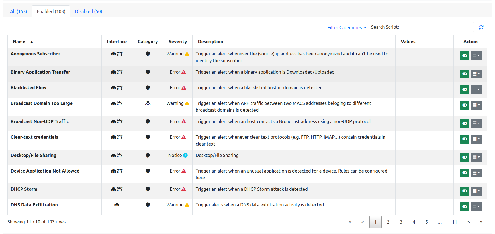

.. _WebUIUserScripts:

Checks
############

Checks process network elements and perform actions such as triggering alerts. Creating checks is discussed in detail in :ref:`Checks`. This section describes how users scripts can be enabled and disabled, configured, and applied to network elements such as hosts and flows.

Checks can be configured from any interface, from the menu `Settings->Checks`. 

  Checks Settings

Configuring a check means:

- Choosing the network elements the script is going to be executed for.
- Enabling/disabling it.
- Setting its configuration values.

`Configurations` are used to accomplish this.

Configurations
--------------

Checks are configured by means of `Configurations`. A `Default` configuration is always present. The `Default` configuration is used to configure:

- SNMP devices checks.
- Global system-wide checks.

The default configuration is also applied to:

- Any host of every interface.
- Any flow of every interface.
- Any interface.
- Any local network defined.

Additional configurations can be created to limit the scope of their application. This means any additional configurations can be applied to:

- Any subset of hosts of every interface.
- Any flow of a subset of the active interfaces.
- A subset of the active interfaces.
- A subset of the defined local networks.

The scope of application is shown in column `Applied To`. The Default configuration is `Applied to` any network element which is not included in any other configuration.

Editing Configurations
~~~~~~~~~~~~~~~~~~~~~~

Checks configurations can be edited for any of the configurable network elements. The edit page shows three tabs, namely `All`, `Enabled`, and `Disabled` to give immediate access to the whole list of checks, or to limit the view to only those that are enabled or disabled.

A check can be enabled or disabled by clicking the corresponding button under the `Actions` column. Certain checks can also have their values configured. In this case, an extra button `Edit` becomes available under the `Actions` column.

Resetting, Importing and Exporting Configurations
~~~~~~~~~~~~~~~~~~~~~~~~~~~~~~~~~~~~~~~~~~~~~~~~~

All existing configurations can be imported and exported in bulk, to ease backup, restore, and replication across multiple machines. Buttons to perform this task are available below the configuration list. Button `Export Configuration` allows to download a JSON file, whereas button `Import Configuration` accepts a previously downloaded JSON file to load the configurations. `Reset Configuration` cleans up any existing configuration on the current system.

