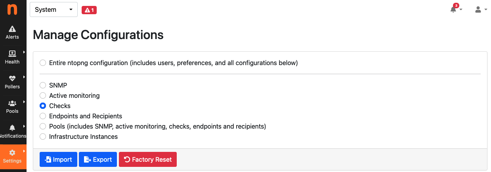

.. _WebUIUserScripts:

Checks
############

Checks process network elements and perform actions such as triggering alerts. Creating checks is discussed in detail in :ref:`Checks`. This section describes how users scripts can be enabled and disabled, configured, and applied to network elements such as hosts and flows.

Checks can be configured from any interface, from the menu `Settings->Checks`. 

.. figure:: ../img/web_gui_checks.png
  :align: center
  :alt: Checks Settings

  Checks Settings

Configuring a check means:

- Choosing the network elements the script is going to be executed for.
- Enabling/disabling it.
- Setting its configuration values.

Editing Checks
~~~~~~~~~~~~~~

Checks can be edited for any of the configurable network elements. The edit page shows three tabs, namely `All`, `Enabled`, and `Disabled` to give immediate access to the whole list of checks, or to limit the view to only those that are enabled or disabled.

A check can be enabled or disabled by clicking the corresponding button under the `Actions` column. Certain checks can also have their values configured. In this case, an extra button `Edit` becomes available under the `Actions` column.

Resetting, Importing and Exporting Configured Checks
~~~~~~~~~~~~~~~~~~~~~~~~~~~~~~~~~~~~~~~~~~~~~~~~~~~~

All existing check configurations can be imported and exported in bulk, to ease backup, restore, and replication across multiple machines. To perform these actions, visit the System Interface -> Settings -> Manage Configurations and select Checks

  Checks Import, Export and Reset

