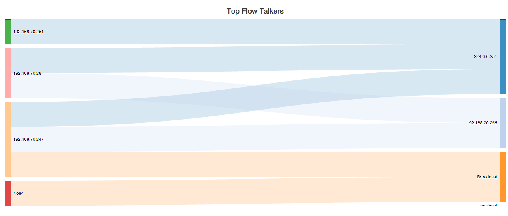
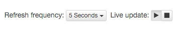
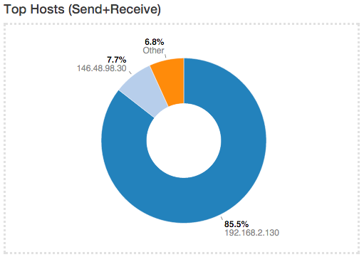
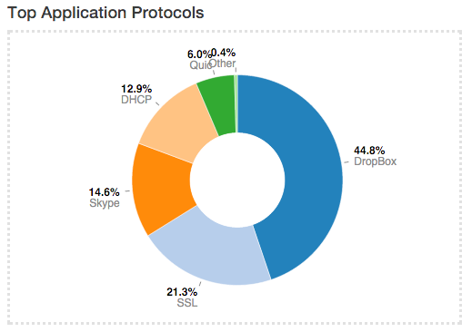
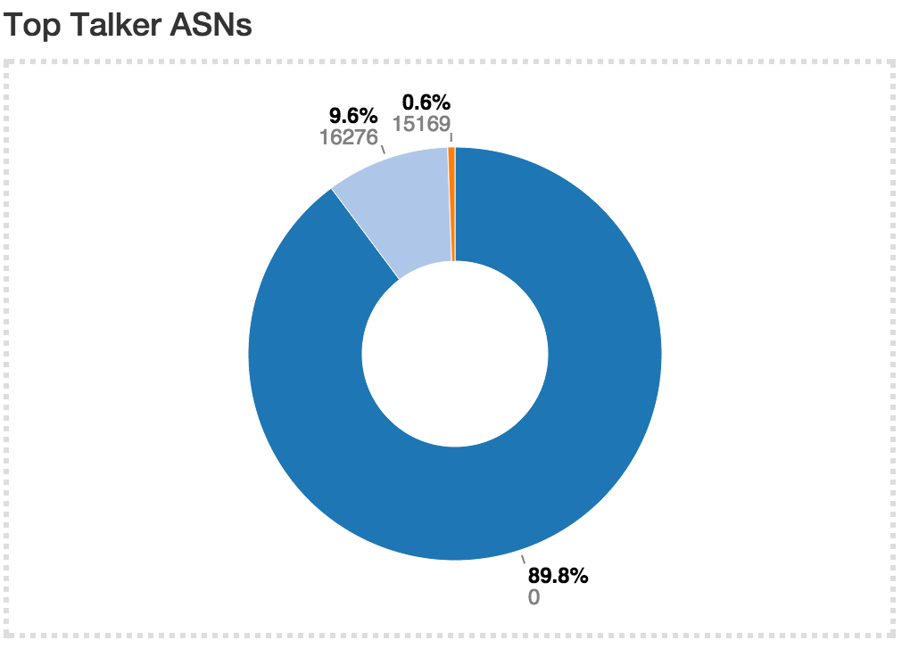
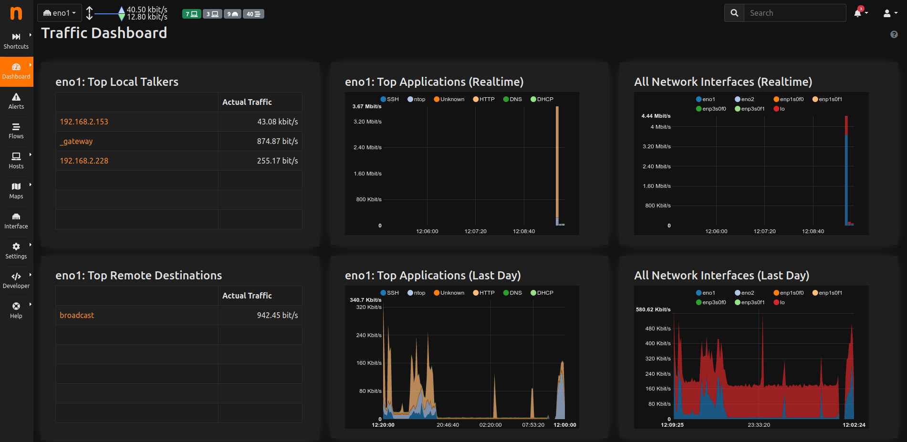

Dashboard
#########
Dashboard is a dynamic page and provides an updated snapshot of the current traffic for the selected interface or interface view being monitored by ntopng. Community and Professional version have two different dashboards.

Dashboard in the Community Version
----------------------------------
The dashboard provides information about Talkers, Hosts, Ports, Applications, ASNs, and Senders. Information can be selected from the top menu. Each item is discussed below.

.. figure:: ../img/web_gui_dashboard_community_top_menu.png
  :align: center
  :alt: The Top Menu for the Dashboard

  The Top Menu for the Dashboard

Talkers
^^^^^^^
The default dashboard page is a Sankey diagram of Top Flow Talkers

  The Sankey Diagram of Top Flow Talkers

The Sankey diagram displays hosts currently active on the monitored interface or interface view. Host pairs are joined together by colored bars representing flows. The client host is always placed in the left edge of the bar. Similarly, the server is placed on the right. Bar width is proportional to the amount of traffic exchanged. The wider the bar, the higher the traffic exchanged between the corresponding pair of hosts.

By default, the diagram is updated every 5 seconds. Refresh frequency can be set or disabled from the dropdown menu shown right below the diagram.
Host and flow information shown in the Sankey is interactive. Indeed, both host names (IP addresses) as well as flows are clickable.

  Diagram Refresh Settings

  A double-click on any host name redirects the user the 'Host Details' page, that contains a great deal of host-related information. This page will be discussed later in the manual.

Similarly, a double-click on any bar representing a flow redirects the user to the 'Hosts Comparison' page. Hosts can be pairwise compared in terms of Applications, Layer-4 Protocols, and Ports. A pie chart of exchanged traffic can be shown as well.
Below is shown an Application comparison between two hosts. The diagram shows that both hosts on the left have used DNS services (on the right). It is also possible to visually spot behaviors and trends. For example it is possible to see that jake.unipi.it is much more prone to use Google’s DNS than the other host.

.. figure:: ../img/web_gui_dashboard_sankey_pairwise_host_comparison.png
  :align: center
  :alt: Pairwise Host Comparison

  Pairwise Host Comparison

Hosts
^^^^^
Hosts View provides a pie chart representation of the captured traffic. Aggregation is done on a per-host basis. Similarly to the Sankey Diagram discussed above, any host name (or non-resolved IP address) shown can be double-clicked to visit the corresponding ‘Host Details’ page.

The pie chart is refreshed automatically.

  Pie Chart of Top Hosts

Ports
^^^^^
Ports view provides two separated pie charts with the most used ports, both for clients and for servers. Each pie chart provides statistics for client ports and server ports.

.. figure:: ../img/web_gui_dashboard_community_pie_chart_top_ports.png
  :align: center
  :alt: Pie Chart of Top Client and Server Ports

  Pie Chart of Top Client and Server Ports

Any port number shown can be double-clicked to visit the 'Active Flows' page. This page lists all the currently active flows such that client or server port matches the one clicked.

Applications
^^^^^^^^^^^^
Application View provides another pie chart that represents a view of the bandwidth usage divided per application protocol. Protocol identification is done through ntopn nDPI engine. Protocols that cannot be identified are marked as Unknown.

  Pie Chart of Top Applications

In the same manner as for previous view, application names are clickable to be redirected to a page with more detailed information on application.

Autonomous System Numbers (ASNs)
^^^^^^^^^^^^^^^^^^^^^^^^^^^^^^^^
ASNs view provides a pie chart representation of the traffic grouped by Autonomous System (AS). An AS is either a single network or a group of networks, controlled by a network administrator on behalf of a single administrative entity (such as a university, a business enterprise, or a business division). An AS is also sometimes referred to as a routing domain. A globally unique number called an Autonomous System Number (ASN) is assigned to each AS.

  Pie Chart of Top ASNs

Senders
^^^^^^^
Senders view provides a pie chart representation of top flow senders currently active. This graph shows the percentage of traffic being sent by endpoints either on local or remote networks.

.. figure:: ../img/web_gui_dashboard_community_pie_chart_top_senders.png
  :align: center
  :alt: Pie Chart of Top Senders

  Pie Chart of Top Senders

Dashboard in the Professional Version
-------------------------------------
The dashboard in the professional version provides a great deal of information, including realtime traffic - both per monitored interface and per application - top local talkers and top destinations. The dashboard is refreshed dynamically. Tables and chars are kept updated by ntopng.
The right part of the dashboard displays realtime and last-day charts of Top Applications and Network Traffic. In case a network interface view is selected, then network traffic is shown on a per physical-interface basis. Items shown in each chart can be dynamically toggled simply by clicking on the corresponding coloured dot in the chart key.

  Professional Dashboard

The left part of the dashboard shows tables of realtime Top Local Talkers and Top Remote Destinations, including the amount of traffic exchanged.
Top Local Talkers are hosts, belonging to local networks, that are exchanging the highest traffic volumes.
Similarly, Top Remote Destinations are hosts, belonging to remote networks, that are currently exchanging the highest traffic volumes.
Next to each Actual Traffic value there is an arrow that point up or down that indicates whether the traffic for such host has increased/decreased since the last web page update.

Each host show can be clicked to access its ‘Host Details’ page. Next to a host you can find a badge enclosing a number: it indicates how many virtual HTTP servers the host features.
  
