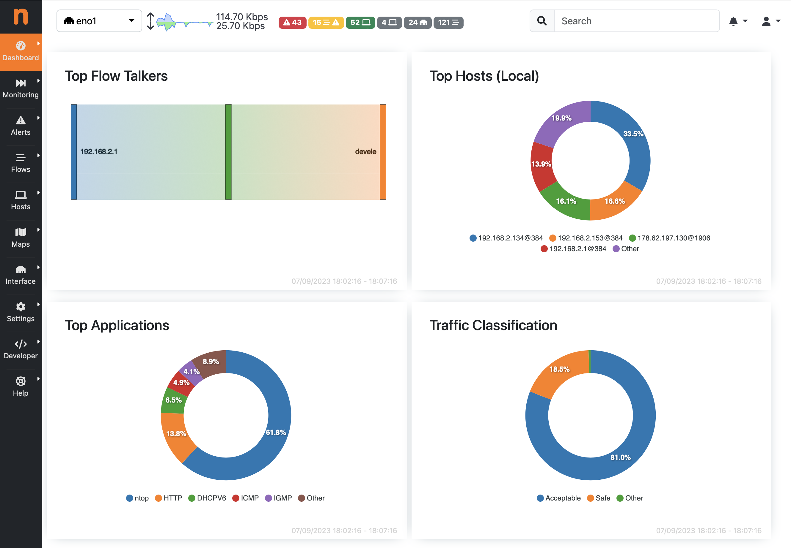

.. _Dashboard:

Dashboard
#########

The Dashboard is the landing (default) page that you see after logging in ntopng. This is a dynamic page providing an updated snapshot of the current traffic for the selected interface being monitored by ntopng. Community, Professional and Enterprise versions have different dashboards.

Community Dashboard
-------------------

The Community dashboard provides information about Top Talkers, Hosts, Applications, Classification which are automatically updated every a few seconds.

  Community Dashboard

Talkers
^^^^^^^

The Top Flow Talkers Sankey diagram displays hosts currently active on the monitored interface or interface view. Host pairs are joined together by colored bars representing flows. The client host is always placed in the left edge of the bar. Similarly, the server is placed on the right. Bar width is proportional to the amount of traffic exchanged. The wider the bar, the higher the traffic exchanged between the corresponding pair of hosts.

.. figure:: ../img/web_gui_dashboard_sankey.png
  :align: center
  :alt: The Sankey Diagram of Top Flow Talkers

  The Sankey Diagram of Top Flow Talkers

Hosts
^^^^^

The Top Hosts view provides a pie chart representation of the captured traffic. Aggregation is done on a per-host basis. Similarly to the Sankey Diagram discussed above, any host name (or non-resolved IP address) shown can be double-clicked to visit the corresponding ‘Host Details’ page.

.. figure:: ../img/web_gui_dashboard_community_pie_chart_top_hosts.png
  :align: center
  :alt: Pie Chart of Top Hosts

  Pie Chart of Top Hosts

Applications
^^^^^^^^^^^^

The Top Application view provides another pie chart that represents a view of the bandwidth usage divided per application protocol. Protocol identification is done through the ntopng nDPI engine. Protocols that cannot be identified are marked as Unknown.

.. figure:: ../img/web_gui_dashboard_community_pie_chart_top_applications.png
  :align: center
  :alt: Pie Chart of Top Applications

  Pie Chart of Top Applications

In the same manner as for previous view, application names are clickable to be redirected to a page with more detailed information on application.

Professional/Enterprise Dashboard
---------------------------------

The Dashboard in the Professional and Enterprise versions provides an higher level of details, information and traffic analysis insights, including realtime traffic for all monitored interfaces, per application, Top Local Talkers, Top destinations, comparison with historical traffic (when Historical Traffic Dump is enabled), etc. The dashboard is refreshed dynamically, tables and charts are kept updated by ntopng every few seconds.
The Dashboard is based on a flexible rendering engine based on templates, that makes the dashboard dynamic and customizable. There are multiple built-in templates, and more can be added by the user. The dashboard template which is used by default is automatically selected by ntopng based on the ntopng configuration (e.g. graphical components depicting traffic comparison with respect to the past are available when the ClickHouse support is enabled and Historical Flow data is available).

  Enterprise Dashboard

Network Discovery
-----------------

Network Discovery is available under the Dashboard sub-menu.

.. note::
    This feature is available only for `Packet Interfaces <interfaces/packet_vs_zmq>`_.

.. figure:: ../img/web_gui_network_discovery_page.png
  :align: center
  :alt: Network Discovery
    Network Discovery

By clicking `Run Discovery` button next to the Search box, above the table, a Network Discovery is going to be launched. 
ntopng now tries to contact all the available devices inside the `local network` by using different protocols (The following protocols are used to discover the devices: ARP, SSDP, MDNS, SNMP) and after few seconds, all the available devices are going to be displayed into the table.
The table contains:

- `IP Address`: The IP Address of the device.
- `Name`: The name of the device (if available).
- `Manufacturer`: The manufacturer of the device.
- `MAC Address`: The MAC Address of the device.
- `OS`: The Operting System of the device (if available).
- `Info`: The services made available from the device.
- `Device`: The device type (Router, PC, ...).

