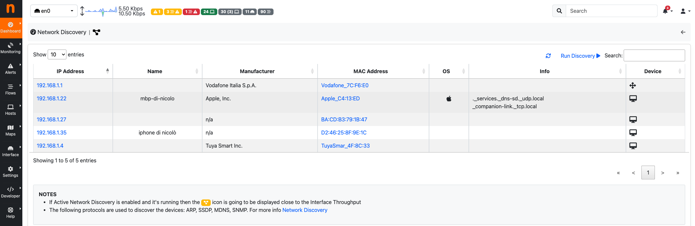

.. _Dashboard:

Dashboard
#########

Dashboard menu is different, depending on the currently licensed version.

.. figure:: ../img/web_gui_home_menu_pro.png
  :align: center
  :alt: Professional Version Home Menu

  Professional/Enterprise Versions Home Menu
  
.. figure:: ../img/web_gui_home_menu_community.png
  :align: center
  :alt: Community Version Home Menu

  Community Version Home Menu

Traffic Dashboard
-----------------

Dashboard is a dynamic page and provides an updated snapshot of the current traffic for the selected interface or interface view being monitored by ntopng. Community and Professional version have two different dashboards.

Dashboard in the Community Version
----------------------------------
The dashboard provides information about Talkers, Hosts, Ports, Applications, ASNs, and Senders. Information can be selected from the top menu. Each item is discussed below.

.. figure:: ../img/web_gui_dashboard_community_top_menu.png
  :align: center
  :alt: The Top Menu for the Dashboard

  The Top Menu for the Dashboard

Talkers
^^^^^^^
The default dashboard page is a Sankey diagram of Top Flow Talkers

.. figure:: ../img/web_gui_dashboard_sankey.png
  :align: center
  :alt: The Sankey Diagram of Top Flow Talkers

  The Sankey Diagram of Top Flow Talkers

The Sankey diagram displays hosts currently active on the monitored interface or interface view. Host pairs are joined together by colored bars representing flows. The client host is always placed in the left edge of the bar. Similarly, the server is placed on the right. Bar width is proportional to the amount of traffic exchanged. The wider the bar, the higher the traffic exchanged between the corresponding pair of hosts.

By default, the diagram is updated every 5 seconds. Refresh frequency can be set or disabled from the dropdown menu shown right below the diagram.
Host and flow information shown in the Sankey is interactive. Indeed, both host names (IP addresses) as well as flows are clickable.

.. figure:: ../img/web_gui_dashboard_sankey_refresh_settings.png
  :align: center
  :alt: Diagram Refresh Settings

  Diagram Refresh Settings

  A double-click on any host name redirects the user the 'Host Details' page, that contains a great deal of host-related information. This page will be discussed later in the manual.

Hosts
^^^^^
Hosts View provides a pie chart representation of the captured traffic. Aggregation is done on a per-host basis. Similarly to the Sankey Diagram discussed above, any host name (or non-resolved IP address) shown can be double-clicked to visit the corresponding ‘Host Details’ page.

The pie chart is refreshed automatically.

.. figure:: ../img/web_gui_dashboard_community_pie_chart_top_hosts.png
  :align: center
  :alt: Pie Chart of Top Hosts

  Pie Chart of Top Hosts

Ports
^^^^^
Ports view provides two separated pie charts with the most used ports, both for clients and for servers. Each pie chart provides statistics for client ports and server ports.

.. figure:: ../img/web_gui_dashboard_community_pie_chart_top_ports.png
  :align: center
  :alt: Pie Chart of Top Client and Server Ports

  Pie Chart of Top Client and Server Ports

Any port number shown can be double-clicked to visit the 'Active Flows' page. This page lists all the currently active flows such that client or server port matches the one clicked.

Applications
^^^^^^^^^^^^
Application View provides another pie chart that represents a view of the bandwidth usage divided per application protocol. Protocol identification is done through the ntopng nDPI engine. Protocols that cannot be identified are marked as Unknown.

.. figure:: ../img/web_gui_dashboard_community_pie_chart_top_applications.png
  :align: center
  :alt: Pie Chart of Top Applications

  Pie Chart of Top Applications

In the same manner as for previous view, application names are clickable to be redirected to a page with more detailed information on application.

Autonomous System Numbers (ASNs)
^^^^^^^^^^^^^^^^^^^^^^^^^^^^^^^^
ASNs view provides a pie chart representation of the traffic grouped by Autonomous System (AS). An AS is either a single network or a group of networks, controlled by a network administrator on behalf of a single administrative entity (such as a university, a business enterprise, or a business division). An AS is also sometimes referred to as a routing domain. A globally unique number called an Autonomous System Number (ASN) is assigned to each AS.

.. figure:: ../img/web_gui_dashboard_community_pie_chart_top_asns.png
  :align: center
  :alt: Pie Chart of Top ASNs

  Pie Chart of Top ASNs

Senders
^^^^^^^
Senders view provides a pie chart representation of top flow senders currently active. This graph shows the percentage of traffic being sent by endpoints either on local or remote networks.

.. figure:: ../img/web_gui_dashboard_community_pie_chart_top_senders.png
  :align: center
  :alt: Pie Chart of Top Senders

  Pie Chart of Top Senders

.. _DashboardPro:

Dashboard in the Professional Version
-------------------------------------
The dashboard in the professional version provides a great deal of information, including realtime traffic - both per monitored interface and per application - top local talkers and top destinations. The dashboard is refreshed dynamically. Tables and charts are kept updated by ntopng.
The right part of the dashboard displays realtime and last-day charts of Top Applications and Network Traffic. In case a network interface view is selected, then network traffic is shown on a per physical-interface basis. Items shown in each chart can be dynamically toggled simply by clicking on the corresponding coloured dot in the chart key.

.. figure:: ../img/web_gui_dashboard_pro.png
  :align: center
  :alt: Professional Dashboard

  Professional Dashboard

The left part of the dashboard shows tables of realtime Top Local Talkers and Top Remote Destinations, including the amount of traffic exchanged.
Top Local Talkers are hosts, belonging to local networks, that are exchanging the highest traffic volumes.
Similarly, Top Remote Destinations are hosts, belonging to remote networks, that are currently exchanging the highest traffic volumes.
Next to each Actual Traffic value there is an arrow that point up or down that indicates whether the traffic for such host has increased/decreased since the last web page update.

Each host show can be clicked to access its ‘Host Details’ page. Next to a host you can find a badge enclosing a number: it indicates how many virtual HTTP servers the host features.
  
Network Discovery
-----------------

Network Discovery is available under the Dashboard sub-menu.

.. note::
    This feature is available only for `Packet Interfaces <interfaces/packet_vs_zmq>`_.

    Network Discovery

By clicking `Run Discovery` button next to the Search box, above the table, a Network Discovery is going to be launched. 
ntopng now tries to contact all the available devices inside the `local network` by using different protocols (The following protocols are used to discover the devices: ARP, SSDP, MDNS, SNMP) and after few seconds, all the available devices are going to be displayed into the table.
The table contains:

- `IP Address`: The IP Address of the device.
- `Name`: The name of the device (if available).
- `Manufacturer`: The manufacturer of the device.
- `MAC Address`: The MAC Address of the device.
- `OS`: The Operting System of the device (if available).
- `Info`: The services made available from the device.
- `Device`: The device type (Router, PC, ...).

Report
------

The Professional version of ntopng allows to generate custom traffic reports for one or more interfaces
monitored. Report page, reachable from the dropdown home menu in the main toolbar, presents the
user with multiple configuration options.

.. figure:: ../img/web_gui_report_top.png
  :align: center
  :alt: Report Page Top

  The Top of the Report Page

Fixed-width temporal intervals are available on the left. They are 1h (one hour), 1d (one day), 1w (one
week), 1M (one month), 6M (six months), and 1Y (one year). A click on any of those intervals produces an
automatic report that spans a time range that starts at the present and that goes backwards in time until
the clicked interval is reached.

Exact temporal intervals can be chosen using the two dropdown date time pickers in the center. The first
and the second pickers are used to specify the start and the end of a custom report, respectively. Once
dates and times have been chosen, the report is obtained by clicking on ‘Generate’.

The small checkbox icon right of the ‘Generate’ button allows to select one or more of the available
monitored interfaces, as well as application protocols of interest. Clicking on it yields the following overlaid
menu.

.. figure:: ../img/web_gui_report_filter.png
  :align: center
  :alt: Report Filter

  Report Filter Overlay

Finally, the rightmost icon generates a printer-friendly report ready to be printed.

Reports contain charts of monitored interfaces overall traffic, local versus remote traffic, local networks
traffic, as well as the traffic grouped by:

- Application Protocols (e.g., HTTPS, Skype)
- Countries
- Local Hosts (hosts belonging to local networks) and Remote Hosts (hosts belonging to remote
  networks)
- Local Operating Systems
- Autonomous Systems

In the remainder of this section are screenshots of reported information discussed above.

.. figure:: ../img/web_gui_report_traffic.png
  :align: center
  :alt: Interfaces Traffic

  Report - Network Interfaces and Traffic

.. figure:: ../img/web_gui_report_networks.png
  :align: center
  :alt: Top Networks

  Report - Top Networks and Applications

.. figure:: ../img/web_gui_report_monitored_ifaces.png
  :align: center
  :alt:  Monitored Network Interfaces

  Report - Monitored Network Interfaces Summary

.. figure:: ../img/web_gui_report_top_networks.png
  :align: center
  :alt:  Top Networks

  Report - Top Networks

.. figure:: ../img/web_gui_report_countries.png
  :align: center
  :alt: Top countries

  Report - Top Countries

.. figure:: ../img/web_gui_report_local_remote.png
  :align: center
  :alt: Local and Remote Traffic

  Report - Local to Remote and Remote to Local Traffic

.. figure:: ../img/web_gui_report_app_breakdown.png
  :align: center
  :alt: Application Breakdown

  Report - Application Breakdown

Activity Report
^^^^^^^^^^^^^^^

In the enterprise version of ntopng it's also possible to get a detailed tabular
report of a single host, interface or network traffic over a specific time frame.

.. figure:: ../img/web_gui_report_activity_report.png
  :align: center
  :alt: Host Activity Report

  Host Activity Report

.. warning::

   The report is currently *not available* when using InfluxDB as the timeseries
   driver.

The report provides daily, weekly and monthly details on the total traffic made
by the entity (host in this case) and the total duration the host has been active
on the network. It also provides the previous period data as long as comparison
columns to easily analyze the difference between the two periods.

Via the date picker at the top of the chart it's possible to easily jump to another
period. The right and left arrows provide a convenient way to jump to the next and
previous period respectively. Via the "Today" button it's possible to jump to the
current day view, which show the traffic entity during the different hours of the day.

.. note::

  The report is based on the timeseries data. It is necessary to enable the traffic
  timeseries in order to display it.

Historical Flow Report
^^^^^^^^^^^^^^^^^^^^^^

Reports can also be generated for historical flows when ntopng is started with option :code:`F` as described in the `Flows Dump documentation`_. Multiple downstream stores are supported. See :ref:`Historical Flows` for additional information.

.. _`Flows Dump documentation` : ../advanced_features/flows_dump.html
