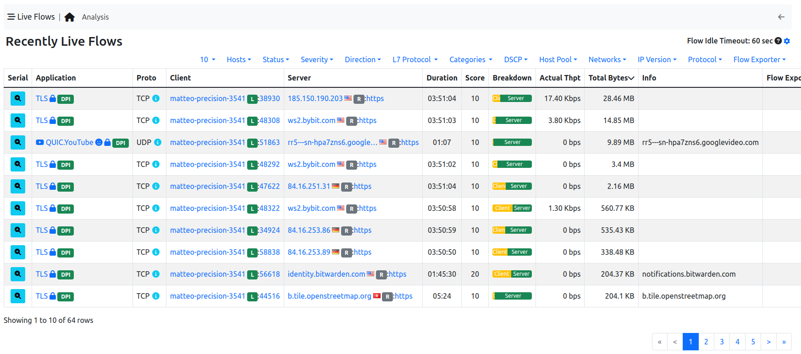

Flows
#####

The ‘Flows’ entry in the top toolbar can be selected to visualize realtime traffic information on the currently
active flows. A flow can be thought of as a logical, bi-directional communication channel between two
hosts [1]_. Multiple simultaneous flows can exist between the same pair of hosts.

  Active Flows Page

Flows are uniquely identified via a 5-tuple composed of:

- Source and destination IP address
- Source and destination port
- Layer-4 protocol

Each flow is shown as a row entry in the flows table. Flows are sortable by application using the rightmost
dropdown menu at the top right edge of the table. Similarly, the other dropdown menu enables the user
to choose the number of flows displayed on each page.

Flows have multiple information fields, namely, Application, Layer-4 Protocol, Client and Server hosts,
Duration, Client and Server Breakdown, Current Throughput, Total Bytes, and Additional Information.
Information fields are briefly discussed below.

Application
-----------

Application is the Layer-7 program which is exchanging data through the flow. This is the piece of
software that lays closest to the end user. Examples of Applications are Skype, Redis, HTTP, and Bit
Torrent. Layer-7 applications are detected by the NTOP opensource Deep Packet Inspection (DPI) engine
named nDPI [2]_. In case application detection fails, ntopng marks the flow as ‘Unknown’. If the detection
succeeds, the application name and a thumb up (down) is shown if the application is deemed to be good
(bad).

Application name can be clicked to see all hosts generating traffic for the application.

Layer-4 Protocol (L4 Proto)
---------------------------

The layer-4 protocol is the one used at the transport level. Most common transport protocol are the
reliable Transmission Control Protocol (TCP) and the best-effort User Datagram Protocol (UDP).

Client
------

This field contains host and port information regarding the client endpoint of the flow. An host is
considered a client if it is the initiator of the flow. Information is shown as host:port and both information
are clickable. If the host has a public IP address, ntopng also shows the country flag for that client [3]_ . A blue
flag is drawn when the host is the ntopng host.

Server
------

Similarly to the client, this field contains information regarding the server endpoint of the flow. An host is
considered a server if it is not the initiator of the flow. We refer the reader to the previous paragraph for a
detailed description.

Duration
--------

This is the amount of time that has elapsed since the flow was opened by the client.

Breakdown
---------

Flows are bi-directional, in the sense that traffic flows both from the server to the client and from the client
to the server. This coloured bar gives and indication on the amount of traffic exchanged in each of the two
directions. Client to server traffic in shown in orange, while server to client in blue.

Actual Throughput
-----------------

The throughput is computed periodically (the refresh time is a few seconds).

Total Bytes
-----------

The amount of traffic exchanged thought the flow. This total value is the sum of traffic exchanged in each
of the two directions (client to server and server to client).

Info
----

Extra information nDPI is able to extract from the detected flow is made available in this field. This field
may include urls, traffic profiles (in the Professional Version), contents of DNS requests, and so on.

.. [1] Actually, flows may also exist between a host and a multicast group, as well as a broadcast domain.
.. [2] https://github.com/ntop/nDPI
.. [3] These data are based on MaxMind databases.
