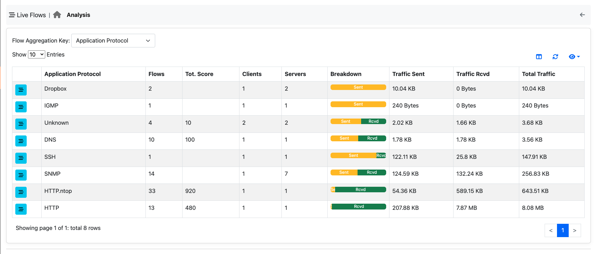
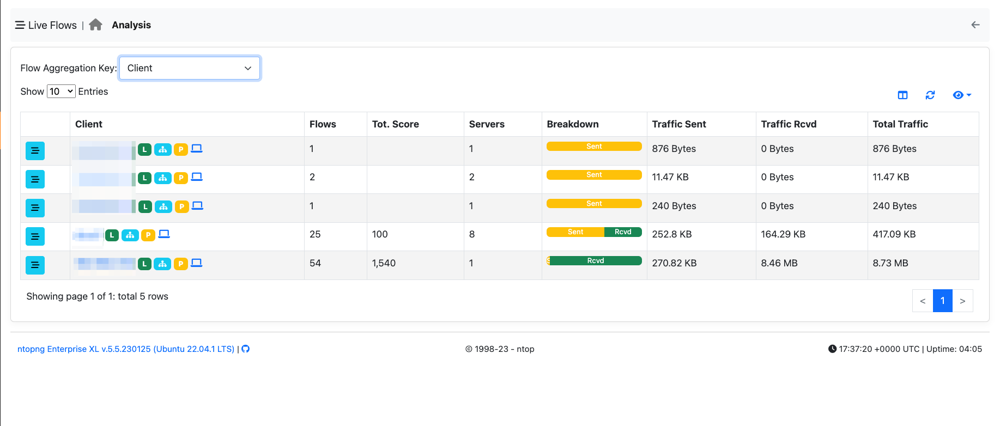
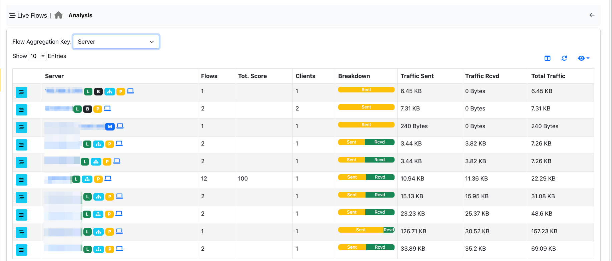
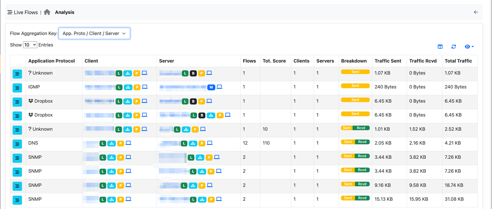
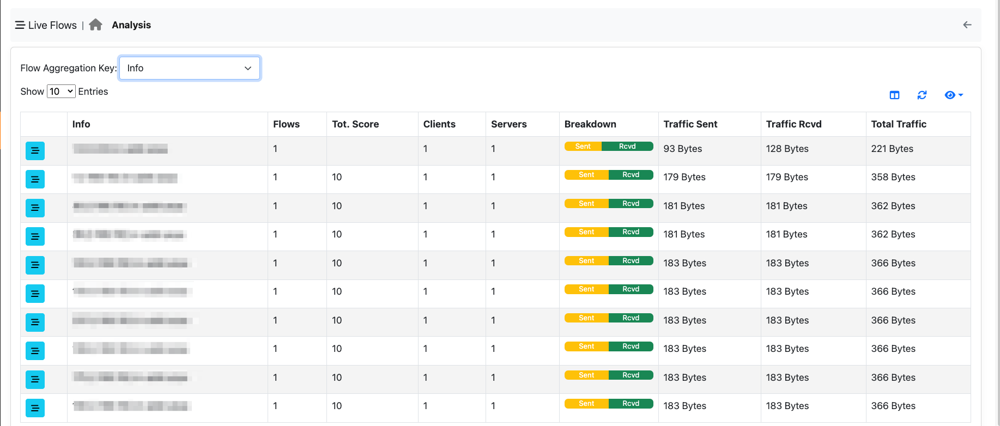

.. _WebGuiFlows:

Flows
#####

Live
----

The ‘Flows’ entry in the top toolbar can be selected to visualize realtime traffic information on the currently
active flows. A flow can be thought of as a logical, bi-directional communication channel between two
hosts [1]_. Multiple simultaneous flows can exist between the same pair of hosts.

  Active Flows Page

Flows are uniquely identified via a 5-tuple composed of:

- Source and destination IP address
- Source and destination port
- Layer-4 protocol

Each flow is shown as a row entry in the flows table. Flows are sortable by application using the rightmost
dropdown menu at the top right edge of the table. Similarly, the other dropdown menu enables the user
to choose the number of flows displayed on each page.

Flows have multiple information fields, namely, Application, Layer-4 Protocol, Client and Server hosts,
Duration, Client and Server Breakdown, Current Throughput, Total Bytes, and Additional Information.
Information fields are briefly discussed below.

Detailed Flow Information
^^^^^^^^^^^^^^^^^^^^^^^^^

By clicking the lens image at the beginning of the flow, it's possible to jump to the detailed flow information. Here all the information ntopng has about the flow, are going to be displayed.

  Flow Details Page

Application
^^^^^^^^^^^

Application is the Layer-7 program which is exchanging data through the flow. This is the piece of
software that lays closest to the end user. Examples of Applications are Skype, Redis, HTTP, and Bit
Torrent. Layer-7 applications are detected by the NTOP open source Deep Packet Inspection (DPI) engine
named nDPI [2]_. In case application detection fails, ntopng marks the flow as ‘Unknown’. If the detection
succeeds, the application name and an informative icon are shown.

Here is a list of possible informative icons:

  - The lock icon tells that the protocol carries information in a secure way (e.g. via SSL)
  - The thumb-up icons tells that the protocol is generally not harmful for network performance
  - The thumb-down icons tells that the protocol is generally harmful for network performance
  - The smile face tells that the protocol is generally used for user entertainment
  - The yellow triangle indicates a possible problem on the flow. By clicking a flow details it's possible to see what the reported problem is (e.g. flow with low goodput)

The application name can be clicked to see all hosts generating traffic for the application.

Layer-4 Protocol (L4 Proto)
^^^^^^^^^^^^^^^^^^^^^^^^^^^

The layer-4 protocol is the one used at the transport level. Most common transport protocol are the
reliable Transmission Control Protocol (TCP) and the best-effort User Datagram Protocol (UDP).

Client
^^^^^^

This field contains host and port information regarding the client endpoint of the flow. An host is
considered a client if it is the initiator of the flow. Information is shown as host:port and both information
are clickable. If the host has a public IP address, ntopng also shows the country flag for that client [3]_ . A blue
flag is drawn when the host is the ntopng host.

Server
^^^^^^

Similarly to the client, this field contains information regarding the server endpoint of the flow. An host is
considered a server if it is not the initiator of the flow. We refer the reader to the previous paragraph for a
detailed description.

Duration
^^^^^^^^

This is the amount of time that has elapsed since the flow was opened by the client.

Breakdown
^^^^^^^^^

Flows are bi-directional, in the sense that traffic flows both from the server to the client and from the client
to the server. This coloured bar gives and indication on the amount of traffic exchanged in each of the two
directions. Client to server traffic in shown in orange, while server to client in blue.

Actual Throughput
^^^^^^^^^^^^^^^^^

The throughput is computed periodically (the refresh time is a few seconds).

Total Bytes
^^^^^^^^^^^

The amount of traffic exchanged thought the flow. This total value is the sum of traffic exchanged in each
of the two directions (client to server and server to client).

TLS Information
^^^^^^^^^^^^^^^

ntopng provides detailed information on TLS flows:

.. figure:: ../img/web_gui_flows_tls_information.png
  :align: center
  :alt: TLS information

- The TLS certificate requested by the client and the server names returned by the server
- The TLS certificate validity time frame
- Client and server `JA3`_ signatures, which represent a fingerprint of the most relevant
  information in the TLS handshake. By clicking on the signature it is possible to manually
  check if the signature corresponds to a known malware into the `abuse.ch database`_.
- The Client `TLS ALPN`_, which contains the list of application protocols provided
  by the client during the TLS handshake
- The supported TLS protocols of the client

This information is very valuable in identifying potential threats on the encrypted traffic,
which include but are not limited to:

- Malicious clients/server (by matching the JA3 signature)
- Expired TLS certificates
- Unsecure TLS protocols in use
- MITM TLS attacks

ntopng already reports such events with specialized alerts (the available alerts
depend on the ntopng version used). For an in depth discussion on the challenges with encrypted traffic and how
the metadata can help in identifying network threats, check out the related ntop
`blog post`_ and related posts.

SSH Signature
^^^^^^^^^^^^^

In a similar way to the JA3 TLS signature, `HASSH`_ is a fingerprint on the SSH handshake.
ntopng generates the HASSH fingerprint of both the client and the server hosts of the flow.
ntopng also extracts and visualizes the SSH application banner which usually reports the
name and version of the SSH client/server application used.

This information can be used to identify outdated and vulnerable programs, which
undermine the hosts security. Moreover, the HASSH fingerprint can be matched against
known malware signatures to identify known threats.

.. _`HASSH`: https://engineering.salesforce.com/open-sourcing-hassh-abed3ae5044c

DNS Signature
^^^^^^^^^^^^^

ntopng also extracts and visualizes information regarding DNS application.
It reports, in the following order, the DNS query type, the DNS query error and DNS query,
following the standard classification (`RFC1035`_).

.. figure:: ../img/web_gui_flows_dns_information.png
  :align: center
  :alt: DNS information

Info
^^^^

Extra information nDPI is able to extract from the detected flow is made available in this field. This field
may include URLs, traffic profiles (in the Professional Version), contents of DNS requests, and so on.

.. [1] Actually, flows may also exist between a host and a multicast group, as well as a broadcast domain.
.. [2] https://github.com/ntop/nDPI
.. [3] These data are based on MaxMind databases.

Issues
^^^^^^

A flow could have some issues (reported in the :ref:`BasicConceptAlerts`).
All the issues of the flow are reported in the Detailed Flow Information page.

.. _`JA3`: https://github.com/salesforce/ja3
.. _`TLS ALPN`: https://en.wikipedia.org/wiki/Application-Layer_Protocol_Negotiation
.. _`blog post`: https://www.ntop.org/ndpi/effective-tls-fingerprinting-beyond-ja3
.. _`abuse.ch database`: https://sslbl.abuse.ch/ja3-fingerprints
.. _`RFC1035`: https://datatracker.ietf.org/doc/html/rfc1035

.. _Minor Connection state:

Major and Minor Connection State
^^^^^^^^^^^^^^^^^^^^^^^^^^^^^^^^

A flow using TCP as the L4 Protocol will have major and minor connection state. 

The major connection states are:

- **ATTEMPTED**
- **ESTABLISHED**
- **CLOSED**

For each major connection states, there are many minor connection states. 

When the major connection state is **ATTEMPTED**, the minor connection state could be one of the following states:

- **S0**: Connection attempt seen, no reply.
- **REJ**: Connection attempt rejected.
- **RSTOS0**: The client sent a SYN followed by a RST, and we never saw a SYN-ACK from the server.
- **RSTRH**: The server sent a SYN ACK followed by a RST, and we never saw a SYN from the (purported) client.
- **SH**: The client sent a SYN followed by a FIN, and we never saw a SYN ACK from the server (hence the connection was “half” open).
- **SHR**: The server sent a SYN ACK followed by a FIN, and we never saw a SYN from the client.
- **OTH**: No SYN seen, just midstream traffic.

If the major connection state is **ESTABLISHED** the minor connection state is

- **S1**: Connection established, not terminated.
 
Finally, if the major connection state is **CLOSED**, the minor connection state could be one of the following states:

- **SF**: Normal establishment and termination.
- **S2**: Connection established and close attempt by the client seen (but no reply from the server).
- **S3**: Connection established and close attempt by the server seen (but no reply from the client).
- **RSTO**: Connection established, the client aborted (sent a RST).
- **RSTR**: The server sent a RST.

Historical Flows Explorer
-------------------------

When ClickHouse is enabled, an historical flows explorer becomes available in the ntopng web GUI.
This page is used to navigate throw the flows seen and stored by ntopng.

.. note::

   ClickHouse support including the Historical Flows Explorer is only available in ntopng Enterprise M or above.

The explorer is available from the left sidebar, under the Flows section.

.. figure:: ../img/clickhouse_flow_explorer.png
  :align: center
  :alt: Historical Flows Explorer

  Historical Flows Explorer

It is possible, like for the Alerts Page, to navigate throw the flows by filtering the results.
Multiple filters are available by clicking the various results (e.g. The host `develv5`, to investigate its activities) or by clicking the `+` symbol in the right upper part of the GUI and selecting the wanted filter.

See :ref:`Historical Flow Explorer` for more information.

Flow Analysis
-------------

  Live Flows navigation bar

The flow analysis page allows flows to be analysed in an aggregated fashion instead of the classical 5-tuple. Basic aggregation criteria are available in all ntopng versions, whereas advanced ones only on selected Enterprise editions.

Application Protocol
^^^^^^^^^^^^^^^^^^^^

This criteria allows you to aggregate flows according to the application protocol (e.g. WhatsApp). This is useful for selecting all flows with a specific protocol.

Client
^^^^^^

You can use this aggregation criteria to cluster all flows originated by a specific client. Clicking on the flows icon, allows you to drill down to 5-tuple flow level.

Server Criteria
^^^^^^^^^^^^^^^

You can use this aggregation criteria to cluster all flows targeting a specific server. Clicking on the flows icon, allows you to drill down to 5-tuple flow level.

Client / Server / Destination Port Criteria
^^^^^^^^^^^^^^^^^^^^^^^^^^^^^^^^^^^^^^^^^^^

You can use this aggregation criteria to cluster all flows with the same Client/Server/DstPort. Clicking on the flows icon, allows you to drill down to 5-tuple flow level.

.. note::

  The following aggregation criteria are available only from Enterprise M license or superior.

Client / Server Criteria
^^^^^^^^^^^^^^^^^^^^^^^^

You can use this aggregation criteria to cluster all flows with the same Client/Server. Clicking on the flows icon, allows you to drill down to 5-tuple flow level.

App. Proto / Client / Server Criteria
^^^^^^^^^^^^^^^^^^^^^^^^^^^^^^^^^^^^^

You can use this aggregation criteria to cluster all flows with the same Application Protocol/Client/Server. Clicking on the flows icon, allows you to drill down to 5-tuple flow level.

Info Criteria
^^^^^^^^^^^^^

You can use this aggregation criteria to cluster all flows with the same information field (e.g. resolved host name in DNS flows). Clicking on the flows icon, allows you to drill down to 5-tuple flow level.

