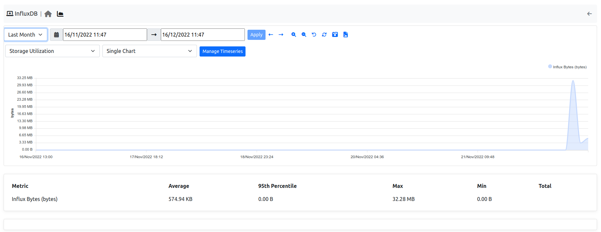

.. _Health:

Health
######

.. figure:: ../img/web_gui_system_interface.png
  :align: center
  :alt: System Interface

  System Interface

Like descripted in this `system section`_, the system interface is used to monitor the system on which ntopng is running.
In the Health section, users are able to monitor some core information about the system, going from the CPU/Memory usage of the system to the interfaces or Redis status.

System
------

  System Interface

Here a few information are available:

- CPU Load;
- CPU State;
- Memory Usage;
- ntopng PID;
- ntopng Memory Usage;
- ntopng Alerts;
- ntopng Storage Usage;
- Log Trace (for debugging);

By clicking the chart icon, the `Historical Charts`_ page is going to be displayed.
Clicking instead on the wrench, an other monitoring page is going to be shown with the state of ntopng queues, periodic activities and behavioral checks.

.. _Internals:

Internals
^^^^^^^^^

Internals expose status and health of certain ntopng components. Internal components are:

- `Hash Tables`
- `Periodic Activities`
- `Checks`

Information exposed is accessible from the `wrench` icon of any interface - including the :ref:`BasicConceptSystemInterface` - and is discussed detail below for each component.

Internals timeseries generation is of by default and can be enabled from  `Preferences->Timeseries->Internals`.

.. figure:: ../img/internals_timeseries.png
  :align: center
  :alt: Internals Timeseries

  Internals Timeseries

.. _InternalsHashTables:

Hash Tables
^^^^^^^^^^^

ntopng uses `hash tables <https://en.wikipedia.org/wiki/Hash_table>`_ to keep `active` network elements in memory. Hosts are kept in the `Hosts` hash table, flows are kept in the `Flows` hash table, and so on.

To ensure smooth functionalities, ntopng hash tables must:

- Have enough room to keep all the active network elements.
- Have enough room to accommodate new network elements that may arrive.
- Be not so full to reduce `collisions <https://en.wikipedia.org/wiki/Hash_table#Collision_resolution>`_.

In addition, every network element in a hash table must:

- Be considered active and updated periodically if it has network traffic associated.
- Be considered idle, removed from the hash table, and deleted from memory when its traffic is no longer seen.

Failing to meet one or more of the conditions will almost surely cause ntopng to malfunction. Under normal circumstances, such conditions are verified but may fail due to:

- ntopng misconfiguration, especially when :ref:`OperatingNtopngOnLargeNetworks` which require fine tuning
- ntopng bugs

Aim of the `Hash Tables` internals table is to monitor hash tables and hash table entries to check and possibly highlight the issues above.

.. figure:: ../img/internals_hash_tables.png
  :align: center
  :alt: Internals: Hash Tables

  Internals: Hash Tables

Information shown in the table columns is:

- `Hash Table`: The name of the hash table.
- `Chart`: A link to the historical chart of hash table idle and active entries over time.
- `Entries in Active State`: The total number of network elements that are currently active in the hash table.
- `Entries in Idle State`: The total number of network elements that are currently idle but waiting to be removed from the hash table and deleted from memory.
- `Hash Table Utilization`: The total number of active and idle network elements in the hash table, with reference to the total number of network elements the hash table can accommodate.

Information shown is useful to troubleshoot the following issues:

- `Network elements that are idle but are not being removed from the hash table`: This can exhausts hash table room and prevent new elements to be inserted. In this case, column `Entries in Idle State` will have a value comparable to, or even greater than, `Entries in Active State`. Having this issue means ntopng cannot remove idle elements with a sufficient speed and it should not happen.
- `The hash table is almost full`: This degrades ntopng performances as hash table accesses become slower and it can also prevent new elements from being inserted into the hash table. In this case, the bar in column `Hash Table Utilization` will be composted mostly of `Active` entries. Increasing the number of hosts and flows as described in :ref:`OperatingNtopngOnLargeNetworks` can solve.

Periodic Activities
^^^^^^^^^^^^^^^^^^^

Periodic activities are Lua scripts executed by ntopng at regular intervals of time. Lua scripts are found in the `checks <https://github.com/ntop/ntopng/tree/dev/scripts/lua/modules/check_definitions>`_. They can be run, in parallel, for each interface or for the system. Periodic activities include, but are not limited to:

- `Timeseries generation`.
- `Execution of Checks` as described in :ref:`WebUIUserScripts`.
- `Handling idle and active hash table entries` as described in :ref:`InternalsHashTables`.

Multiple threads are available for the execution of periodic activities. A thread executes one periodic activity at time. Multiple periodic activities are executed sequentially by the same thread. Multiple parallel threads execute multiple periodic activities simultaneously.

Each periodic activity has a `frequency` associated, that is, how often it needs to be executed. It also has a `max duration`, that is, the maximum execution time. For example, a periodic activity with `frequency` 5 and `max duration` 10 is executed every 5 seconds. Once in execution, it can take up to 10 seconds to complete. Assuming the activity actually takes 9 seconds to complete, this is what happens:

- At time `t=0`  the periodic activity is executed.
- At time `t=5`  the periodic activity is running so nothing is done, no new execution starts.
- At time `t=9`  the periodic activity completes its execution.
- At time `t=10` the periodic activity is executed.
- ...

To ensure smooth functionalities, periodic activities must:

- Always take less than `max duration` to complete.
- Be executed according to their `frequency`.
- Not drop alerts.

Failing to meet one or more of the conditions above can cause ntopng to malfunction. Normally, conditions are are verified. However, such conditions may fail when:

- All threads are busy so no one can execute a periodic activity ad the right `frequency`.
- A bug is causing a periodic activity to take more than its `max duration` to complete.
- A user activity is executing too many :ref:`Checks` that make it slow.
- Too many alerts are being generated and the export cannot keep up with the generation.

Aim of the `Periodic Activities` internals table is to monitor the execution of periodic activities to check and possibly highlight the issues above.

.. figure:: ../img/internals_periodic_activities.png
  :align: center
  :alt: Internals: Periodic Activities

  Internals: Periodic Activities

Information shown in the table columns is:

- `Periodic Activity`: The name of the periodic activity. Name equals the file name of the periodic activity Lua script which can be either found under the `system <https://github.com/ntop/ntopng/tree/dev/scripts/lua/modules/check_definitions/system>`_ periodic activities, `interface <https://github.com/ntop/ntopng/tree/dev/scripts/lua/modules/check_definitions/interface>`_ periodic activities, or both.
- `Frequency`: How often a periodic activity has to be executed.
- `Max Duration`: How long the periodic activity execution can take.
- `Chart`: A link to the historical charts of the periodic activity.
- `Time Utilization`: Periodic activity execution time, with reference to the `Max Duration`.
- `Status`: :code:`sleeping` if the activity has completed and is waiting for the next execution, :code:`queued` if the activity has been scheduled for execution but it isn't running yet, :code:`running` if the activity is currently in execution.
- `Last Start`: Indicates when the periodic activity was started the last time.
- `Last Duration`: Indicates the most recent periodic activity execution time. If the activity is :code:`running` indicates the current execution time.
- `Completion`: Is a percentage indicating the completion of the periodic activity. A slow periodic activity which would take more than `Max Duration` to complete, will not reach a 100% completion.
- `TS Writes`: The total number of timeseries points written by the periodic activity.
- `TS Drops`: The total number of timeseries points dropped by the periodic activity as writes were failing or slow.
- `Not Executed`: Counts the number of times a periodic activity wasn't scheduled for execution, either because it was already running (running slow) or already scheduled (no thread was available to execute it).
- `Running Slow`: Counts the number of times a periodic activity was taking more than `Time Utilization` to complete.

.. _Degraded Performance:

Degraded Performance
^^^^^^^^^^^^^^^^^^^^

When ntopng detects issues with periodic activities, it shows a triangle left to the periodic activity name. Hovering the mouse on the triangle prints the description of the ongoing issue. A yellow triangle is also shown at the top of every page. Clicking on the triangle opens a page with a summary of all the periodic activities with issues.

.. figure:: ../img/internals_periodic_activities_issues.png
  :align: center
  :alt: Internals: Periodic Activities with Issues

  Internals: Periodic Activities with Issues

The image above shows periodic activity :code:`stats_update.lua` which is taking too long to execute for interface `eno1`. This periodic activity has a `Max Duration` of 10 seconds as it can be seen from the table column. However, periodic activity `Last Duration` equals 15 seconds and thus it has exceeded `Max Duration` by 5 seconds. This is also evident by looking at the `Time Utilization` which it is all `Busy` has no green `Available` space. When this happens, the periodic activity is said to be slow and this is the actual ongoing issue for :code:`stats_update.lua`. The total number of times since startup this periodic activity has been detected to be slow is counted in column `Running Slow` and it equals 16.

Degraded performance can be temporary. The triangle shown at the top of every page and triangles shown left to periodic activity names indicate currently ongoing issues and disappear if no issue is currently occurring.

Periodic activities with issues also have their alerts. Alerts are engaged when the issue is ongoing, or past when the issue is no longer occurring. 

Periodic activities are in charge of running script checks.

Checks
^^^^^^

:ref:`Checks` are part of ntopng scripts. They are executed periodically or when a certain event occurs.

Aim of the `Checks` internals table is to monitor the execution of scripts.

  Internals: Checks

Information shown in the table columns is:

- `Check`: The name of the check which is executed.
- `Target`: The target of the check, either an `host`, a `flow` or one of the other targets.
- `Hook`: One of the :ref:`Check Hooks`.
- `Last Num Calls`: The number of times the check has been called the last time a periodic activity has executed it.
- `Last Duration`: The total duration of the check, computed as the sum of the duration of any of its `Last Num Calls`.

Information shown is useful to troubleshoot the following issues:

- `Troubleshoot` periodic activities with :ref:`Degraded Performance`: A periodic activity may be slow because it is executing too many checks. Combining data from the `Periodic Activities` internals table with this table can highlight this condition.

  ntopng Activities

.. _`system section`: ../basic_concepts/system_interface.html
.. _`Historical Charts`: ./other_components.html

Interfaces
----------

.. figure:: ../img/web_gui_interfaces_monitoring.png
  :align: center
  :alt: Interfaces Monitoring

  Interfaces Monitoring

In the Interfaces Health monitoring, the state of the interfaces analyzed by ntopng is going to be displayed, from the number of alerts, to the number of hosts, 
flows, devices, packets received and dropped.

.. _Alert Monitor:

Alert
-----

This monitor is used to understand if there is some alert loss and how much is the internal queue filled. 

.. figure:: ../img/alert_monitor_home.png
  :align: center
  :alt: The Alert Monitor Home

  The Alert Monitor Home

The overview has the following items:

- :code:`Fill Level/Dropped`: indicates how much is the internal queue filled and the number of alerts dropped.

.. _Redis Monitor:

Redis Monitor
-------------

`Redis <https://redis.io/>`_ is a key-value store used by ntopng to cache data and preferences. Redis runs as an external service both on Linux and on Windows. ntopng connects to Redis using sockets. Failing to connect to Redis would cause ntopng to malfunction. Redis must always be up, running and reachable to ensure ntopng functionalities.

Aim of this monitor is to check Redis health and resources used. The home of the Redis Monitor shows a brief overview

.. figure:: ../img/redis_monitor_home.png
  :align: center
  :alt: The Redis Monitor Home

  The Redis Monitor Home

The overview has three items:

- :code:`health`: A badge which is either green or red, depending on the status of Redis. The badge is green when the Redis Append Only File (AOF) is operational, otherwise the badge is red.
- :code:`ram`: Total memory Redis has obtained from the operating system.
- :code:`database keys`: Total number of keys currently stored in Redis.

ntopng interacts with Redis using `commands <https://redis.io/commands>`_. The number of times each command is issued is reported under the *wrench* page

.. figure:: ../img/redis_monitor_wrench.png
  :align: center
  :alt: The Redis Commands Monitor

  The Redis Commands Monitor

This page is mostly useful to debug anomalous uses of commands and it not really relevant for a user.

Available timeseries are:

- A stacked `Top Commands Call` to have an overview of the top commands used in time.
- RAM used
- Database keys
- Number of calls for a subset of Redis commands used.

Timeseries can be disabled from the :ref:`ntopngPreferences`, tab *Timeseries->System Probes*.

.. _InfluxDB Monitor:

InfluxDB Monitor
----------------

ntopng features an :ref:`InfluxDB Driver` to export timeseries to `InfluxDB <https://www.influxdata.com/>`_. Using InfluxDB causes ntopng to enable and periodically execute the InfluxDB monitor. The InfluxDB monitor checks InfluxDB health and status. The home of the InfluxDB Monitor shows a brief overview

.. figure:: ../img/influxdb_monitor_home.png
  :align: center
  :alt: The InfluxDB Monitor Home

  The InfluxDB Monitor Home

The overview has the following items:

- :code:`health`: A badge which is either green, yellow or red, depending on the status of InfluxDB. The badge is green when ntopng is correctly exporting to InfluxDB, yellow when there are export errors that are recoverable and didn't cause any data loss, red when export errors are persistent and data loss is occurring.
- :code:`storage utilization`: Total disk space used by InfluxDB.
- :code:`ram`: Total memory InfluxDB has obtained from the operating system.
- :code:`total exports`. Total number of successful writes into InfluxDB. A single write writes multiple points at once.
- :code:`total points`: Total number of points successfully written into InfluxDB.
- :code:`dropped points`: Total number of points dropped due to InfluxDB write failures.
- :code:`series cardinality`: An indication of how challenging is for InfluxDB to handle written points.

When InfluxDB is temporarily unable to export, the :code:`health` turns yellow.

.. figure:: ../img/influxdb_monitor_temporarily_unable.png
  :align: center
  :alt: InfluxDB Temporarily Unable to Export

  InfluxDB Temporarily Unable to Export

`Temporarily unable to export` means ntopng is actively retrying failing exports. Exports typically fails when InfluxDB is down or cannot ingest new data. After several attempts, ntopng gives up and drops the data it couldn't export. In this case, the :code:`health` turns into red.

.. figure:: ../img/influxdb_monitor_failing.png
  :align: center
  :alt: InfluxDB Failing to Export

  InfluxDB Failing to Export

`Failing to export` also causes alerts to be triggered with the reason of the failure to help the administrator fixing the issue.

ntopng keeps retrying even when the :code:`health` is red to recover as soon as InfluxDB becomes fully functional again.

Timeseries of items shows in the overview are available as well from the *char* page.

  InfluxDB Monitor Timeseries

Timeseries can be disabled from the :ref:`ntopngPreferences`, tab *Timeseries->System Probes*.

The InfluxDB monitor is implemented as an ntopng plugin. Source code is available on `gitHub <https://github.com/ntop/ntopng/tree/dev/scripts/plugins/influxdb_monitor>`_.

.. _ClickHouse Monitor:

ClickHouse Monitor
------------------

ntopng features ClickHouse to export flows to `ClickHouse <https://clickhouse.com/>`_. Enabling the export into ClickHouse Database is going to make the :doc:`Historical Flow Explorer <../clickhouse/historical_flow_explorer>` page available.

.. note::
    ClickHouse export is available only with Enterprise license

.. figure:: ../img/clickhouse_monitor_home.png
  :align: center
  :alt: The ClickHouse Monitor Home

  The ClickHouse Monitor Home

The overview has the following items:

- :code:`Health`: A badge which is either green, yellow or red, depending on the status of ClickHouse. The badge is green when ntopng is correctly exporting to ClickHouse, yellow when there are export errors that are recoverable and didn't cause any data loss, red when export errors are persistent and data loss is occurring.
- :code:`Tables Size`: Total disk space used by ClickHouse.
- :code:`Last Errors`: A log trace used to check if some error occurred during the export of the flows
