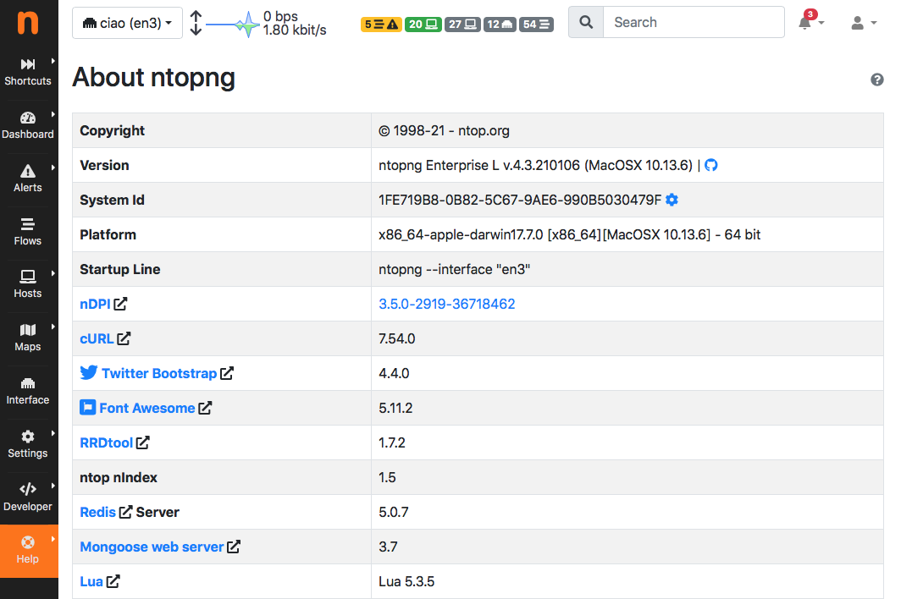

Help Menu
#########

The help menu shows several entries useful to know ntopng on the current ntopng as well as to find extra information from external sources.

.. figure:: ../img/web_gui_home_menu_help.png
  :align: center
  :alt: Help Menu

  Help Menu
  

About
-----

Shows information about ntopng Version, Platform, Currently Logged User, Uptime value and some details related to its internals.

  The 'About ntopng' Page

The upgrade from Community to Professional Version can be done by clicking on the system ID. The browser will be redirected to the ntop shop to generate a valid license. The generated id should be save in the appropriate field in License field.

ntop Blog
---------
Is a link to http://www.ntop.org/blog/ page where some useful information of tricks can be found.

Report an Issue
---------------
Is a link to https://github.com/ntop/ntopng/issues page where you can report specific bug you discovered.
