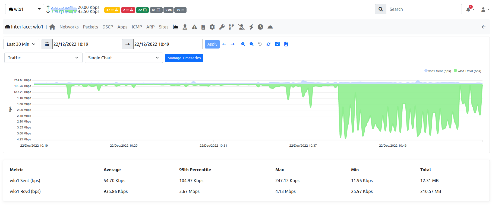
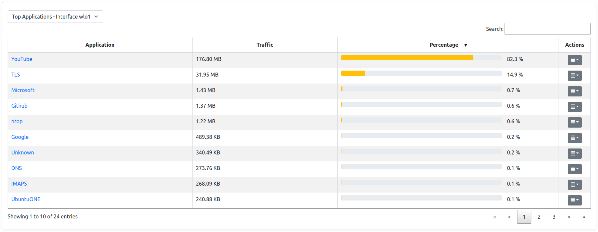

Historical Charts
#################

ntopng provides historical views on the `recorded timeseries data`_ .

  Historical Charts

From the top left dropdown it's possible to select the timeseries data to display.
Other than the actual timeseries data, the chart will also show:

  - A comparison series with the past. In the picture above, `30m ago` will show the
    interface traffic 30 minutes ago.

  - A trend line, which indicates the trend of the total traffic in the specified period.
    This is based on the https://github.com/stanford-futuredata/ASAP algorithm.

  - A SMA line, for the `Simple Moving Average`_ of the traffic. This performs an average
    on the traffic trend by smoothing it.

  - An EMA line, for the `Exponential Moving Average`_ of the traffic. This reacts to
    trends changes more quickly then the SMA.

  - An RSI line, for the `Relative Strength Index`_ on the difference between now and the
    past. Usually an RSI value above 70 indicates a major increase of the traffic as compared to the
    previous period, whereas an RSI value below 30 indicates a major decrease.

  - The average line, a straight line outlining the average value for the timeseries.

  - 95th percentile, a straight line outlining the 95th `percentile`_ value of the traffic.
    It indicates the value for which 95% of the timeseries points are below it.

By using the time selectors is possible to specify a specific time frame to graph.
It is also possible the predefined resolutions to display the latest data for predefined intervals,
e.g. latest 5 or 30 minutes. By clicking on `-30` and `+30` buttons is also possible to jump to
the corresponding interval in the past or future.

Timeseries data is shown on the charts is sampled. In order to get more accurate data is necessary
to zoom into the chart. This can be performed easily by dragging the mouse on the specified interval;
chart will update dynamically and show the interval data with higher resolution. A double click on the
chart performs a zoom out.

By clicking on the |permalink_icon| icon it's possible to get a permanent link to the current view to share
with others. If `traffic recording`_ is enabled, by clicking the |pcap_download_icon| icon it's possible to
download a PCAP file of the interface or host traffic in the specified time frame. Depending on the selected
historical timeseries, this could be available or not.

Tabular View
------------

Under the timeseries charts there is a tabular view which shows historical data for the
specified timeframe in a tabular format.

  Historical Tabular View

By clicking on the dropdown on the left it's possible to select the specific data to view.
Currently, the following views are implemented:

  - Top Protocols: the top protocols traffic and the percentage of each protocol on the total traffic.

  - Top Categories: the top categories traffic and the percentage of each category on the total traffic.

  - Top Senders: the top local sender hosts and their traffic.

  - Top Receivers: the top local receiver hosts and their traffic.

  - Top Interfaces: the top interfaces of a SNMP device.

  - An overview of the Misbehaving Flows status

.. _`recorded timeseries data`: ../basic_concepts/timeseries.html
.. _`traffic recording`: ../traffic_recording.html
.. _`Exponential Moving Average`: https://en.wikipedia.org/wiki/Moving_average#Exponential_moving_average
.. _`Simple Moving Average`: https://en.wikipedia.org/wiki/Moving_average#Simple_moving_average
.. _`Relative Strength Index`: https://en.wikipedia.org/wiki/Relative_strength_index
.. _`percentile`: https://es.wikipedia.org/wiki/Percentil
