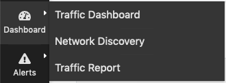
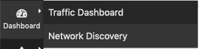

Home Menu
#########
Four items belong to the Home menu. An additional entry 'Report' is available in the Professional and Enterprise versions.

  Professional Version Home Menu
  

  Community Version Home Menu

About ntopng
------------
Shows information about ntopng Version, Platform, Currently Logged User, Uptime value and some details related to its internals.

.. figure:: ../img/web_gui_home_menu_about_ntopng.png
  :align: center
  :alt: The 'About ntopng' Page

  The 'About ntopng' Page

The upgrade from Community to Professional Version can be done by clicking on the system ID. The browser will be redirected to the ntop shop to generate a valid license. The generated id should be save in the appropriate field in License field.

ntop Blog
---------
Is a link to http://www.ntop.org/blog/ page where some useful information of tricks can be found.

Report an Issue
---------------
Is a link to https://github.com/ntop/ntopng/issues page where you can report specific bug you discovered.

Dashboard
---------
Provides a shortcut to default dashboard page of ntopng. The dashboard is discussed in greater detail in the following section.
