Host Details
############

Host Details page is as follows.

A contextual menu with labels and badges appears right below the top toolbar. Menu entries are
dynamic, hence, some of them may not always be present.

Menu entries are discussed below.

Home
----

*Home* is the default view of the Host Details page and provides detailed information including host MAC
Address (or the last router MAC address if the host is remote), IP Address (with network mask if detected),
a toggle to activate/deactivate alerts for the host, a checkbox to enable packet dump for the specific host,
symbolic hostname (or IP address), location (local or remote), date and time of first and last packet seen
for the host, traffic breakdown, amount of traffic packets received/sent, number of flows as client/server
host. All of this information is also available in JSON format by clicking on the ‘Download’ link. The heat
map provides the Activity Map for each host. Each box represents one minute of traffic. By default, Activity
Map shows the last six hours, but it is possible to set a different timeframe using the controls.

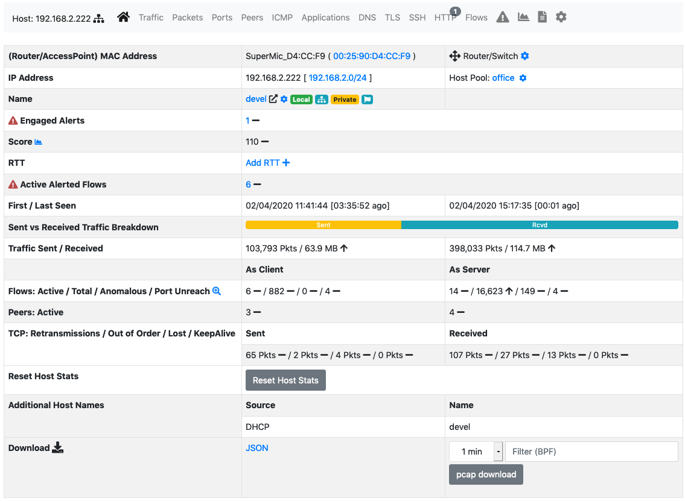

  The Home View of the Host Details Page

Traffic
-------

The Traffic Page provides Layer-4 protocol statistics for the host. A pie chart showing L-4 protocol
breakdown is show at the top of page. A table with detailed statistics is shown below the chart.

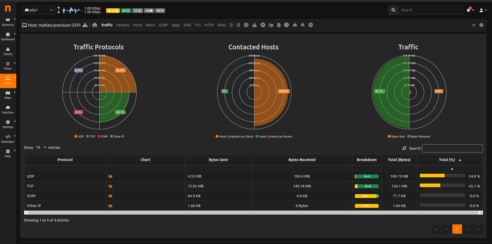

  The Traffic View of the Host Details Page

Packets
-------

Packets page provides pie charts with packet size distribution, both for sent and received packets.

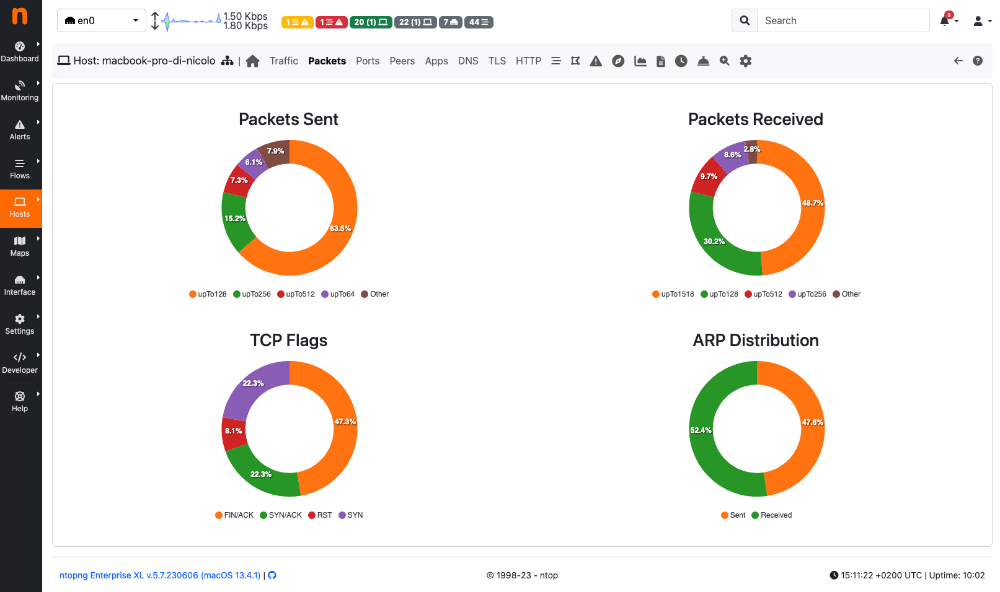

  The Packets View of the Host Details

Ports
-----

Ports page provides pie charts with traffic statistics grouped by port. A chart is available for client ports
and another one is available for server ports.

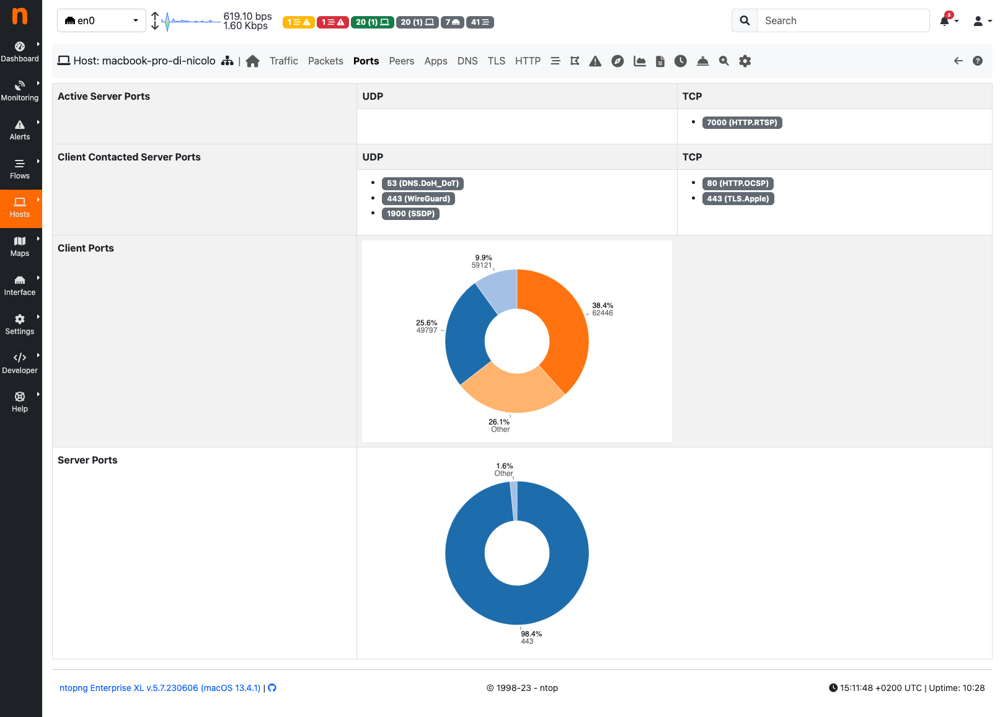

  The Ports View of the Host Details Page

Peers
-----

Peers page presents a graphical overview of top contacted peers and top protocols used. In the following
screenshot some hosts are struck-through intentionally for privacy reasons. A table with top application
per peer is shown below the graphical overview. Every information is clickable to allow the user to drill
down and find insights.

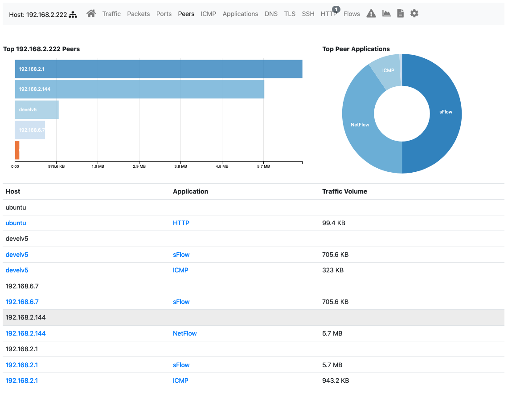

  The Peers View of the Host Details Page

Protocols
---------

Using the DPI information, this page provides in pie chart and tabular format the amount of traffic divided
by application. An additional pie chart provides a statistics about protocol type. A click on the protocol
name redirects the user to the page with detailed statistics about the selected protocol.

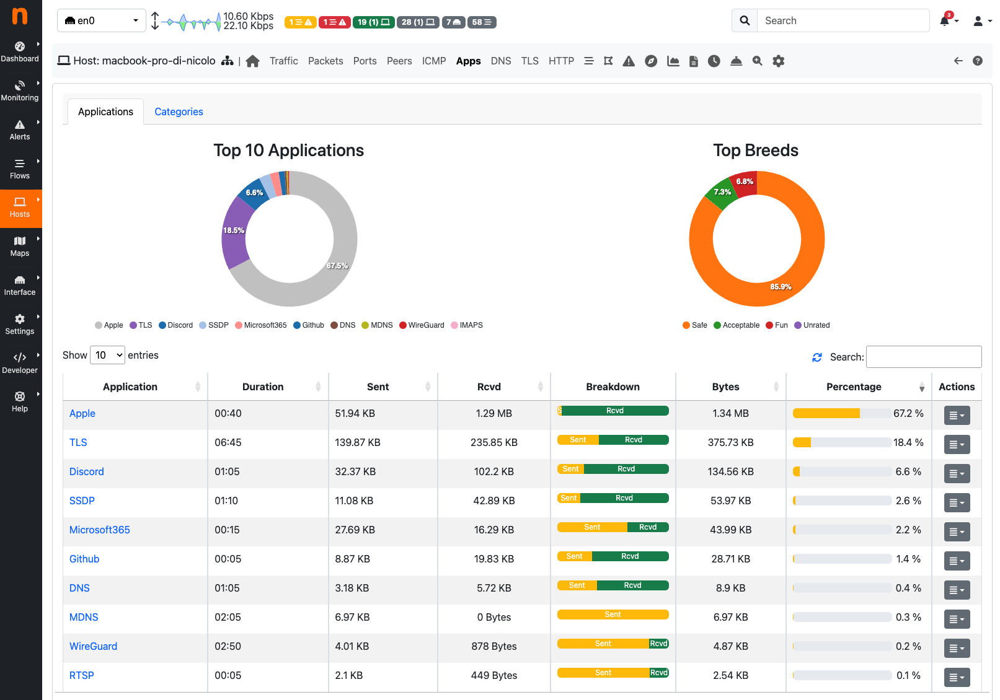

  The Protocols View of the Host Details Page

DNS
---

The chart and the table displayed on this page report DNS statistics, such as the number of queries, their
type (e.g., A, AAAA, PTR, and so on), and possible errors.

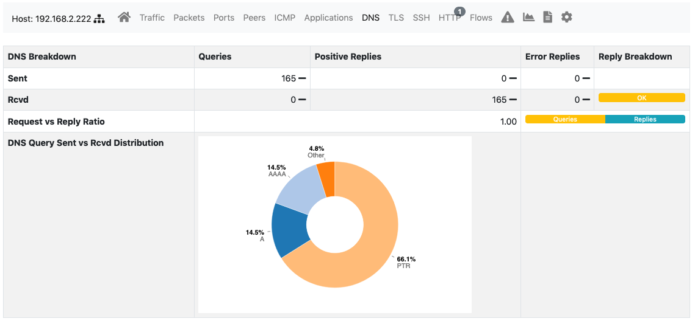

  The DNS View of the Host Details Page

HTTP
----

This page provides information about the HTTP protocol in terms of requests done and responses
received for each HTTP method, together with response codes. Counters are provided both as tables and
pie charts. In the case of virtual host being detected, a badge with the number of virtual hosts detected for
the same IP address is displayed in the host bar and an entry for each virtual server is displayed in a
virtual server table.

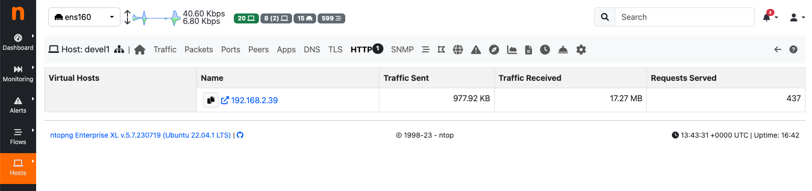

  The HTTP View of the Host Details Page with Virtual Hosts

Flows
-----

Flows page lists all active flows that have the selected host as an endpoint. A section of this manual
discuss in greater detail the statistics shown for flows.

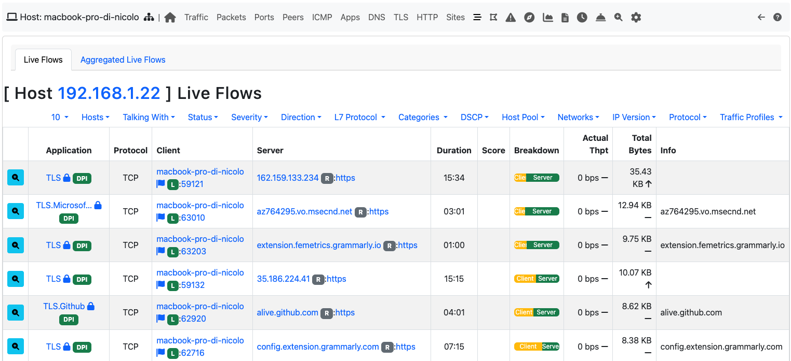

  The Flows View of the Host Details Page

SMNP
----

SMNP page provides SNMP information for the selected host with all the standard SNMP traffic metrics.

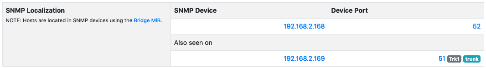

  The SMNP View of the Host Details Page

Talkers
-------

Talkers page provides top talkers having active flows with selected host. Similarly to the Community
edition dashboard, top talkers are laid out in a Sankey Diagram.

Geography
---------

Geography page provides an interactive map that shows the selected hosts, its flows, and its
peers.

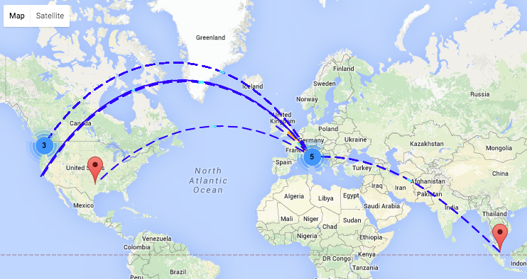

  The Geography View of the Host Details Page

Alerts Configuration
--------------------

Alerts Configuration page enables the user to set custom thresholds on multiple metrics, and to trigger
alerts based on those thresholds. Alerts can be armed, among other metrics, per total bytes, DNS traffic,
P2P traffic or packets, in a fixed time interval. Available time intervals are 1 and 5 minutes, 60 minutes,
and 1 day. Two columns are available for configuration. The first affects only the selected local host,
whereas the second affects all local hosts.

.. figure:: ../img/web_gui_host_details_alerts.png
  :align: center
  :alt: Host Alerts View

  The Alerts View of the Host Details Page

Statistics
----------

Statistics page provides historical traffic statistics for the selected host. The user can choose to filter
statistics on a protocol basis and display data in several formats (e.g., bytes, packets, flows, and so on).

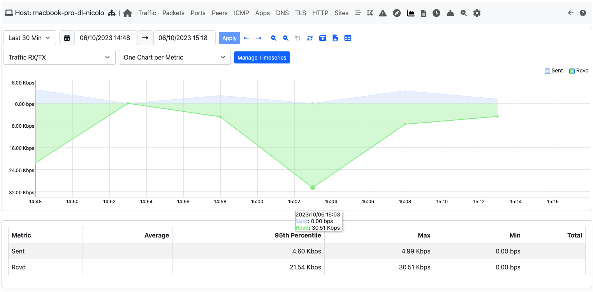

  The Statistics View of the Host Details Page

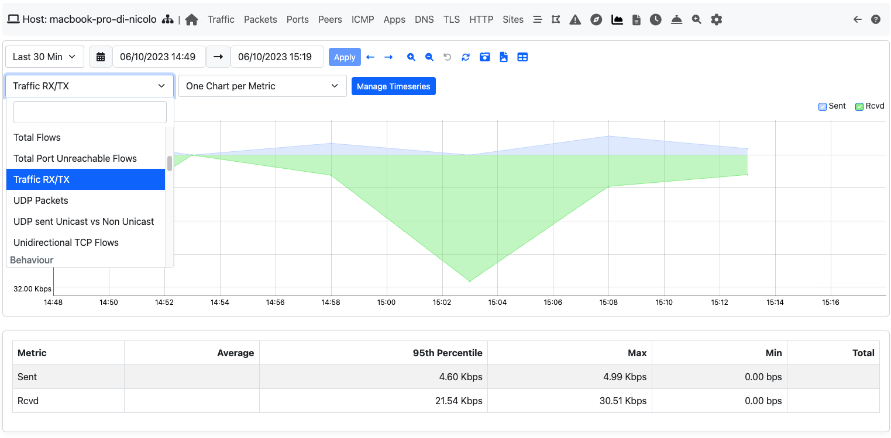

  The Dropdown menu in The Statistics View of the Host Details Page
