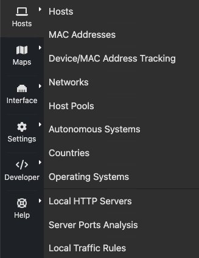
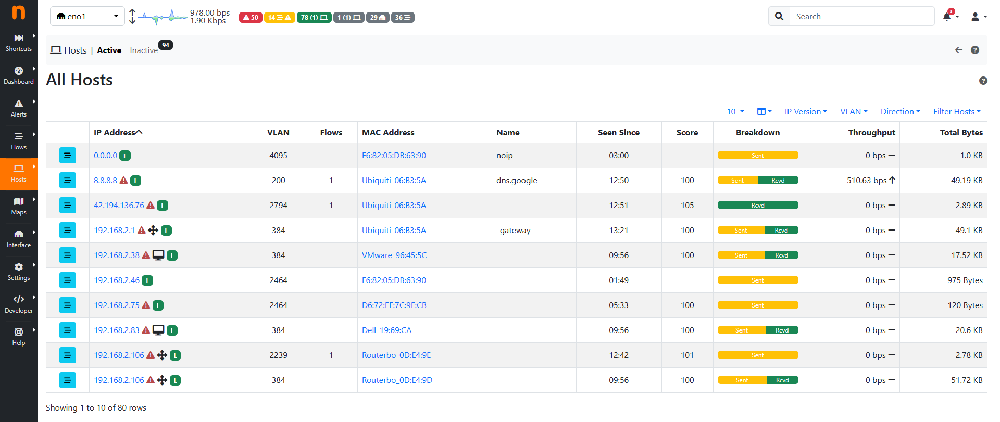
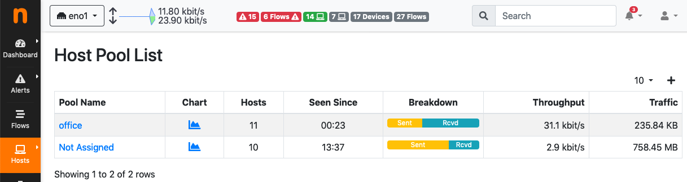
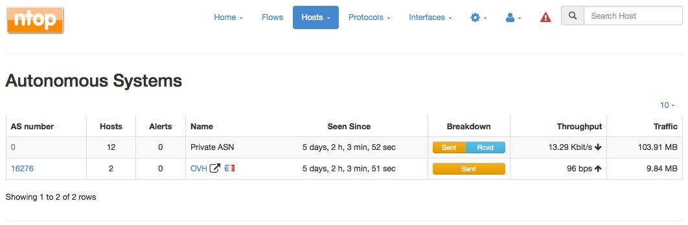
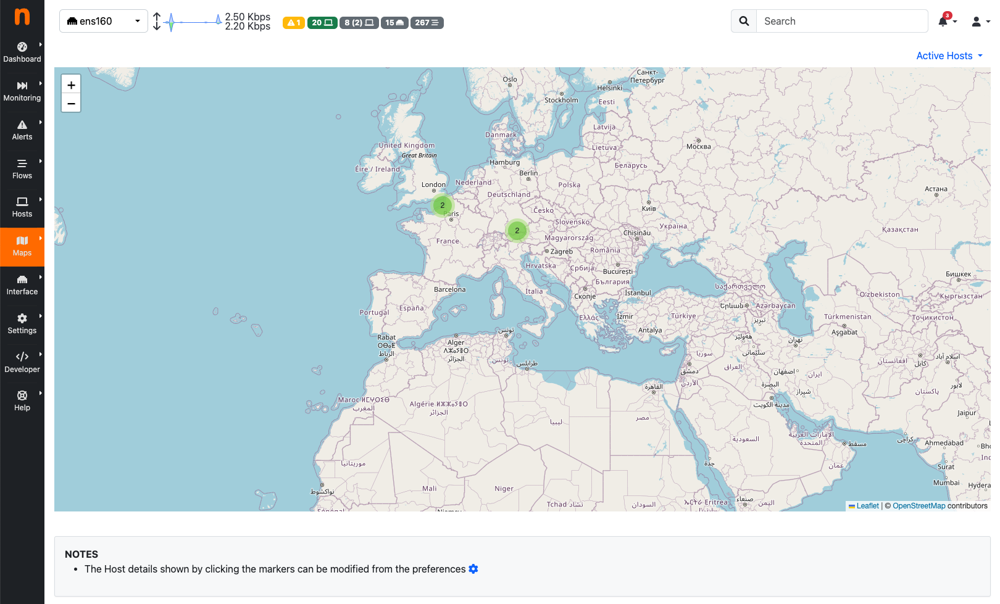

.. _Hosts:

Hosts
#####

Hosts is a dropdown menu always reachable from the top toolbar that contains a bunch of links to host-
related information pages. The dropdown is as follows:

  The Hosts Dropdown Menu

Host-related information pages available have the following content

- Hosts page shows all hosts seen
- Networks page lists all networks — both local and remote — any seen host belongs to
- Host Pools page has the list of the defined Host Pools
- Autonomous Systems page presents all Autonomous Systems (AS) any seen host belongs to
- Countries page shows hosts countries based on the information provided by MaxMind databases
- Operating Systems page lists all host operating systems that have been detected. Detection is done
  using passive fingerprinting techniques
- HTTP Servers (Local) page shows monitored HTTP servers, limited to local hosts only
- Top Hosts Traffic page presents traffic of top hosts in order to typology selected;
- Geo Map page lays out hosts in a geographic map to give visual insights into the geographical
  locations of seen hosts
- Tree Map page shows a tree representation of the monitored environment
- Local Matrix page displays a matrix representation of local systems

All Hosts
---------

All hosts that have been seen monitoring network interfaces are show here. Column headers can be
clicked to sort results in descending (ascending) order of the clicked header. Additional sort options are
available in the top right corner of the table.
The table shown has several columns, including

- IP address, with optional country flag and OS logo (if detected)
- Location, either Local (the host belongs to a local network) or Remote (the host belongs to a remote
  network) — please note that this is not a geographical location
- Alerts, with the number of alerts associated to the host
- Name, having the resolved hostname (or a custom name, if set in any Host Details page)
- Seen Since, with the amount of time it has lapsed since the first packet sent/received by the host has
  been observed
- ASN, with the AS number (if available)
- Breakdown, showing a bar that gives visual insights in the use of both traffic directions
- Throughput, with the overall actual throughput of the host
- Traffic, with the total traffic exchanged by the host

  The All Hosts Page

Any host can be clicked to be redirected to its ‘Host Details’ page, which is discussed below.

Host Pools
----------

Host Pools are logical groups of hosts that are described in detail in the “Network Interfaces" section of
this document. This page show the list of defined and currently active Host Pools.

  The Host Pools List Hosts Page

Each row of the table shows, for each pool, the following information:

- The Pool Name as defined by the user during Host Pool creation
- A Chart icon to access historical pool traffic timeseries. Historical pool traffic charts must be enabled
  from the preferences page and are a feature that is only supported in the Professional version.
- The number of active hosts in the pool
- The number of alerts detected as the sum of host alerts for each host in the pool
- Seen Since, with the amount of time it has lapsed since the first packet sent/received by any of the
  hosts in the pool has been observed
- Breakdown, showing a bar that gives visual insights in the use of both pool traffic directions
- Throughput, with the overall actual throughput of the pool
- Traffic, with the total traffic exchanged by the poo

Networks
--------

Networks shows all networks discovered by ntopng.

.. figure:: ../img/web_gui_hosts_networks_list.jpg
  :align: center
  :alt: Networks List

  The Networks Summary Page

For each network discovered ntopng provides the number of hosts, alerts triggered, date of discovery,
breakdown, throughput and traffic. Network names can be clicked to display the hosts lists inside the
network selected.

Autonomous Systems
------------------

Autonomous Systems shows all autonomous systems discovered by ntopng.

  The Hosts Autonomous Systems Summary Page

Ntopng uses a Maxmind database to gather information about Autonomous Systems (AS) and based on
this it groups hosts belonging to the same AS. AS number 0 contains all hosts having private IP addresses.

Countries
---------

Countries page provides all countries discovered by ntopng. Any country can be clicked to be redirected to
a page containing the full list of hosts localised in that country.

.. figure:: ../img/web_gui_hosts_countries_list.jpg
  :align: center
  :alt: Hosts Countries List

  The Hosts Countries Summary Page

Operating Systems
-----------------

Operating Systems page shows a list of all OS detected by ntopng. OSes can be clicked to see the detailed
list of hosts.

.. figure:: ../img/web_gui_hosts_os_list.jpg
  :align: center
  :alt: Hosts Operating Systems List

  The Hosts Operating Systems Summary Page

HTTP Servers (Local)
--------------------

HTTP Servers page lists all local HTTP Servers. Multiple distinct virtual hosts may refer to the same HTTP
server IP, which is specified in the second column. Additional information such as bytes sent and received
are available for each HTTP virtual host. By clicking on the magnifying lens icon near to the HTTP virtual
host, it is possible to display all active flows involving it.

.. figure:: ../img/web_gui_hosts_http_servers_list.jpg
  :align: center
  :alt: Local HTTP Servers List

  The Local HTTP Servers Summary Page

Top Hosts (Local)
-----------------

Top hosts page provides hosts activity on time basis. The page should be kept open in order to allow the
graph to dynamical update itself with real-time freshly collected data for each host. The time axis is
divided in 5-minute bars and goes backwards in time in a right-to-left fashion, starting from the present.

.. figure:: ../img/web_gui_hosts_top.jpg
  :align: center
  :alt: Top Hosts

  The Top Hosts Summary Page

Geo Map
-------

The Hosts Geo Map page provides world map where hosts are arranged according to their
geographical position.

  The Hosts Geo Map Summary Page

Tree Map
--------

This page provides a tree map of all monitored hosts. By clicking on hosts it is possible to visit the
corresponding ‘Host Details’ page.

.. figure:: ../img/web_gui_hosts_treemap.jpg
  :align: center
  :alt: Tree Map

  The Hosts Tree Map Summary Page

Local Flow Matrix
-----------------

Local Hosts Active Flows Matrix page visualises a matrix of local hosts versus local hosts. Each cell
contains the amount of traffic exchanged between every pair of hosts. Since flows are bi-directional, up to
two values can be indicated in each cell.

.. figure:: ../img/web_gui_hosts_flow_matrix.png
  :align: center
  :alt: Flows Matrix

  The Active Flows Matrix Page
