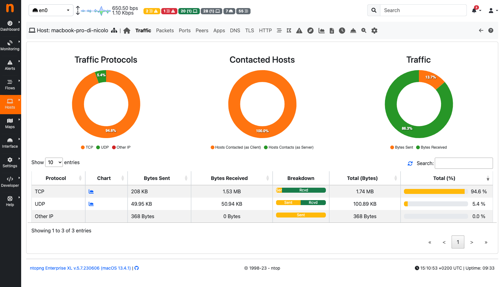
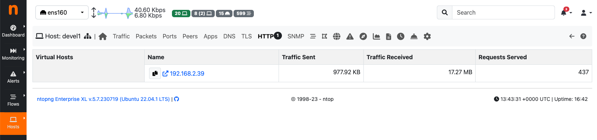
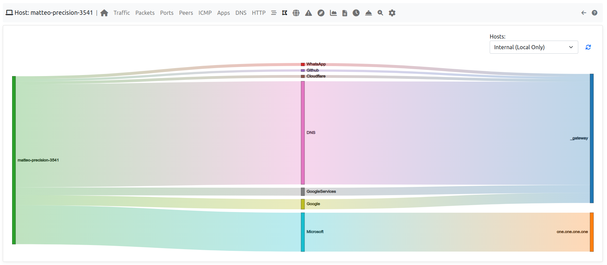
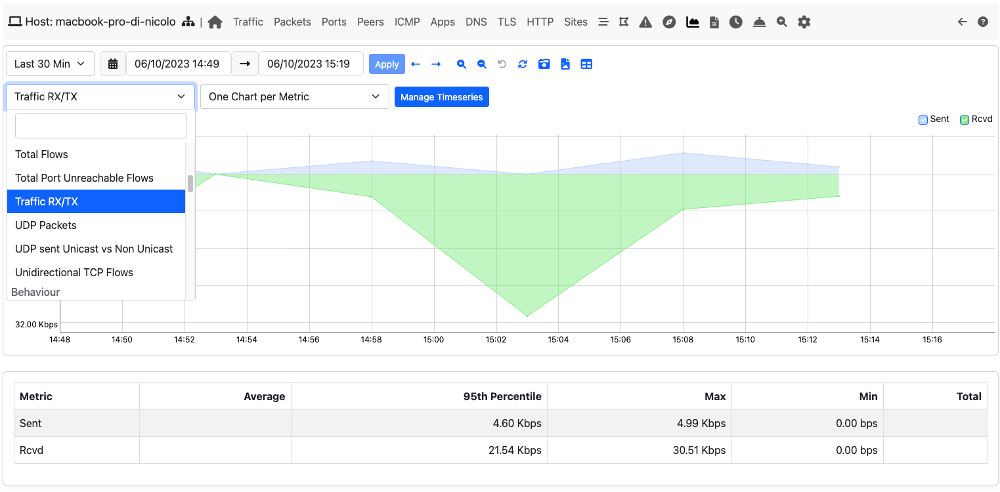
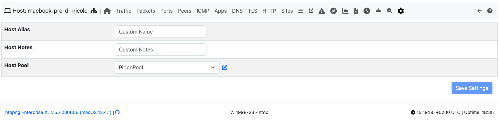
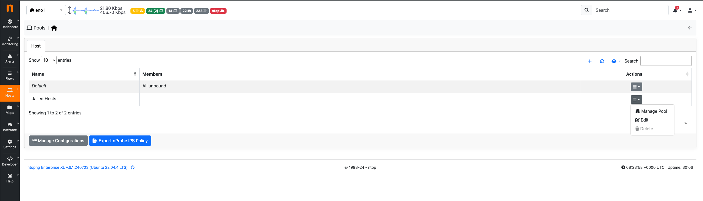
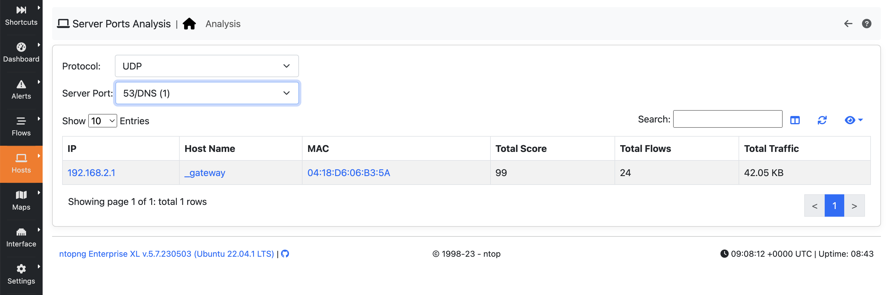

Hosts
#####

Hosts is a dropdown menu always reachable from the top toolbar that contains a bunch of links to host-
related information pages. The dropdown is as follows:

.. figure:: ../img/web_gui_hosts_dropdown.png
  :align: center
  :alt: Hosts Dropdown

  The Hosts Dropdown Menu

Host-related information pages available have the following content

- Hosts page shows all hosts seen
- Networks page lists all networks — both local and remote — any seen host belongs to
- Host Pools page has the list of the defined Host Pools
- Autonomous Systems page presents all Autonomous Systems (AS) any seen host belongs to
- Countries page shows hosts countries based on the information provided by MaxMind databases
- Operating Systems page lists all host operating systems that have been detected. Detection is done
  using passive fingerprinting techniques
- HTTP Servers (Local) page shows monitored HTTP servers, limited to local hosts only
- Top Hosts Traffic page presents traffic of top hosts in order to typology selected
- Server Ports Analysis page shows Local Hosts filtered by selected protocol and port. 

Hosts
-----

All hosts that have been seen monitoring network interfaces are show here. Column headers can be
clicked to sort results in descending (ascending) order of the clicked header. Additional sort options are
available in the top right corner of the table.
The table shown has several columns, including

- IP address, with optional country flag and OS logo (if detected)
- Location, either Local (the host belongs to a local network) or Remote (the host belongs to a remote
  network) — please note that this is not a geographical location
- Alerts, with the number of alerts associated to the host
- Name, having the resolved hostname (or a custom name, if set in any Host Details page)
- Seen Since, with the amount of time it has lapsed since the first packet sent/received by the host has
  been observed
- ASN, with the AS number (if available)
- Breakdown, showing a bar that gives visual insights in the use of both traffic directions
- Throughput, with the overall actual throughput of the host
- Traffic, with the total traffic exchanged by the host

.. figure:: ../img/web_gui_hosts_all.png
  :align: center
  :alt: Alls Hosts

  The All Hosts Page

Any host can be clicked to be redirected to its page, which is discussed below.

Host Details
^^^^^^^^^^^^

The host details pages provide many insights on the information collected for an host.

The navigation bar entries are discussed below. Since the entries are contextual,
some of them may be hidden.

Home
^^^^

*Home* is the default view of the Host Details page and provides detailed information including host MAC
Address (or the last router MAC address if the host is remote), IP Address (with network mask if detected),
a toggle to activate/deactivate alerts for the host, a checkbox to enable packet dump for the specific host,
symbolic hostname (or IP address), location (local or remote), date and time of first and last packet seen
for the host, traffic breakdown, amount of traffic packets received/sent, number of flows as client/server
host. All of this information is also available in JSON format by clicking on the ‘Download’ link. The heat
map provides the Activity Map for each host. Each box represents one minute of traffic. By default, Activity
Map shows the last six hours, but it is possible to set a different timeframe using the controls.

.. figure:: ../img/web_gui_host_details.png
  :align: center
  :alt: Host Details

  The Home View of the Host Details Page

Traffic
^^^^^^^

The Traffic Page provides Layer-4 protocol statistics for the host. A pie chart showing L-4 protocol
breakdown is show at the top of page. A table with detailed statistics is shown below the chart.

  The Traffic View of the Host Details Page

Packets
^^^^^^^

Packets page provides pie charts with packet size distribution, both for sent and received packets.

.. figure:: ../img/web_gui_host_details_packets.png
  :align: center
  :alt: Host Packets View

  The Packets View of the Host Details

Ports
^^^^^

Ports page provides pie charts with traffic statistics grouped by port. A chart is available for client ports
and another one is available for server ports.

.. figure:: ../img/web_gui_host_details_ports.png
  :align: center
  :alt: Host Ports View

  The Ports View of the Host Details Page

Peers
^^^^^

Peers page presents a graphical overview of top contacted peers and top protocols used. In the following
screenshot some hosts are struck-through intentionally for privacy reasons. A table with top application
per peer is shown below the graphical overview. Every information is clickable to allow the user to drill
down and find insights.

.. figure:: ../img/web_gui_host_details_peers.png
  :align: center
  :alt: Host Peers View

  The Peers View of the Host Details Page

Applications
^^^^^^^^^^^^

Using the DPI information, this page provides in pie chart and tabular format the amount of traffic divided
by application. An additional pie chart provides a statistics about protocol type. A click on the protocol
name redirects the user to the page with detailed statistics about the selected protocol.

.. figure:: ../img/web_gui_host_details_protocols.png
  :align: center
  :alt: Host Protocols View

  The Protocols View of the Host Details Page

DNS
^^^

The chart and the table displayed on this page report DNS statistics, such as the number of queries, their
type (e.g., A, AAAA, PTR, and so on), and possible errors.

.. figure:: ../img/web_gui_host_details_dns.png
  :align: center
  :alt: Host DNS View

  The DNS View of the Host Details Page

TLS
^^^

  The TLS View of the Host Details Page

ntopng registers the `JA3`_ TLS fingerprints of an host (either when the host is a client or a server) along with their the number of uses.
As explained in the `Flows section`_, this information is very important in order to uncover possible threats on the encrypted
traffic. By clicking on the signature it is possible to manually check if the JA3 signature
corresponds to a known malware into the `abuse.ch database`_.

By taking a snapshot of the signatures registered on an host it is possible to know, for example,
if the host has installed a new program or has updated an existing one. This may be very important
on environments where the programs installed into an host are not supposed to change.

By enabling the `nProbe Agent integration`_, this view can be further augmented
with the name of the process which initiated or received the TLS connection.

.. _`nProbe Agent integration`: https://www.ntop.org/guides/ntopng/using_with_nprobe_agent.html
.. _`abuse.ch database`: https://sslbl.abuse.ch/ja3-fingerprints
.. _`JA3`: https://github.com/salesforce/ja3
.. _`Flows section`: flows.html#tls-information

SSH
^^^

ntopng registers the `HASSH`_ fingerprints of an host, either when the host initiates or receives an SSH connection,
along with their the number of uses. As explained in the `related Flows section`_, this information can be used to identify
malicious applications or vulnerable SSH versions.

.. _`HASSH`: https://engineering.salesforce.com/open-sourcing-hassh-abed3ae5044c
.. _`related Flows section`: flows.html#ssh-signature

HTTP
^^^^

This page provides information about the HTTP protocol in terms of requests done and responses
received for each HTTP method, together with response codes. Counters are provided both as tables and
pie charts. In the case of virtual host being detected, a badge with the number of virtual hosts detected for
the same IP address is displayed in the host bar and an entry for each virtual server is displayed in a
virtual server table.

  The HTTP View of the Host Details Page with Virtual Hosts

.. _Sites:

Sites
^^^^^

.. note::

   This page is only available at lieast with a Pro License.

ntopng can keep track of top visited sites for any monitored local
host. Enabling the tracking of top visited sites requires preference
"Top HTTP Sites" to be set using the ntopng preferences page.

  The Preferences Page to Enable Visited Sites

Once the preference has been enabled, this page will start showing
visited websites, which are shown over the two most recent 5-minute
intervals. Newly visited sites are placed under the "Current
Sites". Every 5 minutes ntopng moves the "Current Sites" under "Last 5
Minute Sites", and starts over with a clean "Current Sites".

.. figure:: ../img/web_gui_visited_sites.png
  :align: center
  :alt: Host Sites View

  The Sites View of the Host Details Page

Column "Contacts" count the number of time a particular website has
been visited. Every time the host visit a site, the corresponding
"Contacts" counter is increased by one.

.. note::

   This page is only available in the Host Details page menu when
   there is at least one visited website.

.. _Flows:
   
Flows
^^^^^

Flows page lists all active flows that have the selected host as an endpoint. A section of this manual
discuss in greater detail the statistics shown for flows.

.. figure:: ../img/web_gui_host_details_flows.png
  :align: center
  :alt: Host HTTP View

  The Flows View of the Host Details Page

SMNP
^^^^

SMNP page provides SNMP information for the selected host with all the standard SNMP traffic metrics.

.. figure:: ../img/web_gui_host_details_snmp.png
  :align: center
  :alt: Host SNMP View

  The SMNP View of the Host Details Page

Talkers
^^^^^^^

Talkers page provides top talkers having active flows with selected host. Similarly to the Community
edition dashboard, top talkers are laid out in a Sankey Diagram.

Host Flows
^^^^^^^^^^
.. note::

   This page is only available with an Enterprise License.

The Host Flows page provides an interactive map that shows the currently active flows of the interested host, its peers and protocols.

  The Talks page of the Host Details Page

Geomap
^^^^^^

Geomap page provides an interactive map that shows the selected hosts, its flows, and its
peers.

.. figure:: ../img/web_gui_host_details_geo.png
  :align: center
  :alt: Host Geomap View

  The Geomap View of the Host Details Page

Alerts Configuration
^^^^^^^^^^^^^^^^^^^^

Alerts Configuration page enables the user to set custom thresholds on multiple metrics, and to trigger
alerts based on those thresholds. Alerts can be armed, among other metrics, per total bytes, DNS traffic,
P2P traffic or packets, in a fixed time interval. Available time intervals are 1 and 5 minutes, 60 minutes,
and 1 day. Two columns are available for configuration. The first affects only the selected local host,
whereas the second affects all local hosts. Alerts can be configured from the host :ref:`WebUIUserScripts`.

Asset Map
^^^^^^^^^

.. note::

   This page is only available with an Enterprise L License.

  The Asset Map link on the Host Details Page

The Asset Map is used to understand the assets in a network (DNS, NTP,... servers) and which 'Assets' a specific host uses.
More information can be found at :ref:`Asset Map`.

Statistics
^^^^^^^^^^

Statistics page provides historical traffic statistics for the selected host. The user can choose to filter
statistics on a protocol basis and display data in several formats (e.g., bytes, packets, flows, and so on).

.. figure:: ../img/web_gui_host_details_stats.png
  :align: center
  :alt: Host Statistics View

  The Statistics View of the Host Details Page

  The Dropdown menu in The Statistics View of the Host Details Page

Periodicity Map
^^^^^^^^^^^^^^^

.. note::

   This page is only available with an Enterprise L License.

  The Periodicity Map link on the Host Details Page

The Periodicity Map is used to understand the local communication between hosts in a network.
More information can be found at :ref:`Periodicity Map`.

Service Map
^^^^^^^^^^^

.. note::

   This page is only available with an Enterprise L License.

  The Service Map link on the Host Details Page

The Service Map is used to understand the local communication between hosts in a network.
More information can be found at :ref:`Service Map`.

Historical Flow
^^^^^^^^^^^^^^^

.. note::

   This page is only available with an Enterprise License and only if ClickHouse is enabled

  The Historical Flow link on the Host Details Page

The Historical Flow is used to understand the local communication between hosts in a network.
More information can be found at :ref:`Historical Flow Explorer`.

Host Configuration
^^^^^^^^^^^^^^^^^^

  The Host Configuration on the Host Details Page

In this page a user is able to give an Alias to an Host (an alternative name for an host that's going to be used in all ntopng), give a description to an host, 
assign this host to an host pool or hide this host from the Top Talkers computation.

Host Pools
----------

Host Pools are logical groups of hosts that are described in detail in the “Network Interfaces" section of
this document. This page show the list of defined and currently active Host Pools.

.. figure:: ../img/web_gui_hosts_pools_list.png
  :align: center
  :alt: Host Pools List

  The Host Pools List Hosts Page

Each row of the table shows, for each pool, the following information:

- The Pool Name as defined by the user during Host Pool creation
- A Chart icon to access historical pool traffic timeseries. Historical pool traffic charts must be enabled
  from the preferences page and are a feature that is only supported in the Professional version.
- The number of active hosts in the pool
- The number of alerts detected as the sum of host alerts for each host in the pool
- Seen Since, with the amount of time it has lapsed since the first packet sent/received by any of the
  hosts in the pool has been observed
- Breakdown, showing a bar that gives visual insights in the use of both pool traffic directions
- Throughput, with the overall actual throughput of the pool
- Traffic, with the total traffic exchanged by the pool

Host pools can be configured from the `network interface page`_.

Pools can be created or managed from the *System* interface, 
*Pools* menu. It is possible to add new pools using the “plus” button in the same page.

.. figure:: ../img/web_gui_interfaces_edit_pools.png
  :align: center
  :alt: Edit Pools

  The Pools Page

Once an Host Pool is created, it is possible to add members to it. Host Pool members can be added 
from the *Pools* > *Host Pool Members* page, using the “plus” button.

  The Host Pool Page

The Host Pools configuration, which includes the definition of host pools along with
the pools members, can be easily exported to JSON and imported into another ntopng instance
from the *Settings* > *Manage Configuration* page. Imported host pools will replace the existing ones.

An “Alias” can be associated to each pool member to ease the its identification. Typically, one would
assign a mnemonic label as member alias (e.g., “John’s iPhone” or “Smart TV”).

A view of host pool statistics is accessible from the actual interface, *Hosts* > *Host Pools* menu,
as discussed in the `relevant section`_. The view shows live pool information (e.g., overall pool throughput)
and provides access to the historical pool traffic timeseries (Professional version) as well as to the 
currently active pool members.

.. _`relevant section`: hosts.html#host-pools
.. _HostPools:
.. _`network interface page`: interfaces.html#host-pools

Traffic Policies
^^^^^^^^^^^^^^^^

Host pools can also be used to enforce traffic policies (e.g, block YouTube traffic for the “John” pool and
limit Facebook traffic at 1 Mbps for the “Guests” pool). This feature is available in nEdge (when ntopng is
used inline as described in the “Advanced Features” section of this document), or when ntopng is used in 
combination with `nProbe in IPS mode <https://www.ntop.org/guides/nprobe/ips_mode.html>`_ (see :ref:`UsingNtopngWithNprobeIPS`).

Networks
--------

Networks shows all networks discovered by ntopng.

  The Networks Summary Page

For each network discovered ntopng provides the number of hosts, alerts triggered, date of discovery,
breakdown, throughput and traffic. Network names can be clicked to display the hosts lists inside the
network selected.

Autonomous Systems
------------------

Autonomous Systems shows all autonomous systems discovered by ntopng. Autonomous Systems require :ref:`Geolocation` enabled.

.. figure:: ../img/web_gui_hosts_as_list.png
  :align: center
  :alt: AS List

  The Hosts Autonomous Systems Summary Page

Ntopng uses a Maxmind database to gather information about Autonomous Systems (AS) and based on
this it groups hosts belonging to the same AS. AS number 0 contains all hosts having private IP addresses.

Countries
---------

Countries page provides all countries discovered by ntopng. Any country can be clicked to be redirected to
a page containing the full list of hosts localised in that country. Countries require :ref:`Geolocation` enabled.

.. figure:: ../img/web_gui_hosts_countries_list.png
  :align: center
  :alt: Hosts Countries List

  The Hosts Countries Summary Page

Operating Systems
-----------------

Operating Systems page shows a list of all OS detected by ntopng. OSes can be clicked to see the detailed
list of hosts.

.. figure:: ../img/web_gui_hosts_os_list.png
  :align: center
  :alt: Hosts Operating Systems List

  The Hosts Operating Systems Summary Page

HTTP Servers (Local)
--------------------

HTTP Servers page lists all local HTTP Servers. Multiple distinct virtual hosts may refer to the same HTTP
server IP, which is specified in the second column. Additional information such as bytes sent and received
are available for each HTTP virtual host. By clicking on the magnifying lens icon near to the HTTP virtual
host, it is possible to display all active flows involving it.

.. figure:: ../img/web_gui_hosts_http_servers_list.png
  :align: center
  :alt: Local HTTP Servers List

  The Local HTTP Servers Summary Page

Top Hosts (Local)
-----------------

Top hosts page provides hosts activity on time basis. The page should be kept open in order to allow the
graph to dynamical update itself with real-time freshly collected data for each host. The time axis is
divided in 5-minute bars and goes backwards in time in a right-to-left fashion, starting from the present.

.. figure:: ../img/web_gui_hosts_top.png
  :align: center
  :alt: Top Hosts

  The Top Hosts Summary Page

Server Ports Analysis
---------------------

The Server Local Hosts Ports Live Analysis page provides live details of hosts filtered by the selected port and L4 protocol. 
The page displays host information such as IP, Host Name, MAC Address, number of Total Flows, Total Score, and Total Traffic.
By clicking on the IP hyperlink, the user can be redirected to the live flows page filtered by the selected server IP and server port.
By clicking on the Host Name hyperlink, the user can be redirected to the host details page.
By clicking on the MAC Address hyperlink, the user can be redirected to the MAC details page.

  Server Ports Analysis Page
