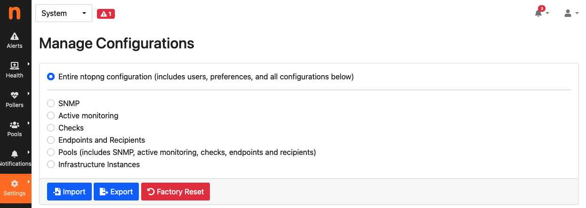

.. _ConfigurationImportExport:

Configuration Import/Export
===========================

ntopng provides the ability to backup its configuration, in order to be able to restore it in case of system
failures and reinstallations, or to clone it to other systems requiring the very same configuration (e.g. in
a cluster or in a high-availability deployment), saving a lot of time for manually copying all the settings.

Through the web GUI it is possible to export selected configurations, including:

- SNMP configuration
- Active Monitoring configuration
- Checks configuration
- Alerts Endpoints and Recipients
- All Pools (this will also include all the previous items, as this depends on them)

or export the entire ntopng configuration, which includes *Users* and *Preferences* in addition to all the
above items. In both cases, a small JSON file containing the configuration is generated.

It is also possible to import back a configuration which as been exported before, providing the JSON file.
The configuration items contained in the imported configuration will be added to those already present in
the current ntopng configuration (e.g. endpoint already configured in ntopng, if any, will not be deleted when
importing additional endpoints).

Resetting the configuration to factory defaults is also possible. This is also useful when importing
a configuration and preserving the old one is not required nor wanted (e.g. when adding a set of recipients
and endpoints without preserving those already present).

All this is available from the *Settings* -> *Manage Configurations* menu, as shown in the below picture.

  The Manage Configurations Page

Import/Export via API
---------------------

Configuration can also be imported and exported programmatically via API. Following is an example that uses the REST API to export and then import the global ntopng configuration.

To export the global ntopng configuration in a local JSON file :code:`all_config.json` from an host :code:`office`, user :code:`admin` (identified with password :code:`admin`) can call the following endpoint

.. code:: bash

  $ curl -u admin:admin1 "http://office:3000/lua/rest/v2/export/all/config.lua?download=1" > all_config.json

To import the configuration, the contents of :code:`all_config.json` must be POST-ed as the value of a string :code:`JSON` to the following endpoint:

.. code:: bash

  $ curl -uadmin:admin1 -H "Content-Type: application/x-www-form-urlencoded" --data-urlencode "JSON=`cat all_config.json`" "http://office:3000/lua/rest/v2/import/all/config.lua"

A successful POST is confirmed by the following message:

.. code:: bash

  {"rc":0,"rc_str":"OK","rc_str_hr":"Success","rsp":[]}

A restart of ntopng is required after the import of the global configuration.
