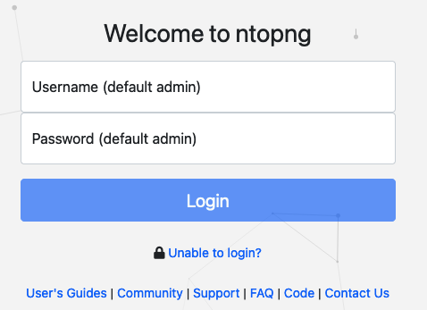
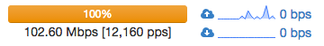

The ntopng Web GUI
##################
After ntopng has started you can view the GUI. By default, the GUI can be accessed from any web browser at :code:`http://<ntopng IP>:3000/`. A different port can be specified as a command line option during ntopng startup. The first page that always pops out contains the login form - provided that the user has not decided to turn authentication off during startup.

  The Login Page

The default login is

+------------------+-------+
| **username**     | admin |
+------------------+-------+
| **password**     | admin |
+------------------+-------+

During the first access, a prompt will require the user to change the default password.

Administrator privileges are granted to user *admin*. If an unauthenticated user attempts to access a specific ntopng URL, the system will redirect the browser to the login page and then, upon successful authentication, to the requested resource. Ntopng GUI web pages have a common structure the user will soon be familiar with. The pages are mostly composed of a top toolbar, some body content, and a 'dashboard' footer.

  The Header Bar

The items list are Home, Flows, Hosts, Protocols, Interfaces, Setting, Logout, and Search Host. An extra item Alert pops out when some alerts fired in reaction of user configuration.

In the left part of the footer, ntopng summarizes some information such as logged-in user, monitored interfaces, and used version (Community or Professional).

In the center it is shown a gauge which provides the bandwidth saturation level for monitored interfaces. The same information is also reported as a function of time in two dynamic graphs, for upstream and downstream traffic, respectively.

  The Center of the Footer Bar

Finally, in the right side of the footer there is the uptime information, direct links to current Alerts (if any), Hosts, Layer-2 Devices, and Flows counters monitored by ntopng.

.. figure:: ../img/web_gui_right_side_of_footer_bar.png
  :align: center
  :alt: The Right Side of the Footer Bar

  The Right Side of the Footer Bar

.. warning::
   Gauge scale is calculated according to physical interfaces features. It is not always possible to determine maximum nominal interfaces speed. For this reason, scale can me manually configured simply by clicking on the gauge. Changes will be automatically saved to persistent storage.

      
.. toctree::
    :maxdepth: 2
    :numbered:

    home_menu
    dashboard
    report
    flows
    hosts
    host_details
    interfaces
    settings
    administration
    alerts
    host_search
