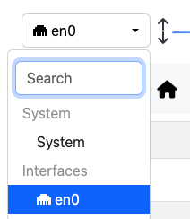
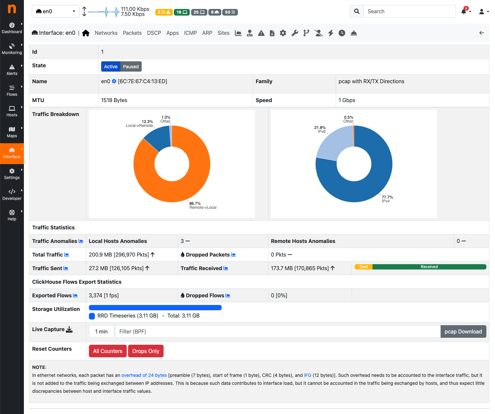
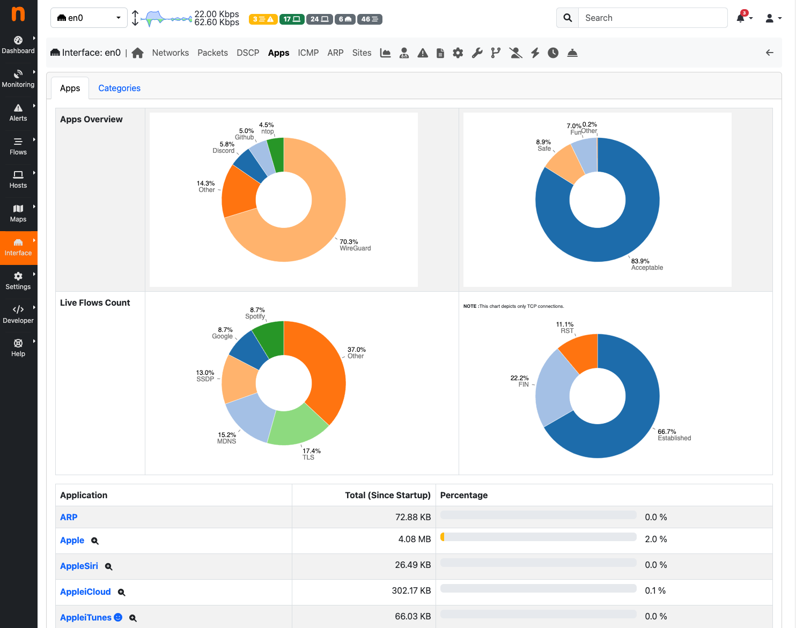
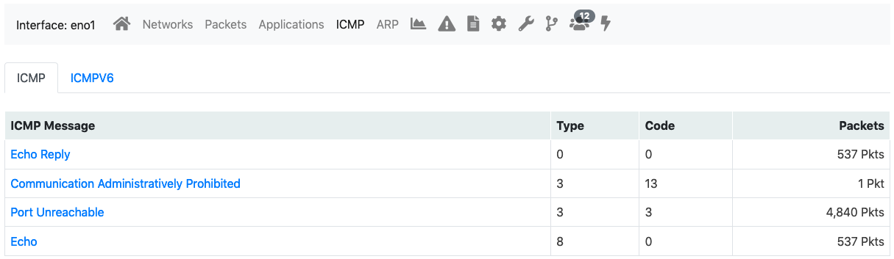
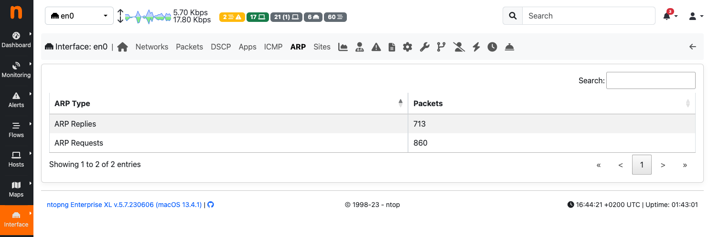
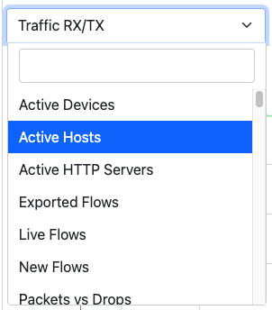
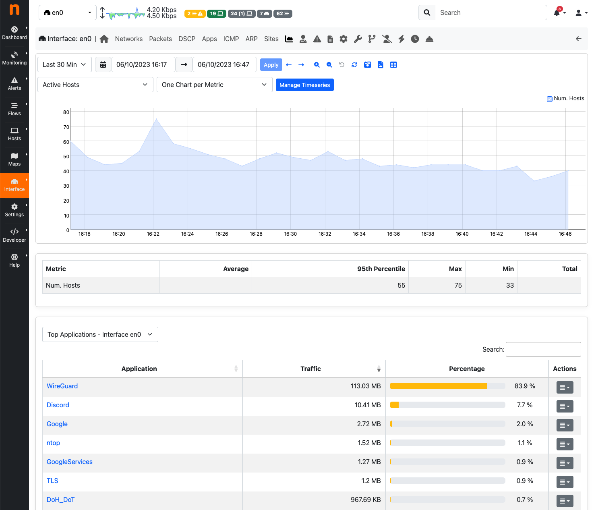
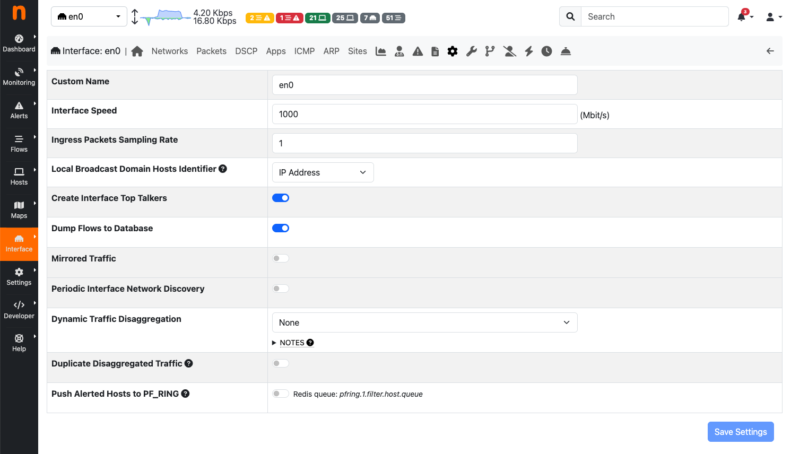
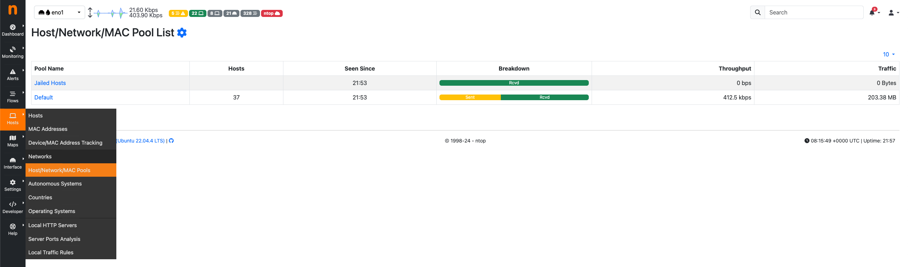
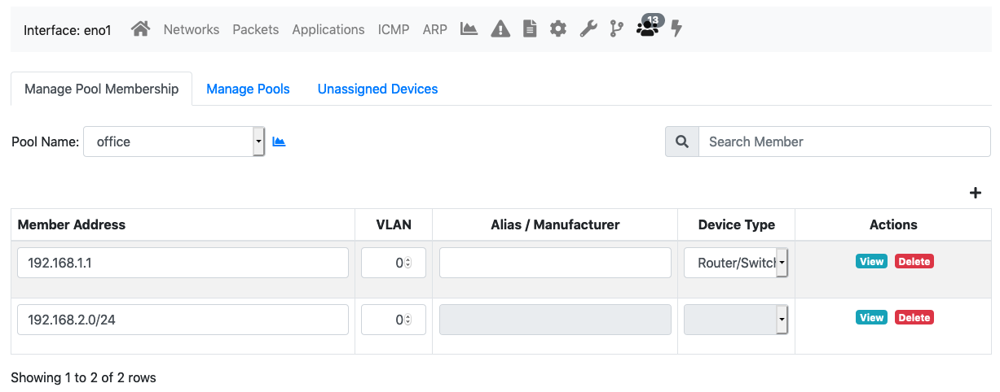

Interfaces
##########

The Interfaces dropdown menu entry in the top toolbar contains lists all the interfaces that are currently
monitored by ntopng. Among all interfaces listed, one has a check mark that indicates the interface is
currently selected. Every data and information shown in ntopng web GUI relates to the currently selected
interface. Any interface listed can be selected simply by clicking on its name.

  The Interfaces Dropdown Menu

The dropdown menu is only used to switch between selected interfaces, it is also used to actually see
interface traffic statistics. Interface traffic statistics can be accessed by clicking on the currently selected
interface.

  The Home View of the Interface Details Page

A contextual menu with multiple options and badges appear right below the top toolbar. Menu
entries are discussed below.

Home
----

In the Home page it is possible to view general interface information, such as Id (a unique integer
identifier ntopng assigns to each monitored interface), family (e.g., pcap), and the overall traffic counters in
bytes. It is possible to customise the interface name just by writing a custom name into the Name textbook
and clicking on “Save Name”. Interface monitoring can be temporarily paused from the ‘State’ toggle
buttons.

Packets
-------

Packets page shows a pie chart of packets size distribution.

.. figure:: ../img/web_gui_interfaces_packets.png
  :align: center
  :alt: Interface Packets View

  The Packets View of the Interface Details Page

Protocols
---------

Protocols page provides three pie charts and a specific table with nDPI-detected protocols for the selected
interface.

In the two top pie charts ntopng shows the application distribution and its categorisation. The bottom pie
chart shows nDPI-detected applications for currently active flows. All labels are clickable and point to
detailed statistics pages. Belo pie charts there is a list of protocols detected with the corresponding total
traffic, both in absolute terms and as a percentage of the total traffic.
By selecting any Application Protocol, it is possible to display a statistics page with temporal charts for that
protocol. Similarly, by clicking on the magnifying lens icon, it is possible to display all active flows for that
protocol.

  The Protocols View of the Interface Details Page

ICMP
----

ICMP page shows overall interface ICMP statistics.

  The ICMP View of the Interface Details Page

ARP
---

The Address Resolution Protocol (ARP) page highlights the number of ARP requests and replies seen.

  The ARP View of the Interface Details Page

Statistics
----------

Statistics page provides historical traffic statistics for the selected interface. The user can choose to filter
statistics on a protocol basis and display data in several formats (e.g., bytes, packets, flows, and so on). In
the Professional Version of ntopng, traffic for interface views in shown as stacked per physical interface.
Physical interface visualisation can be toggled by clicking on the coloured dot just left of interface name.

The time series span can be adjusted by selecting values from 5 minutes up to 1 year. Moreover, drill-
down is possible by clicking on the time series itself. Every click zooms the chart in, centering the time
series around the clicked point.

In addition, time series shown can be chosen via the dropdown menu labelled ‘Time series’. For example,
it is possible to visualise all or just one protocol, traffic, packets, active hosts and flows, and so on. Ntopng
is VLAN aware, hence if several VLANs are detected, traffic is accounted also on a VLAN basis.

  The Dropdown Time Series Menu in the
  Statistics View of the Interface Details Page

  The Statistics View of the Interface Details
  Page (Professional Version)

Historical interface minute top talkers are shown on the right of the page, and get refreshed automatically
when the mouse moves over the chart.

An historical “Flows” tab is present next to the “Chart” when ntopng is started with the -F switch. This
historical table shows flows data that have been recorded and dumped during the selected observation
period. The Professional/Enterprise version of ntopng also feature two extra tabs, namely, “Talkers” and
“Protocols” to drill down historical data by talkers and application protocols.

.. figure:: ../img/web_gui_interfaces_historical_flows.png
  :align: center
  :alt: Interface Historical Flows

  The Historical Flows Table of the Interface Details Page Statistics View

Traffic Profiles (Professional Version)
---------------------------------------

See later in this manual for more information.

Settings
--------

The settings page allow the configuration of several interface properties.

  The Settings View of the Interface Details Page

**Custom Name**:
Is a label used to identify the interface.

**Interface Speed**:
The speed of the interface expressed in Mbps. Typically, ntopng is able to properly determine this speed
automatically.

**Realtime Stats Refresh Rate**:
Amount of time between two consecutive refreshes of dashboard and footer charts. Useful for example
when using ntopng in combination with nProbe to collect remote NetFlow of sFlow.

**Scaling Factor**:
A constant used to up-scale interface traffic. This is useful when ntopng is processing sampled traffic.

Host Pools
----------

Host pools are logical groups of hosts. Pools are added using the “plus” button in the “Manage Pools” tab
of the Host Pools page.

  The Edit Host Pools “Manage Pools” of the Interface Details Page

Once an Host Pool is created, it is possible to add members to it. Host Pool members are added using the
“plus” button in the “Manage Pool Membership” tab of the Host Pools page.

Each pool member can be a:

- Layer 2 device (specified with a Mac Address)
- Layer 3 host (specified with an IPv4/IPv6 Address and, optionally, a VLAN)
- Layer 3 network (specified with an IPv4/IPv6 network in CIDR format and, optionally, a VLAN)

An “Alias” can be associated to each pool member to ease the its identification. Typically, one would
assign a mnemonic label as member alias (e.g., “John’s iPhone” or “Smart TV”). A “Device Type” can be
associated to each member as well. Devices types are used to categorise members on the basis of the
device type (e.g., TV, Camera, Smartphone).

The image below shows an “IoT Devices” Host Pool with two members, namely a smart tv and a router.

  The Edit Host Pools “Manage Pool Membership” of the Interface Details Page

A view of every host pool is accessible from the “Hosts” menu, entry “Host Pools” as discussed earlier in
this document. The view shows live pool information (e.g., overall pool throughput) and provides access to
the historical pool traffic timeseries (Professional version) as well as to the currently active pool members.

Host pools can also be used to enforce traffic policies (e.g, block YouTube traffic for the “John” pool and
limit Facebook traffic at 1 Mbps for the “Guests” pool). This feature is only available when ntopng is used
inline and is a feature only available in the professional version. ntopng inline is described in the
“Advanced ntopng Features” of this document.

Packet Dump
-----------

This page allows you to save to disk selected packets that match various criteria.

Ntopng can dump packets to disk or to a TAP interface. Moreover, it can be configured
to dump all the traffic or just the unknown traffic. The latter feature can be enabled
to generate a PCAP file containing the traffic of all the flows marked as "Unknown",
which can then be submitted to the ntop team for further analysis.

Pcap files are generated under the ntopng data directory, into the "pcap" folder
of a specific network inteface id (e.g. `/var/tmp/ntopng/0/pcap`). In particular,
The unknown traffic is stored into the folder "pcap/ndpi_unknown".
