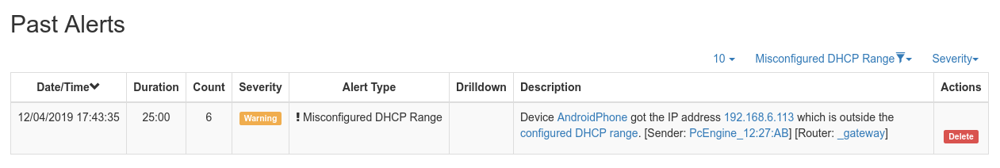

Interfaces
##########

The Interfaces dropdown menu entry in the top toolbar contains lists all the interfaces that are currently
monitored by ntopng. Among all interfaces listed, one has a check mark that indicates the interface is
currently selected. A special interface is always present in ntopng, the `System Interface`_.
Most of the data and information shown in ntopng web GUI is related to the currently selected
interface. Any interface listed can be selected simply by clicking on its name.

.. figure:: ../img/web_gui_interfaces_dropdown.png
  :align: center
  :alt: Interface Dropdown

  The Interfaces Dropdown Menu

The dropdown menu is only used to switch between selected interfaces, it is also used to actually see
interface traffic statistics. Interface traffic statistics can be accessed by clicking on the currently selected
interface.

.. figure:: ../img/web_gui_interfaces_home.png
  :align: center
  :alt: Interface Home

  The Home View of the Interface Details Page

A contextual menu with multiple options and badges appear right below the top toolbar. Menu
entries are discussed below.

.. _`System Interface`: ../basic_concepts/system_interface.html

Home
----

In the Home page it is possible to view general interface information, such as Id (a unique integer
identifier ntopng assigns to each monitored interface), family (e.g., pcap), and the overall traffic counters in
bytes. It is possible to customize the interface name just by writing a custom name into the Name textbook
and clicking on “Save Name”. Interface monitoring can be temporarily paused from the ‘State’ toggle
buttons.

Packets
-------

Packets page shows a pie chart of packets size distribution.

.. figure:: ../img/web_gui_interfaces_packets.png
  :align: center
  :alt: Interface Packets View

  The Packets View of the Interface Details Page

Applications
------------

Applications page provides three pie charts and a specific table with nDPI-detected protocols for the selected
interface.

In the two top pie charts ntopng shows the application distribution and its categorization. The bottom pie
chart shows nDPI-detected applications for currently active flows. All labels are clickable and point to
detailed statistics pages. Belo pie charts there is a list of protocols detected with the corresponding total
traffic, both in absolute terms and as a percentage of the total traffic.
By selecting any Application Protocol, it is possible to display a statistics page with temporal charts for that
protocol. Similarly, by clicking on the magnifying lens icon, it is possible to display all active flows for that
protocol.

.. figure:: ../img/web_gui_interfaces_protocols.png
  :align: center
  :alt: Interface Protocols View

  The Protocols View of the Interface Details Page

ICMP
----

ICMP page shows overall interface ICMP statistics.

.. figure:: ../img/web_gui_interfaces_icmp.png
  :align: center
  :alt: Interface ICMP View

  The ICMP View of the Interface Details Page

ARP
---

The Address Resolution Protocol (ARP) page highlights the number of ARP requests and replies seen.

.. figure:: ../img/web_gui_interfaces_arp.png
  :align: center
  :alt: Interface ARP View

  The ARP View of the Interface Details Page

Statistics
----------

Statistics page provides historical traffic statistics for the selected interface. The user can choose to filter
statistics on a protocol basis and display data in several formats (e.g., bytes, packets, flows, and so on). In
the Professional Version of ntopng, traffic for interface views in shown as stacked per physical interface.
Physical interface visualization can be toggled by clicking on the coloured dot just left of interface name.

The time series span can be adjusted by selecting values from 5 minutes up to 1 year. Moreover, drill-
down is possible by clicking on the time series itself. Every click zooms the chart in, centering the time
series around the clicked point.

In addition, time series shown can be chosen via the dropdown menu labelled ‘Time series’. For example,
it is possible to visualize all or just one protocol, traffic, packets, active hosts and flows, and so on. Ntopng
is VLAN aware, hence if several VLANs are detected, traffic is accounted also on a VLAN basis.

.. figure:: ../img/web_gui_interfaces_timeseries_dropdown.png
  :align: center
  :alt: Interface Timeseries Dropdown

  The Dropdown Time Series Menu in the
  Statistics View of the Interface Details Page

.. figure:: ../img/web_gui_interfaces_statistics_view.png
  :align: center
  :alt: Interface Statistics View

  The Statistics View of the Interface Details
  Page (Professional Version)

Historical interface minute top talkers are shown on the right of the page, and get refreshed automatically
when the mouse moves over the chart.

An historical “Flows” tab is present next to the “Chart” when ntopng is started with the -F switch to export flows to MySQL. This
historical table shows flows data that have been recorded and dumped during the selected observation
period. The Professional/Enterprise version of ntopng also feature two extra tabs, namely, “Talkers” and
“Protocols” to drill down historical data by talkers and application protocols.

.. figure:: ../img/web_gui_interfaces_historical_flows.png
  :align: center
  :alt: Interface Historical Flows

  The Historical Flows Table of the Interface Details Page Statistics View

Traffic Profiles (Professional Version)
---------------------------------------

See later in this manual for more information.

Settings
--------

The settings page allow the configuration of several interface properties.

.. figure:: ../img/web_gui_interfaces_settings.png
  :align: center
  :alt: Interface Settings

  The Settings View of the Interface Details Page

**Custom Name**:
Is a label used to identify the interface.

**Interface Speed**:
The speed of the interface expressed in Mbps. Typically, ntopng is able to properly determine this speed
automatically.

**Realtime Stats Refresh Rate**:
Amount of time between two consecutive refreshes of dashboard and footer charts. Useful for example
when using ntopng in combination with nProbe to collect remote NetFlow of sFlow.

**Ingress Packets Sampling Rate**:
Packets arriving on the interface could have been sampled upstream,
for example by a packet broker or another device. This setting allows
to specify the sampling rate to enable ntopng to perform proper
upscaling.

**Local Broadcast Domain Hosts Identifier**:
Determines if `Local Broadcast Domain`_ hosts whose IP address is inside a
configured `DHCP range`_ are serialized by their MAC address or IP address.
This setting also applies to the timeseries of the host. In a DHCP network,
the IP address of a host usually changes so the host it's better identified
by its MAC address in this case.

**Hide from Top Networks**:
This setting allows to specify a comma-separated list of networks
containing hosts that have to be hidden from the top statistics. 
Hosts belonging to the specified networks will not be shown in the top
statistics.

**Create Interface Timeseries**:
This setting toggles the generation of timeseries for the selected
interface. No timeseries will be generated when this setting is
unchecked, including timeseries associated with local hosts and networks.

**Create One-Way Traffic Timeseries**:
This setting toggles the generation of timeseries for one way traffic, which
are otherwise ignored. Can be disabled to save disk space.

**Create Interface Top Talkers**:
This setting toggles the creation of top talkers hosts, which are then shown into
the ntopng report.

**Dump Flows to Database**:
This setting specifies on which interfaces the flows dump (`-F` startup option) is
enabled. Disabling the flow dump on some interfaces can reduce the disk load.

**Mirrored Traffic**:
Tick this setting when the interface is receiving traffic from a
mirror/SPAN port. Typically, such interfaces does not have any IP
address associated. ntopng uses this information to skip certain kind
of activities that cannot be performed on mirrored interfaces,
including network device discovery and eBPF events processing.

**Flows-only Interface**:
This setting provides a performance boost by disabling the hosts allocation
on the interface. However this means that the per-host traffic will not be accounted.

**Periodic Interface Network Discovery**:
This setting toggles ntopng periodic network discovery. Network
discovery frequency can be controlled from the preferences and it
defaults to 15 minutes.

**Dynamic Traffic Disaggregation**:
Controls the interface disaggregation as explained in the `Interfaces Disaggregation`_
section.

.. _`Local Broadcast Domain`: ../basic_concepts/local_broadcast_domain.html
.. _`DHCP range`: #id1
.. _`Interfaces Disaggregation`: ../advanced_features/dynamic_interfaces_disaggregation.html

**Duplicate Disaggregated Traffic**:
When the Dynamic Traffic Disaggregation option is set, normally ntopng will only report the
traffic on the disaggregated interfaces, hence the main interface will have no traffic. By
enabling this option it's possible to also report the traffic on the main interface.

DHCP Range
----------

When a DHCP server is active in the network monitored by a network interface,
it's advisable to configure in ntopng the ranges of IP addresses which such server
can assign.

.. figure:: ../img/web_gui_interfaces_dhcp.png
  :align: center
  :alt: Interface DHCP Range Configuration

When a DHCP range is configured, ntopng will monitor the DHCP traffic on the interface
and report anomalous behavior. For example, it detects if IP addresses are assigned outside
the configured range and generate an alert. This can happen, for example, if a new
misconfigured network device is attached to the network.

Since DHCP responses are usually directed to a specific host, this setting is
most effective when the interface monitors mirrored traffic.
