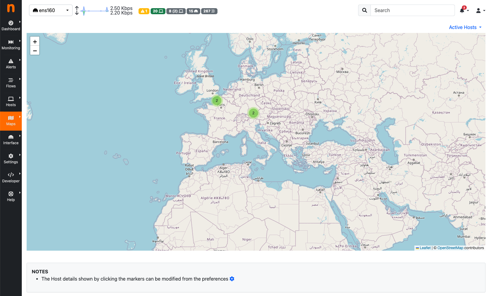

Maps
####

- Geo Map page lays out hosts in a geographic map to give visual insights into the geographical
  locations of seen hosts
- The Host Map, clusters the active hosts to quickly identify outliers

Geo Map
-------

The Hosts Geo Map page provides world map where hosts are arranged according to their
geographical position. :ref:`Geolocation` must be enabled.

  The Hosts Geo Map Summary Page

Host Map
--------

The page shows a bubble chart with visual data clustering, according to a selectable criteria.
Anomalies can be easily spotted by looking at the groups which are distant from the others.

  The Hosts Map page

Service Map
-----------
.. _Service Map:

.. figure:: ../img/advanced_features_service_map_graph.png
  :align: center
  :alt: Service Map

  Service Map

The Service Map contains all the services inside a local network. Only `local hosts` are shown here. Both Periodicity Map (below) and Service Map have a table format, available by clicking the second icon, starting from the left. 
A detailed article describing the `Service Map Page`_.

.. figure:: ../img/web_gui_service_map_table.png
    :align: center
    :alt: Service Map Table

    Service Map Table
    
.. note::
    Service Map is available only with Enterprise L license

.. _`Service Map Page`: https://www.ntop.org/ntop/whats-new-in-ntopng-keep-an-eye-to-lateral-movements/

Periodicity Map
---------------
.. _Periodicity Map:

  Periodicity Map

The Periodicity Map contains the periodic flows of a network, with all the related information, including the frequency, the observation number and so on.
A detailed article describing the `Periodicity Map Page`_.

.. note::
    Periodicity Map is available only with Enterprise L license

.. _`Periodicity Map Page`: https://www.ntop.org/news/whats-new-in-ntopng-a-periodic-problem/

Asset Map
---------
.. _Asset Map:

  Asset Map

The Asset Map contains the asset available in a network and flows flowing towards them; the current Assets available are:
  - DNS Server
  - SMTP Server
  - NTP Server
  - POP Server
  - IMAP Server

A detailed article describing the `Asset Map Page`_.

.. note::
    Asset Map is available only with Enterprise L license

.. _`Asset Map Page`: https://www.ntop.org/ntop/whats-new-in-ntopng-network-assets/
