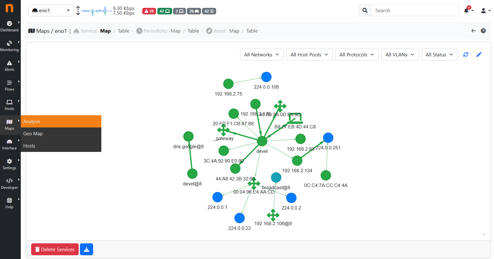
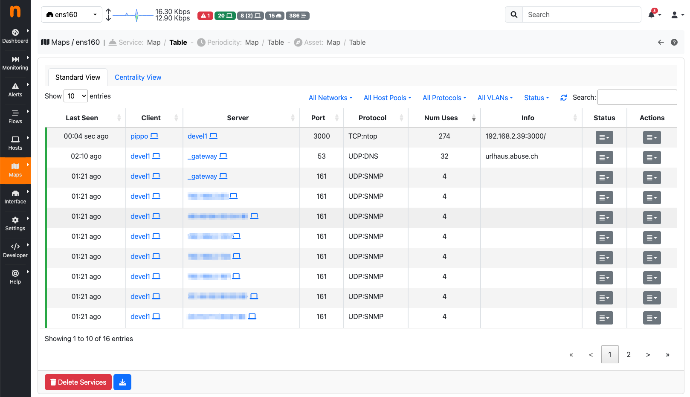

Maps
####

- Geo Map page lays out hosts in a geographic map to give visual insights into the geographical
  locations of seen hosts
- The Host Map, clusters the active hosts to quickly identify outliers

Geo Map
-------

The Hosts Geo Map page provides world map where hosts are arranged according to their
geographical position. :ref:`Geolocation` must be enabled.

.. figure:: ../img/web_gui_hosts_geomap.png
  :align: center
  :alt: Geo Map

  The Hosts Geo Map Summary Page

Host Map
--------

The page shows a bubble chart with visual data clustering, according to a selectable criteria.
Anomalies can be easily spotted by looking at the groups which are distant from the others.

.. figure:: ../img/web_gui_hosts_map.png
  :align: center
  :alt: Hosts Map

  The Hosts Map page

Service Map
-----------

  Service Map

The Service Map contains all the services inside a local network. Only `local hosts` are shown here. Both Periodicity Map (below) and Service Map have a table format, available by clicking the second icon, starting from the left. 

    Service Map Table
    
.. note::
    Service Map is available only with Enterprise license

Periodicity Map
---------------

.. figure:: ../img/advanced_features_periodicity_map_graph.png
  :align: center
  :alt: Periodicity Map

  Periodicity Map

The Periodicity Map contains the periodic flows of a network, with all the related information, including the frequency, the observation number and so on.

.. note::
    Periodicity Map is available only with Enterprise license
