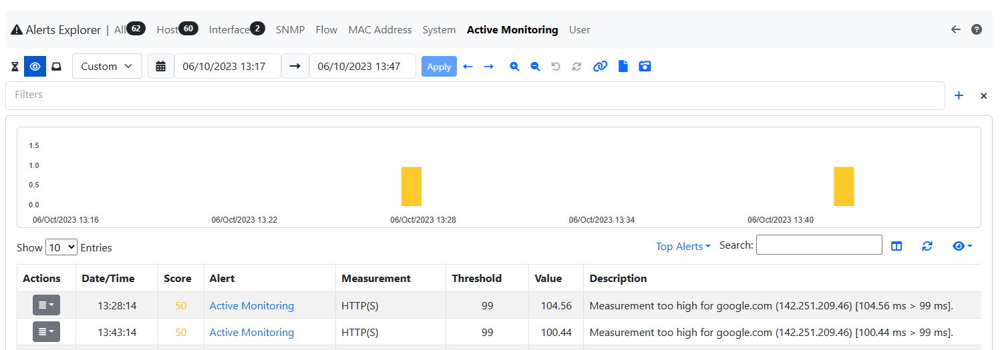
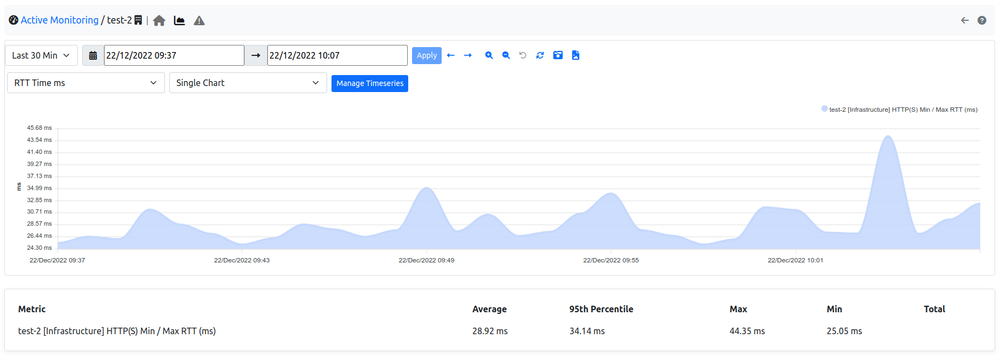

.. _Monitoring:

Monitoring
##########

ntopng supports active monitoring of hosts and devices. Active monitoring means ntopng proactively and periodically reaches hosts and devices to check their status or the status of their services. This section documents active monitoring functionalities offered by ntopng.

.. _Active Monitor:

Active Monitoring
=================

Active Monitoring is available under the :ref:`BasicConceptSystemInterface`. The Active monitoring probes configured hosts on a minute-by-minute basis to check:

- IP reachability.
- Functionality of certain services.

Some checks measure the RTT, that is, the time it takes to reach a certain host and receive a response from it. Other checks measure the bandwith. The following checks are currently supported:

- ICMP and ICMPv6: to check host IP reachability.
- HTTP and HTTPS: to check functionalities of possible host web servers.
- Throughput: to check the Internet throughput.
- Speedtest: to check for Internet bandwidth.

All the monitored hosts are shown in a table.

.. figure:: ../img/active_monitor_table.png
  :align: center
  :alt: The Active Monitor Table

  The Active Monitor Table

The table has the following columns:

- :code:`URL`: The full URL of the monitored host. The URL is the concatenation of the host name or IP address with a prefix which indicates the type of probe, namely one of:

  - :code:`icmp`
  - :code:`icmpv6`
  - :code:`http`
  - :code:`https`
  - :code:`speedtest`

- :code:`Chart`: A link to the measure chart, present when :ref:`Measure Timeseries` are enabled.
- :code:`Threshold`: A threshold used to trigger :ref:`Measure Alerts`.
- :code:`Last Measurement`: The time of the last measurement performed.
- :code:`Last IP`: The latest IP address resolved for the host name indicated in the URL.
- :code:`Measurement`: The value of the latest measure.
- :code:`Actions`: Buttons to delete or edit the configured host.

Hosts can be added to the active monitor using the :code:`plus` sign in the top-right corner of the table.

.. figure:: ../img/active_monitor_add_record.png
  :align: center
  :alt: The RTT Add Record Pane

  The RTT Add Record Pane

Four fields need to be input when adding a host:

- :code:`measurement`: The type of check.
- :code:`host`: The host name or the IP address of the host which needs to be monitored.
- :code:`periodicity`: How often to perform the check.
- :code:`rtt threshold`: A threshold used to trigger :ref:`Measure Alerts`
- :code:`active monitoring pool`: The active monitoring pool associated to this host
- :code:`default interface`: The interface to be used when checking this host (only availble for icmp)

.. _Measure Alerts:

Measure Alerts
--------------

Alerts are triggered when the measured value is above the configured threshold, or when the host is unreachable. Configuring a threshold is contextual to the addition of an host among those monitored. Alerts are shown under the triangle entry of the Active Monitor menu bar.

  The Measure Alerts

Alerts can either be engaged, for currently ongoing issues, or past, for issues occurred in the past.

.. _Measure Timeseries:

Measure Timeseries
------------------

Measure timeseries are written automatically by default for any of the monitored hosts. For example, the image below shows the RTT timeseries written for host :code:`http://ntop.org`.

  The RTT Timeseries of a Monitored Host

Timeseries can be disabled from the :ref:`ntopngPreferences`, tab *Timeseries->System Probes*.

.. figure:: ../img/active_monitor_timeseries_conf.png
  :align: center
  :alt: The Measure Timeseries Configuration

  The Measure Timeseries Configuration

In case of HTTP monitoring, the "HTTP Stats" timeseries show additional insights on the HTTP traffic:

- :code:`Name Lookup`: time spent resolving the host name
- :code:`App Connect`: time spent in the SSL handshake
- :code:`Other`: remaining time for the HTTP request and response

.. _InfrastructureMonitoring:

Infrastructure Monitoring
=========================

ntopng (Enterprise) has the capability to monitor other ntopng instances, being them in the same local LAN or physically/geographically distributed. This capability, also referred to as *infrastructure monitoring*, provides live visibility of ntopng instances' status, as well as of the network interconnecting them.

Using this capability it is possible to obtain full visibility of an infrastucture with multiple running instances, having multiple ntopng instances continuously monitoring each other as if they were a mesh.

For example, the following image shows the monitoring of an infrastructure with three instances, in Milan, Rome and Paris, respectively.

  Infrastructure Monitoring

To view the health and status of other ntopng instances, jump to `System -> Monitoring -> Infrastructure`. In this page is possible to check the currently monitored instractures and add new ntopng instances to monitor.

.. figure:: ../img/infrastructure_monitoring_example.png
  :align: center
  :alt: Infrastructure Monitoring

  Infrastructure Monitoring

When monitoring an other ntopng instace, ntopng shows users various info about the remote instance:

- Status: Represents the status of the remote instance (Up or Down)-
- Throughput: Represents the throughput of the remote instance.
- Hosts: Represents the number of Hosts currently active on the remote instance.
- Flows: Represents the number of Flows currently active on the remote instance.
- Enaged Alerts: Represents the number of currently enganged alerts on the remote instance.
- Flow Alerts: Represents the number of flow alerts currently on the remote instance.

It's possible to monitor an ntopng by clicking the `+` symbol above the table.

.. note::

  users need the User Authentication Token of the remote ntopng to monitor the remote instance, check `here <https://www.ntop.org/guides/ntopng/advanced_features/authentication.html?highlight=token#token-based-authentication>`_.

This `blog post <https://www.ntop.org/ntopng/infrastructure-monitoring-observing-the-health-and-status-of-multiple-ntopng-instances//>`_ describes in detail this capability.

.. _SNMP:

SNMP
====

ntopng (Enterprise) is able to perform SNMP monitoring, providing
an overall visibility of every monitored device, and allowing a
drill-down of the monitored data down to every single device
interface.

Historical charts are available to understand the patterns of traffic
across devices and interfaces.

Alerts can be created, for example, when an interface changes its status
from up to down, or vice versa.

These blog posts explain in detail how SNMP monitoring in ntopng
works, and what are the best practices for its setup:

- https://www.ntop.org/ntopng/advanced-snmp-monitoring-with-ntopng/
- https://www.ntop.org/ntopng/monitoring-network-devices-with-ntopng-and-snmp/

LLDP
----

ntopng supports the Link Layer Discovery Protocol (LLDP). LLDP is a network protocol used to dynamically build network topologies and identify network device neighbors. LLDP can be enabled on network devices such as switches and routers. ntopng periodically uses SNMP to periodically read LLDP information from devices having LLDP enabled. Polled information is then used to build an adjacency graph. The adjacency graph is interactive and is shown in the GUI.

Additional details are available at:

- https://www.ntop.org/ntopng/exploring-physical-network-topologies-using-ntopng/
