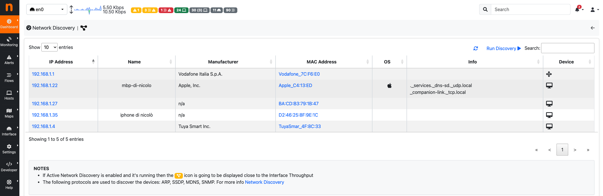

Network Discovery
=================

Network Discovery is available under the Dashboard sub-menu.

.. note::
    This feature is available only for `Packet Interfaces <interfaces/packet_vs_zmq>`_.

    Network Discovery

By clicking `Run Discovery` button next to the Search box, above the table, a Network Discovery is going to be launched. 
ntopng now tries to contact all the available devices inside the `local network` by using different protocols (The following protocols are used to discover the devices: ARP, SSDP, MDNS, SNMP) and after few seconds, all the available devices are going to be displayed into the table.
The table contains:

- `IP Address`: The IP Address of the device.
- `Name`: The name of the device (if available).
- `Manufacturer`: The manufacturer of the device.
- `MAC Address`: The MAC Address of the device.
- `OS`: The Operting System of the device (if available).
- `Info`: The services made available from the device.
- `Device`: The device type (Router, PC, ...).
