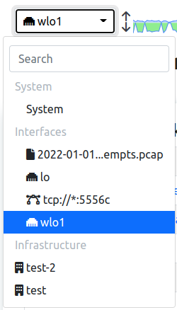

The Network Interface GUI
#########################

This Web Interface is used to monitor the status of a Network Interface; there can be different types of network interfaces, see this `section`_ for more info.

  System Interface Dropdown

By changing interface and jumping to the Network Interface some options are going to be available.

.. _`section`: ../interfaces/index.html

.. toctree::
    :maxdepth: 2

    dashboard
    checks
    flows
    hosts
    maps
    interfaces
