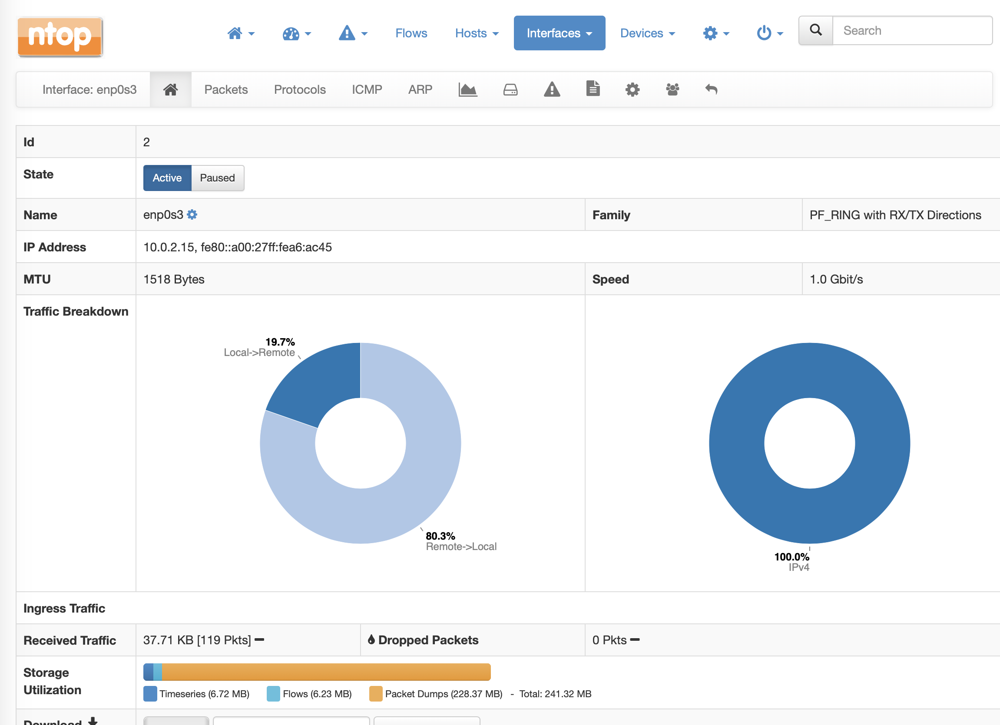
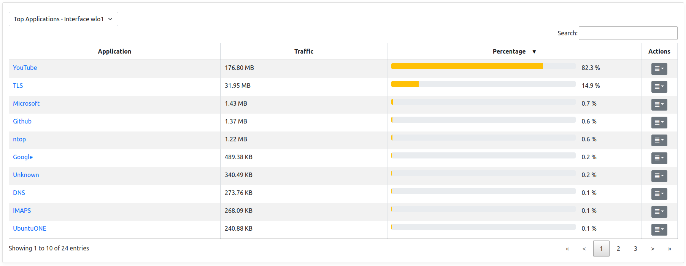

Other Pages and Info
####################

Administration
--------------

.. figure:: ../img/web_gui_administration.png
  :align: center
  :alt: Administration menu

This section shows the currently logged in user along with a logout button to disconnect the user from the ntopng GUI.

The notifications bell shows news from the `ntop blog`_.

.. _`ntop blog`: https://www.ntop.org/blog

Host Search
-----------

.. figure:: ../img/web_gui_host_search.jpg
  :align: center
  :alt: Host Search

  The Search Box

The search box provides a convenient way to search for many traffic elements in ntopng:

- Hosts (both by address and name)
- Mac addresses
- Autonomous Systems
- SNMP Devices

Dynamic auto completion enables users to check whether the searched host appears in the list while typing.

Historical Charts
-----------------

ntopng provides historical views on the `recorded timeseries data`_ .

.. figure:: ../img/web_gui_historical_charts.png
  :align: center
  :alt: Historical Charts

  Historical Charts

From the top left dropdown it's possible to select the timeseries data to display.
Other than the actual timeseries data, the chart will also show:

  - A comparison series with the past. In the picture above, `30m ago` will show the
    interface traffic 30 minutes ago.
  
  - The average line, a straight line outlining the average value for the timeseries.

  - 95th percentile, a straight line outlining the 95th `percentile`_ value of the traffic.
    It indicates the value for which 95% of the timeseries points are below it.

By using the time selectors is possible to specify a specific time frame to graph.
It is also possible the predefined resolutions to display the latest data for predefined intervals,
e.g. latest 5 or 30 minutes. By clicking on `-30` and `+30` buttons is also possible to jump to
the corresponding interval in the past or future.

Timeseries data is shown on the charts is sampled. In order to get more accurate data is necessary
to zoom into the chart. This can be performed easily by dragging the mouse on the specified interval;
chart will update dynamically and show the interval data with higher resolution. A double click on the
chart performs a zoom out.

By clicking on the |permalink_icon| icon it's possible to get a permanent link to the current view to share
with others. If `traffic recording`_ is enabled, by clicking the |pcap_download_icon| icon it's possible to
download a PCAP file of the interface or host traffic in the specified time frame. Depending on the selected
historical timeseries, this could be available or not.

By clicking on the |snapshot_icon| icon it's possible to :ref:`ManageSnapshots`.

Storage Monitor
---------------

According to the configuration, ntopng stores different types of information to disk, including:

- Timeseries (e.g. RRD)
- Packet Dumps (Traffic Recording)
- Flows

The amount of resources in terms of disk space can vary a lot according to the configured data 
retention for each component, the number of hosts and flows. Monitoring the space used by ntopng 
on disk becomes crucial to make sure you are now exceeding the expected amount of resources, 
and check that the automatic space reclaim facilities in ntopng have been configured properly.

The Runtime Status page of the :ref:`BasicConceptSystemInterface` in ntopng shows the current *Storage Utilization*, providing the total
disk space in use, and a breakdown with the disk space used by ntopng to for storing information
for each interface.

.. figure:: ../img/web_gui_runtime_status.png
  :align: center
  :alt: Runtime Status

  The Runtime Status Page

By clicking on an interface, you get redirected to the *Interface Status* page. In this page
you can see the total disk space used for the current interface, and a breakdown with the 
amount of space used for each component (Timeseries, Packet Dumps, Flows).

  The Interface Status Page

From the *Interface Status* page we can easily check if some component is using more space than
expected. At this point we can move to the configuration page for that specific component, and
review the data retention settings. For example, going to the *Traffic Recording* page, we can 
see what is the actual disk utilization, checking the disk space used for Packet Dumps, and we can
review the configured *Max Disk Space* based on the amount of resources that we want to reserve
for this component.

.. figure:: ../img/web_gui_interfaces_recording.png
  :align: center
  :alt: Interface Traffic Recording

  The Interface Traffic Recording Page

Tabular View
------------

Under the timeseries charts there is a tabular view which shows historical data for the
specified timeframe in a tabular format.

  Historical Tabular View

By clicking on the dropdown on the left it's possible to select the specific data to view.
Currently, the following views are implemented:

  - Top Protocols: the top protocols traffic and the percentage of each protocol on the total traffic.

  - Top Categories: the top categories traffic and the percentage of each category on the total traffic.

  - Top Senders: the top local sender hosts and their traffic.

  - Top Receivers: the top local receiver hosts and their traffic.

  - Top Interfaces: the top interfaces of a SNMP device.
   

.. |pcap_download_icon| image:: ../img/pcap_download_icon.png

.. _`recorded timeseries data`: ../basic_concepts/timeseries.html
.. _`traffic recording`: ../traffic_recording.html
.. _`manage snapshot`: ../advanced_features/snapshots.html
.. _`Exponential Moving Average`: https://en.wikipedia.org/wiki/Moving_average#Exponential_moving_average
.. _`Simple Moving Average`: https://en.wikipedia.org/wiki/Moving_average#Simple_moving_average
.. _`Relative Strength Index`: https://en.wikipedia.org/wiki/Relative_strength_index
.. _`percentile`: https://es.wikipedia.org/wiki/Percentil
