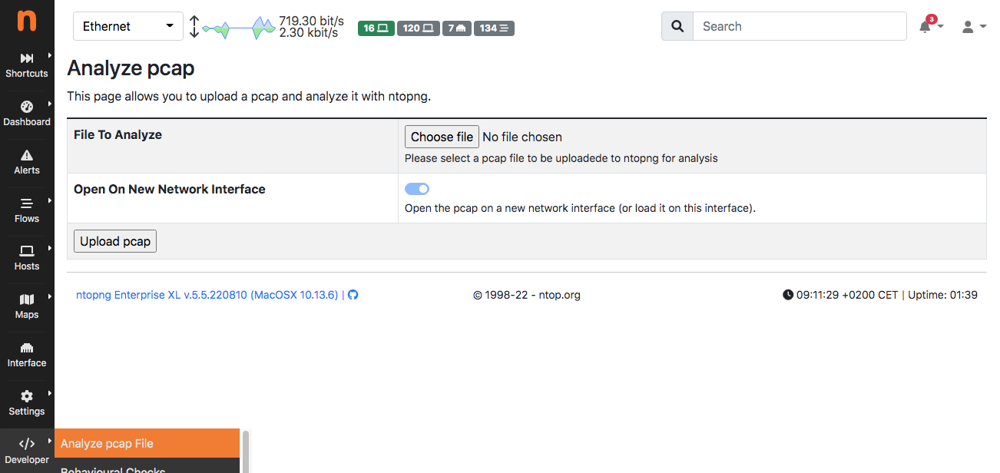

Pcap Analysis
#############

Under the Developer menu there is a menu entry that allows pcaps to be analysed. This feature is useful when using ntopng remotely for analysing pcap files without the need to copy the file on the remote host where ntopng is running.

This form allows you to upload a pcap to ntopng using the web form and let ntopng analyse it.

Upon pcap upload, ntopng will create a new network interface whose name is the pcap file name, and start analyse it. The uploaded pcap will be saved under `/var/lib/ntopng/tmp/upload` and deleted as soon as ntopng has read it all. If you current selected interface is a pcap interface (i.e. it is an interface that has analysed a pcap file), you can use the toggle to instruct ntopng not to create yet another network interface but to replace the current interface with the uploaded pcap.

.. note::
   
   - In order to avoid uploading huge pcaps, ntopng has a limit (currently set to 10 MB) for pcap file upload size.
   - This feature is available in all ntopng editions.
