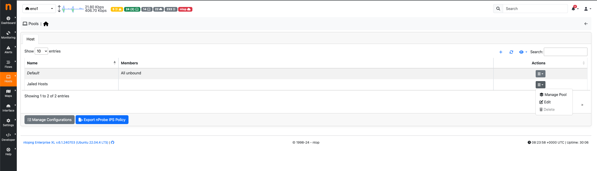
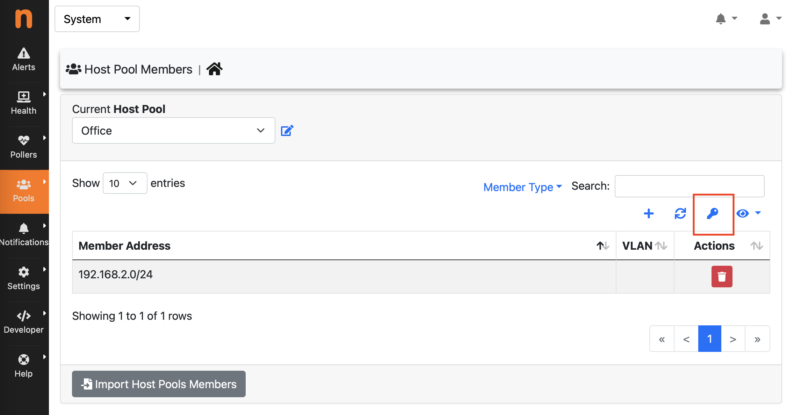
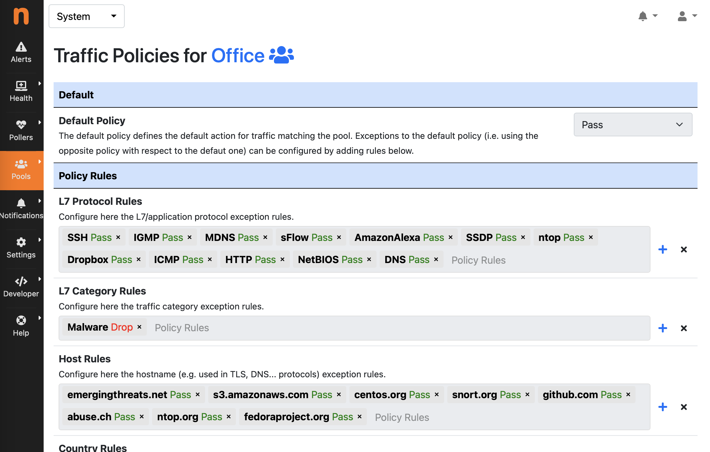
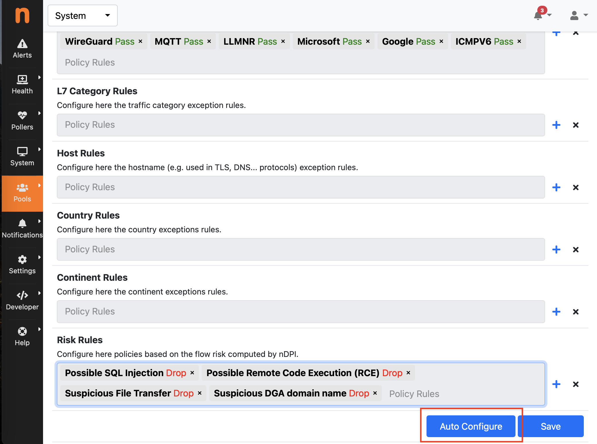

Host Pools
##########

Host pools are logical groups of hosts. Pools can be created or managed from the *System* interface, 
*Pools* menu. It is possible to add new pools using the “plus” button in the same page.

.. figure:: ../img/web_gui_interfaces_edit_pools.png
  :align: center
  :alt: Edit Pools

  The Pools Page

Once an Host Pool is created, it is possible to add members to it. Host Pool members can be added 
from the *Pools* > *Host Pool Members* page, using the “plus” button.

  The Host Pool Page

The Host Pools configuration, which includes the definition of host pools along with
the pools members, can be easily exported to JSON and imported into another ntopng instance
from the *Settings* > *Manage Configuration* page. Imported host pools will replace the existing ones.

An “Alias” can be associated to each pool member to ease the its identification. Typically, one would
assign a mnemonic label as member alias (e.g., “John’s iPhone” or “Smart TV”).

A view of host pool statistics is accessible from the actual interface, *Hosts* > *Host Pools* menu,
as discussed in the `relevant section`_. The view shows live pool information (e.g., overall pool throughput)
and provides access to the historical pool traffic timeseries (Professional version) as well as to the 
currently active pool members.

.. _`relevant section`: hosts.html#host-pools

Traffic Policies
----------------

Host pools can also be used to enforce traffic policies (e.g, block YouTube traffic for the “John” pool and
limit Facebook traffic at 1 Mbps for the “Guests” pool). This feature is available in nEdge (when ntopng is
used inline as described in the “Advanced Features” section of this document), or when ntopng is used in 
combination with `nProbe in IPS mode <https://www.ntop.org/guides/nprobe/ips_mode.html>`_.
In the latter case, ntopng can be used to report information about policed traffic, and also to configure
traffic policies using the web GUI.

.. note::

   A ntopng Pro or Enterprise license is required.

Traffic policies are automatically exported to nProbe after a change to the policies configuration, or
when a new nProbe instance connects to ntopng via ZMQ. In order to publish IPS events (including policies)
an additional ZMQ channel is required. This can be configured using the *--zmq-publish-events* option to 
configure the ntopng ZMQ endpoint for IPS events. Example:

.. code:: bash

   nprobe --zmq tcp://*:1234 --ips-mode none --zmq-publish-events tcp://127.0.0.1:5557 -i nf:0
   ntopng -i tcp://127.0.0.1:1234 --zmq-publish-events tcp://*:5557

Please refer to the `nProbe documentation <https://www.ntop.org/guides/nprobe/ips_mode.html>`_ for more 
details about the nProbe configuration and working mode.

A different traffic policy can be configured for each pool of hosts by clicking on the “key” button in 
the *Pools* > *Host Pool Members* page, after selecting the *System* interface.

  The Host Pool Page

The policies configuration includes a default policy, that can be Pass or Drop (Default Deny), and
more specific rules that can be used to configure exceptions with respect to the default policy, including:

- L7 Application Protocol Rules
- L7 Category Rules
- Host Rules to configure hostnames used in TLS and DNS protocols for instance
- Country Rules
- Continent Rules
- Risk Rules to apply policies based on the Flow Risk computed by nDPI

  The Traffic Policies Page

An *Auto Configure* functionality is also available to automatically create a recommended configuration
for the Traffic Policy by leveraging on the protocols/hosts seen by ntopng for the devices belonging to the Pool
(please note ntopng should run for at least 1 day in order to get the best results). Please note that this
configuration is a *guess* and should be manually fine tuned. This feature is particularly useful in case of 
devices which are supposed to use a limited/static set of services, which is the case of *IoT devices* for 
instance. In this case the *Default Policy* is set to Drop (*Default Deny*) and the *Auto Configure* 
functionality adds those L7 protocols and hostnames which are actually required for the device to work 
(according to the historical data). In order to populate *Host Rules*, the *Top Visited Sites* euristic 
should be enabled under *Settings* > *Preferences* > *Applications*.

  The Auto Configure Feature

