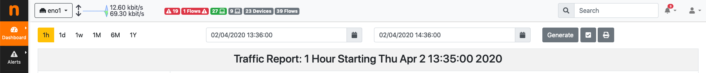
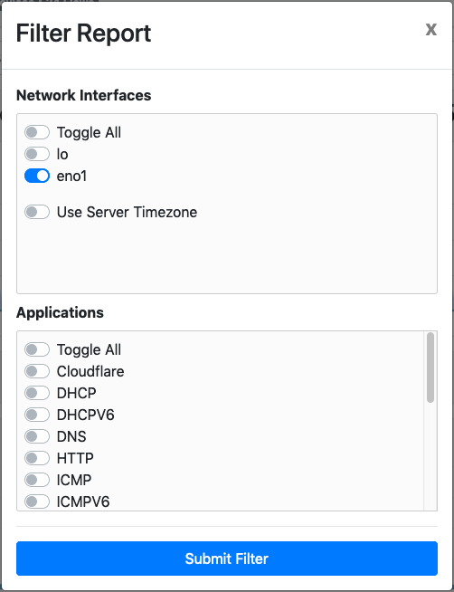
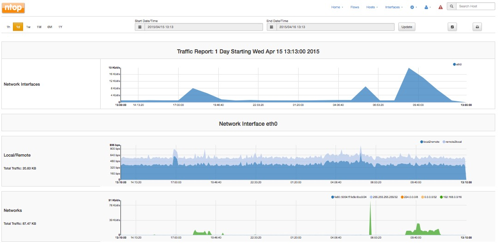
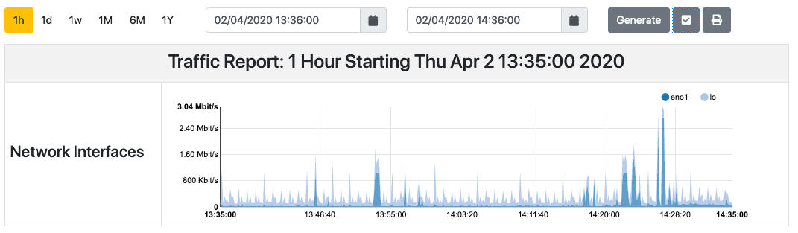
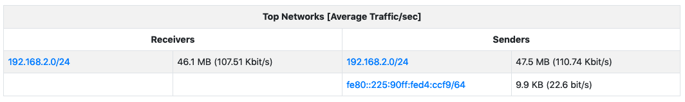
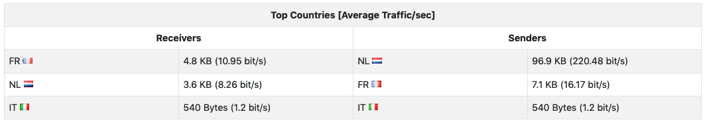
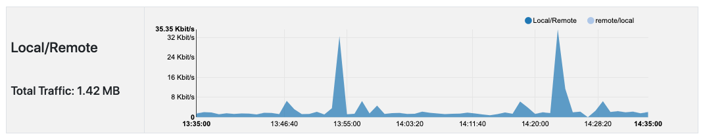
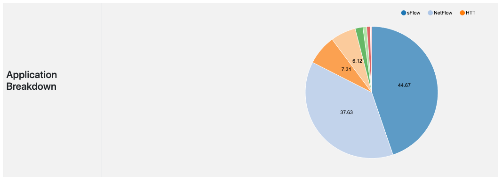

Report
######

The Professional version of ntopng allows to generate custom traffic reports for one or more interfaces
monitored. Report page, reachable from the dropdown home menu in the main toolbar, presents the
user with multiple configuration options.

  The Top of the Report Page

Fixed-width temporal intervals are available on the left. They are 1h (one hour), 1d (one day), 1w (one
week), 1M (one month), 6M (six months), and 1Y (one year). A click on any of those intervals produces an
automatic report that spans a time range that starts at the present and that goes backwards in time until
the clicked interval is reached.

Exact temporal intervals can be chosen using the two dropdown date time pickers in the center. The first
and the second pickers are used to specify the start and the end of a custom report, respectively. Once
dates and times have been chosen, the report is obtained by clicking on ‘Generate’.

The small checkbox icon right of the ‘Generate’ button allows to select one or more of the available
monitored interfaces, as well as application protocols of interest. Clicking on it yields the following overlaid
menu.

  Report Filter Overlay

Finally, the rightmost icon generates a printer-friendly report ready to be printed.

Reports contain charts of monitored interfaces overall traffic, local versus remote traffic, local networks
traffic, as well as the traffic grouped by:

- Application Protocols (e.g., HTTPS, Skype)
- Countries
- Local Hosts (hosts belonging to local networks) and Remote Hosts (hosts belonging to remote
  networks)
- Local Operating Systems
- Autonomous Systems

In the remainder of this section are screenshots of reported information discussed above.

  Report - Network Interfaces and Traffic

.. figure:: ../img/web_gui_report_networks.jpg
  :align: center
  :alt: Top Networks

  Report - Top Networks and Applications

  Report - Monitored Network Interfaces Summary

  Report - Top Countries

  Report - Local to Remote and Remote to Local Traffic

  Report - Application Breakdown
