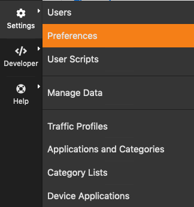
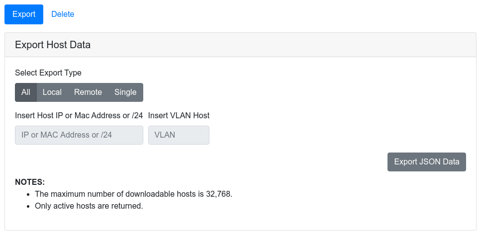

ntopng Settings
===============

The Runtime settings can be configured using the dropdown gear menu in the top toolbar.

  The Dropdown Settings Menu in the Top Toolbar

Manage Users
------------

Manage Users menu gives access to ntopng users administration. Ntopng is a multi-user system that
handles multiple simultaneous active sessions. Ntopng users can have the role of Administrators or
standard users.

.. figure:: ../img/web_gui_settings_users.png
  :align: center
  :alt: Users Settings

  The Manage Users Settings Page

Password and other preferences such as role and allowed networks can be changed by clicking on
button Manage, which causes a new window to pop out.

Preferences
-----------

Preferences menu entry enables the user to change runtime configurations. A thorough help is reported
below every preference directly into ntopng web GUI.

Manage Stored Data
------------------

Ntopng is able to export monitored hosts information. It allows to export data in JSON format giving the
user the ability to include ntopng information in a user created GUI.

  The Export Data Page

Backup Configuration
--------------------

The Backup Configuration entry downloads a copy of the ntopng
configuration, as a compressed tarball (.tar.gz). The following files
and directories are included in the backup:

- Configuration file (unless command line is used for providing the options)
- /etc/ntopng folder
- Runtime configuration (runtimeprefs.json)
- License file

Please note that on Windows systems the runtime configuration file only is provided.

Restore Configuration
---------------------

ntopng configuration can be restored by placing the compressed tarball
(downloaded via Backup Configuration) into the ntopng data directory
and restarting the service. The tarball must be named conf.tar.gz.

For example, assuming the default /var/tmp/ntopng data directory has not been changed, one can
restore a previously backed-up configuration by placing the compressed
tarball in /var/tmp/ntopng/conf.tar.gz and then issuing a
:code:`systemctl restart ntopng`.

.. note::

   After the restore, the compressed archive into the data directory
   is automatically deleted.

.. note::

   Restore is only supported for packaged ntopng installations on
   systems that use :code:`systemd`. Geeks and those who are building
   ntopng from source should have a look at script :code:`httpdocs/misc/ntopng-utils-manage-config`.
