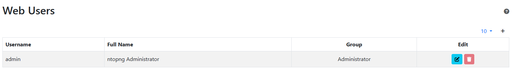

.. _ntopngPreferences:

ntopng Settings
===============

The Runtime settings can be configured using the dropdown gear menu in the top toolbar.

.. figure:: ../img/web_gui_settings_dropdown.png
  :align: center
  :alt: Settings Dropdown

  The Dropdown Settings Menu in the Top Toolbar

Manage Users
------------

Manage Users menu gives access to ntopng users administration. Ntopng is a multi-user system that
handles multiple simultaneous active sessions. Ntopng users can have the role of Administrators or
standard users.

  The Manage Users Settings Page

Password and other preferences can be set during user creation and changed later on by clicking
on the Manage button. User preferences include:

- The user role (Administrator or Not Privileged)
- Allowed interface
- Allowed networks in traffic visualization
- Permission to download live traffic and PCAPs (honoring the interface and networks restrictions)

Preferences
-----------

Preferences menu entry enables the user to change runtime configurations. A thorough help is reported
below every preference directly into ntopng web GUI.

.. _Data Retention:

Data Retention
--------------

Data retention is configurable from the preferences.

.. figure:: ../img/web_gui_settings_retention.png
  :align: center
  :alt: Data Retention Configuration

  Data Retention Configuration

Data retention is expressed in days and it affects:

- Top Talkers stored in sqlite
- Timeseries
- Historical Flows dumped with MySQL and nIndex.

.. note::

  When using RRDs for timeseries, changing the data retention only affects new RRDs created after the change.

Manage Data
-----------

Through the manage data page it is possible to export or delete the interface data.

.. figure:: ../img/web_gui_settings_export_data.png
  :align: center
  :alt: Export Data

  The Export Data Page

It is possible to choose between the following options:

- Export all the hosts data
- Export all the local hosts data
- Export all the remote hosts data
- Export a specific host data, by specifying its IP or MAC address and optionally a VLAN

The JSON data can be downloaded and easily analyzed.

.. figure:: ../img/web_gui_settings_delete_data.png
  :align: center
  :alt: Export Data

  The Delete Data Page

The Delete tab is similar to the export tab.
It provides a convenient way to delete all the data associated to a particular
host or group of hosts (via a /24 network CIDR). It is also possible to delete
all the data associated to the active interface.

The Manage Data page is accessible when a non system interface is selected. On the system interface,
the delete data functionality can be directly accessed via the Settings menu. In this case,
it is possible to:

- Delete the system interface data
- Delete the inactive interfaces data. This can be very useful to free some disk space for old
  interfaces.

Backup Configuration
--------------------

The Backup Configuration entry downloads a copy of the ntopng
configuration, as a compressed tarball (.tar.gz). The following files
and directories are included in the backup:

- Configuration file (unless command line is used for providing the options)
- /etc/ntopng folder
- Runtime configuration (runtimeprefs.json)
- License file

Please note that on Windows systems the runtime configuration file only is provided.

Restore Configuration
---------------------

ntopng configuration can be restored by placing the compressed tarball
(downloaded via Backup Configuration) into the ntopng data directory
and restarting the service. The tarball must be named conf.tar.gz.

For example, assuming the default /var/lib/ntopng data directory has not been changed, one can
restore a previously backed-up configuration by placing the compressed
tarball in /var/lib/ntopng/conf.tar.gz and then issuing a
:code:`systemctl restart ntopng`.

.. note::

   After the restore, the compressed archive into the data directory
   is automatically deleted.

.. note::

   Restore is only supported for packaged ntopng installations on
   systems that use :code:`systemd`. Geeks and those who are building
   ntopng from source should have a look at script :code:`httpdocs/misc/ntopng-utils-manage-config`.
