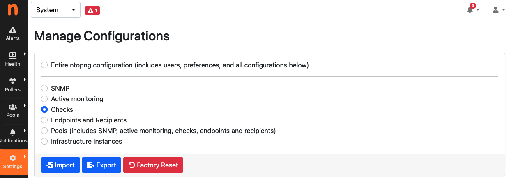
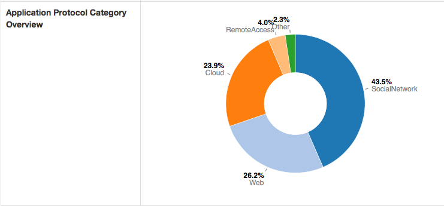
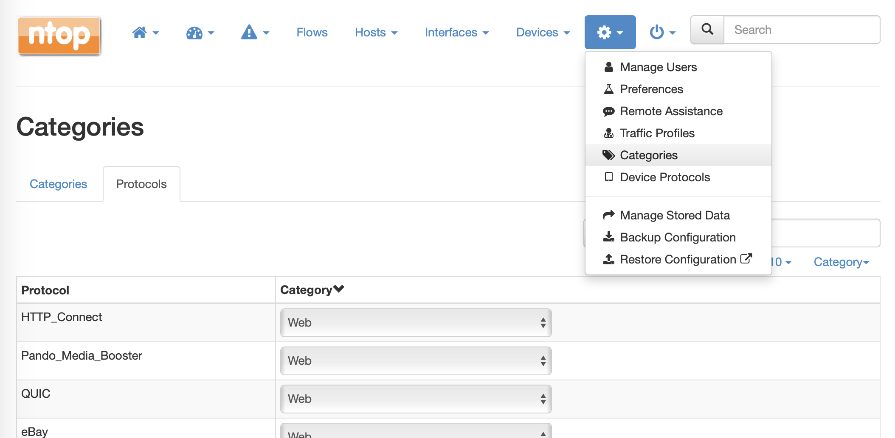

.. _ntopngPreferences:

Settings
========

The Runtime settings can be configured using the dropdown gear menu in the top toolbar.

.. figure:: ../img/web_gui_settings_dropdown.png
  :align: center
  :alt: Settings Dropdown

  The Dropdown Settings Menu in the Top Toolbar

Manage Users
------------

Manage Users menu gives access to ntopng users administration. Ntopng is a multi-user system that
handles multiple simultaneous active sessions. Ntopng users can have the role of Administrators or
standard users.

.. figure:: ../img/web_gui_settings_users.png
  :align: center
  :alt: Users Settings

  The Manage Users Settings Page

Password and other preferences can be set during user creation and changed later on by clicking
on the Manage button. User preferences include:

- The user role (Administrator or Not Privileged)
- Allowed interface
- Allowed networks in traffic visualization
- Permission to download live traffic and PCAPs (honoring the interface and networks restrictions)

Preferences
-----------

Preferences menu entry enables the user to change runtime configurations. There are two types of settings (changeable by clicking the view at the end of the preferences menu) : `Expert View` and `Simple View`. The `Expert View` has all the configurable preferences, instead the `Simple View` only has the basic preferences.

  Preferences List

A thorough help is reported below every preference directly into ntopng web GUI.

Change ntopng Index Page
------------------------

It is possible to change the ntopng index page (e.g., instead of displaying the 'Traffic Dashboard' when opening ntopng, display the 'SNMP' page), by jumping to the 'Settings' and 'Preferences' tab.
From here jump to the 'User Interface' section and modify the 'Index Page' with the ntopng page desired to be displayed as an index.

.. figure:: ../img/change_ntopng_index_page.png
  :align: center
  :alt: Preferences List

For instance, by setting the 'Index Page' to '/lua/pro/enterprise/snmpdevices_stats.lua', when opening ntopng, the default page displayed is going to be the 'SNMP' one.

.. _Data Retention:

Data Retention
--------------

Data retention is configurable from the preferences.

.. figure:: ../img/web_gui_settings_retention.png
  :align: center
  :alt: Data Retention Configuration

  Data Retention Configuration

Data retention is expressed in days and it affects:

- Top Talkers stored in sqlite
- Timeseries
- Historical flows

.. note::

  When using RRDs for timeseries, changing the data retention only affects new RRDs created after the change.

Manage Configuration
--------------------

.. _ConfigurationImportExport:

ntopng provides the ability to backup its configuration, in order to be able to restore it in case of system
failures and reinstallations, or to clone it to other systems requiring the very same configuration (e.g. in
a cluster or in a high-availability deployment), saving a lot of time for manually copying all the settings.

Through the web GUI it is possible to export selected configurations, including:

- SNMP configuration
- Active Monitoring configuration
- Checks configuration
- Alerts Endpoints and Recipients
- All Pools (this will also include all the previous items, as this depends on them)

or export the entire ntopng configuration, which includes *Users* and *Preferences* in addition to all the
above items. In both cases, a small JSON file containing the configuration is generated.

It is also possible to import back a configuration which as been exported before, providing the JSON file.
The configuration items contained in the imported configuration will be added to those already present in
the current ntopng configuration (e.g. endpoint already configured in ntopng, if any, will not be deleted when
importing additional endpoints).

Resetting the configuration to factory defaults is also possible. This is also useful when importing
a configuration and preserving the old one is not required nor wanted (e.g. when adding a set of recipients
and endpoints without preserving those already present).

All this is available from the *Settings* -> *Configurations* menu, as shown in the below picture.

  The Manage Configurations Page

Every night, ntopng automatically creates a backup of the whole application configuration. No backup is created if the configuration didn't change since the previous day. Currently the last 7 backups are stored and older ones are automatically discarded. You can download a backup using the Download menu under the Actions colums. This backup can be restored using the Import button on the main configuration page.

  The Configurations Backup Page

Import/Export via API
^^^^^^^^^^^^^^^^^^^^^

Configuration can also be imported and exported programmatically via API. Following is an example that uses the REST API to export and then import the global ntopng configuration.

To export the global ntopng configuration in a local JSON file :code:`all_config.json` from an host :code:`office`, user :code:`admin` (identified with password :code:`admin`) can call the following endpoint

.. code:: bash

  $ curl -u admin:admin1 "http://office:3000/lua/rest/v2/export/all/config.lua?download=1" > all_config.json

To import the configuration, the contents of :code:`all_config.json` must be POST-ed as the value of a string :code:`JSON` to the following endpoint:

.. code:: bash

  $ curl -uadmin:admin1 -H "Content-Type: application/x-www-form-urlencoded" --data-urlencode "JSON=`cat all_config.json`" "http://office:3000/lua/rest/v2/import/all/config.lua"

A successful POST is confirmed by the following message:

.. code:: bash

  {"rc":0,"rc_str":"OK","rc_str_hr":"Success","rsp":[]}

A restart of ntopng is required after the import of the global configuration.

Manage Data
-----------

Through the manage data page it is possible to export or delete the interface data.

.. figure:: ../img/web_gui_settings_export_data.png
  :align: center
  :alt: Export Data

  The Export Data Page

It is possible to choose between the following options:

- Export all the hosts data
- Export all the local hosts data
- Export all the remote hosts data
- Export a specific host data, by specifying its IP or MAC address and optionally a VLAN

The JSON data can be downloaded and easily analyzed.

.. figure:: ../img/web_gui_settings_delete_data.png
  :align: center
  :alt: Export Data

  The Delete Data Page

The Delete tab is similar to the export tab.
It provides a convenient way to delete all the data associated to a particular
host or group of hosts (via a /24 network CIDR). It is also possible to delete
all the data associated to the active interface.

The Manage Data page is accessible when a non system interface is selected. On the system interface,
the delete data functionality can be directly accessed via the Settings menu. In this case,
it is possible to:

- Delete the system interface data
- Delete the inactive interfaces data. This can be very useful to free some disk space for old
  interfaces.

Checks
------

Checks process network elements and perform actions such as triggering alerts. Creating checks is discussed in detail in :ref:`Checks`. This section describes how users scripts can be enabled and disabled, configured, and applied to network elements such as hosts and flows.

Checks can be configured from any interface, from the menu `Settings->Checks`. 

.. figure:: ../img/web_gui_checks.png
  :align: center
  :alt: Checks Settings

  Checks Settings

Configuring a check means:

- Choosing the network elements the script is going to be executed for.
- Enabling/disabling it.
- Setting its configuration values.

Editing Checks
^^^^^^^^^^^^^^

Checks can be edited for any of the configurable network elements. The edit page shows three tabs, namely `All`, `Enabled`, and `Disabled` to give immediate access to the whole list of checks, or to limit the view to only those that are enabled or disabled.

A check can be enabled or disabled by clicking the corresponding button under the `Actions` column. Certain checks can also have their values configured. In this case, an extra button `Edit` becomes available under the `Actions` column.

Resetting, Importing and Exporting Configured Checks
^^^^^^^^^^^^^^^^^^^^^^^^^^^^^^^^^^^^^^^^^^^^^^^^^^^^

All existing check configurations can be imported and exported in bulk, to ease backup, restore, and replication across multiple machines. To perform these actions, visit the System Interface -> Settings -> Manage Configurations and select Checks

  Checks Import, Export and Reset

|

Applications and Categories
---------------------------

Category
^^^^^^^^

Traditionally nDPI was used by ntopng to detect flows L7 protocol. With the advent of more and more protocols, 
speaking about single protocols is often too difficult. Users usually are not interested in the specific protocol
but rather on a whole group of protocols. For example, it's easier to reason about VPN traffic as a whole rather 
than a particular VPN implementation.

For these reasons, nDPI (and ntopng) has been extended to provide a logical grouping of protocols, called Categories. 
With Categories it's possible, for example, to get an idea of the network traffic of a host:

  Host Category Overview

Some use cases solved by the Categories include:

- Block all advertisement sites (nEdge)
- Trigger an alert whenever my employees access a malware site (ntopng, whereas in nEdge there is the ability to block this traffic)
- Prevent clients from accessing the WiFi sites of competitors as they are using them for comparing prices (nEdge)

Custom Applications
^^^^^^^^^^^^^^^^^^^

In the Applications tab it's possible to configure the category associated associated
with a particular application.

  Applications Configuration Page

ntopng determines the application of a flow via some rules into nDPI. However,
some additional rules can be specified by the user via the *--ndpi-protocols|-p <file>*
option. The file has the following format:

.. code:: text

   # host:"<value>",host:"<value>",.....@<subproto>
   host:"googlesyndacation.com"@Google
   host:"venere.com"@Venere

An example for this configuration file is available `here <https://github.com/ntop/nDPI/blob/dev/example/protos.txt>`_.

Ntopng also supports editing such file from the GUI. In order to do so, it's
still necessary to use the above option to point to a protos file located into
a directory where ntopng has the permission to read and write. In practice, in
order to enable this feature, ntopng should be started with the
*--ndpi-protocols=/var/lib/ntopng/protos.txt* option. If you already have a protos
file, move it to */var/lib/ntopng/protos.txt* and run

.. code:: bash

    sudo chown ntopng:ntopng /var/lib/ntopng/protos.txt

to prepare it to be used by ntopng.

After this feature is enabled, by clicking on the "Edit Rules" button it will be
possible edit an application rules directly from the GUI and add new protocols.
It's important to note that rules and new protocols will only be created and applied
after a restart of ntopng.

.. figure:: ../img/web_gui_application_edit.png
  :align: center
  :alt: The Protocol Category editor
  :scale: 65%

  Editing Application Rules

For example, the `tcp:8080` rule in the example above tells ntopng to treat all
the TCP traffic on port 8080 as HTTP. In order to delete a user defined protocol
it's necessary to clear all of its rules and save the changes.
The protocol will be deleted after a restart of ntopng.

.. _CustomCategoryHosts:
  
Custom Categories
^^^^^^^^^^^^^^^^^

As shown above, ntopng already assigns a default category to the known L7 protocols.
Nevertheless, it's also possible for the user to specify a list of additional hosts
to be included into a particular category. ntopng provides 5 empty "custom categories"
dedicated to this task, but users are also free to modify the other categories.

The custom category hosts can be specified via some host-based rules.
The host-based rules will be used to perform substring matching on some of the flow information:

  - Client/Server IP
  - DNS query
  - Host SNI
  - HTTP Host

If a match is found, the flow category will be set to the corresponding matching category.
These rules can be configured from the *Categories* tab.

.. figure:: ../img/web_gui_category_editor.png
  :align: center
  :alt: The Category editor

By clicking "Edit Rules" it's possible to define some rules to match hosts and associate
them to the category.

.. figure:: ../img/web_gui_edit_category_hosts.png
  :align: center
  :alt: Edit Category Hosts
  :scale: 65%

  Edit Category Hosts

The picture above shows some custom hosts defined for the `Web` category.

.. note::

  host matching based on IP addresses is currently limited to IPv4 flows.

ntopng also supports external lists to define custom categories, loaded from text file (local) or online 
services (e.g. *emergingthreats* for the *Malware* category). Since lists are also used to raise alerts 
(e.g. for hosts in the Malware or Mining category), you may need to add exceptions to those lists,
whitelisting selected hosts. This is possible adding an host to the list, prepending "!" to the IP/hostname
(e.g. !1.2.3.4).

Adding a Rule from a Flow
^^^^^^^^^^^^^^^^^^^^^^^^^

From the flow details page, it's possible to click on the plus sign beside the flow SNI,
DNS or HTTP host to easily create a rule to associate such host to a particular application
or category.

.. figure:: ../img/web_gui_add_host_to_category.png
  :align: center
  :alt: Add Host Rule

.. figure:: ../img/web_gui_add_host_to_category_dialog.png
  :align: center
  :alt: Add Host Rule
  :scale: 85%

  Add Host Rule

