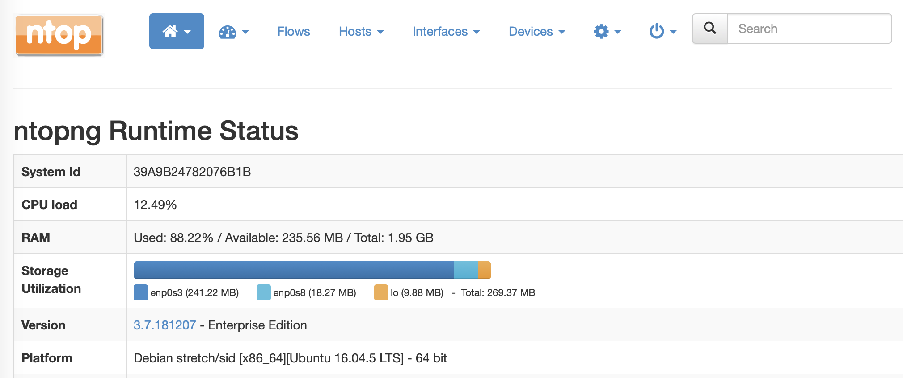
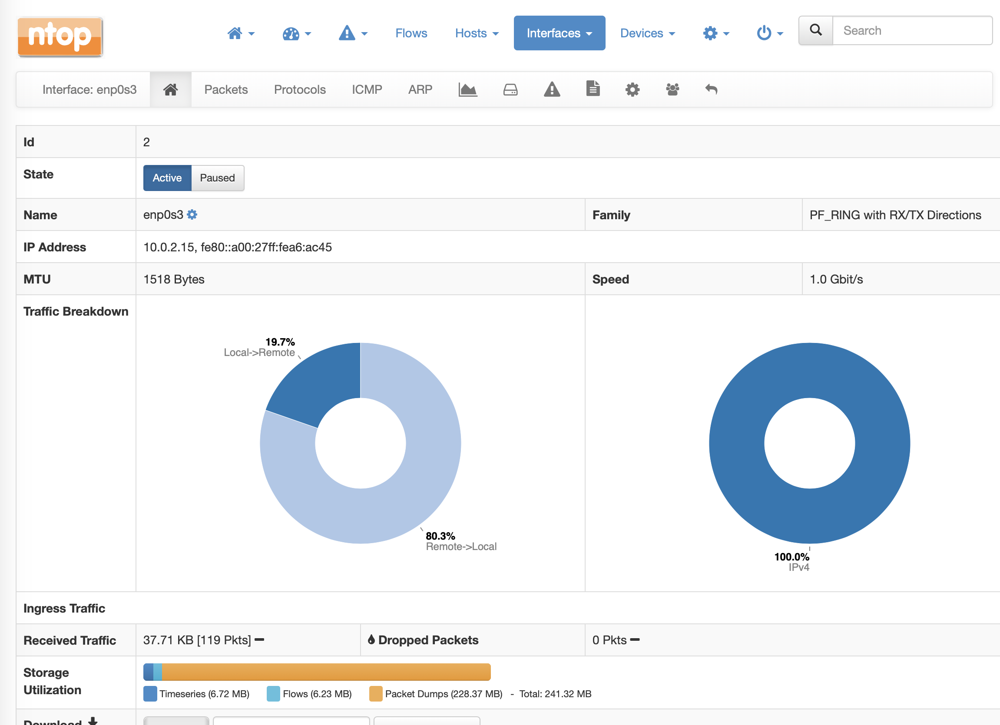
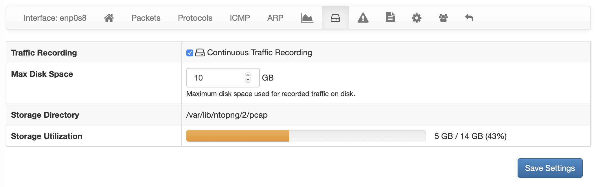

Storage Monitor
===============

According to the configuration, ntopng stores different types of information to disk, including:

- Timeseries (e.g. RRD)
- Packet Dumps (Traffic Recording)
- Flows

The amount of resources in terms of disk space can vary a lot according to the configured data 
retention for each component, the number of hosts and flows. Monitoring the space used by ntopng 
on disk becomes crucial to make sure you are now exceeding the expected amount of resources, 
and check that the automatic space reclaim facilities in ntopng have been configured properly.

The Runtime Status page of the :ref:`BasicConceptSystemInterface` in ntopng shows the current *Storage Utilization*, providing the total
disk space in use, and a breakdown with the disk space used by ntopng to for storing information
for each interface.

  The Runtime Status Page

By clicking on an interface, you get redirected to the *Interface Status* page. In this page
you can see the total disk space used for the current interface, and a breakdown with the 
amount of space used for each component (Timeseries, Packet Dumps, Flows).

  The Interface Status Page

From the *Interface Status* page we can easily check if some component is using more space than
expected. At this point we can move to the configuration page for that specific component, and
review the data retention settings. For example, going to the *Traffic Recording* page, we can 
see what is the actual disk utilization, checking the disk space used for Packet Dumps, and we can
review the configured *Max Disk Space* based on the amount of resources that we want to reserve
for this component.

  The Interface Traffic Recording Page

